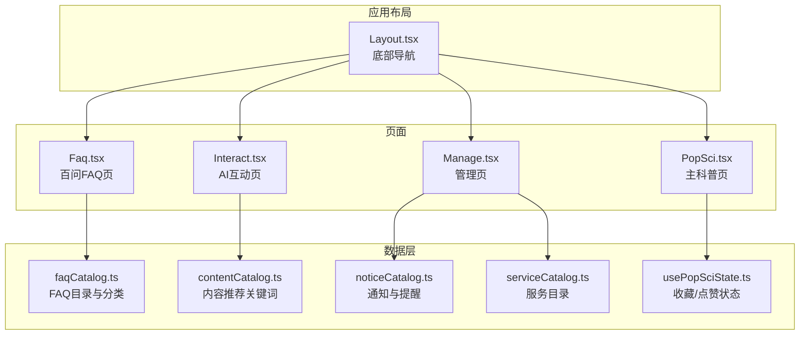
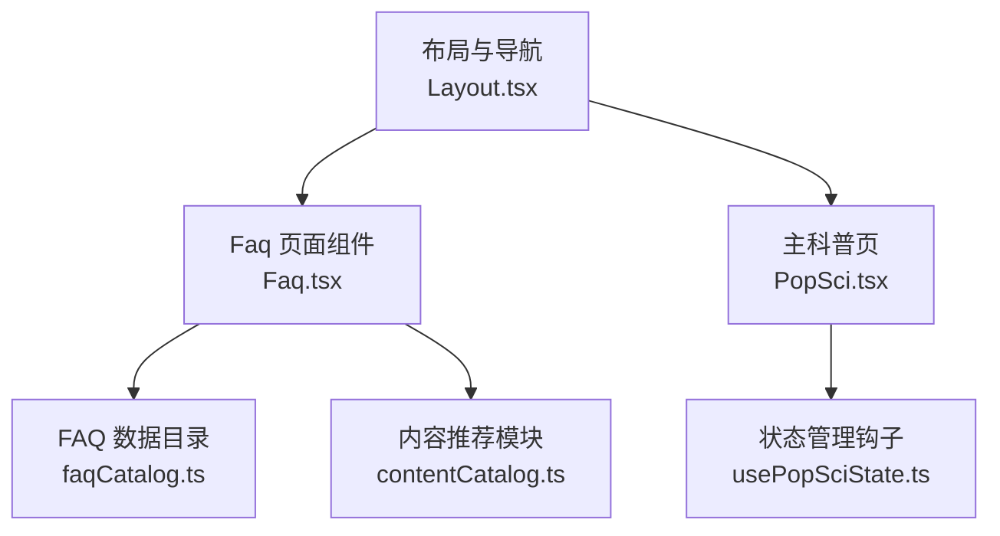
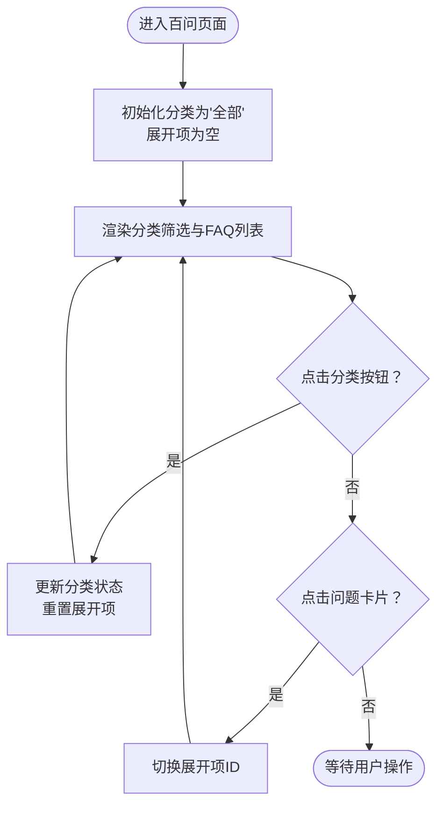
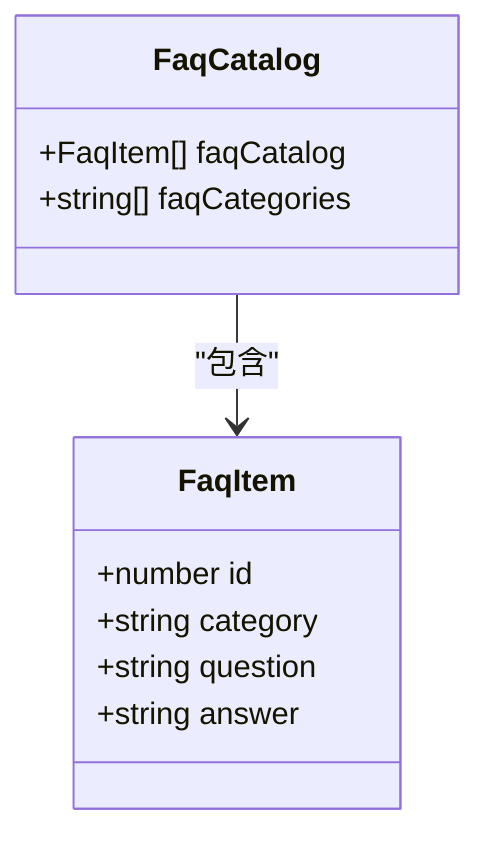
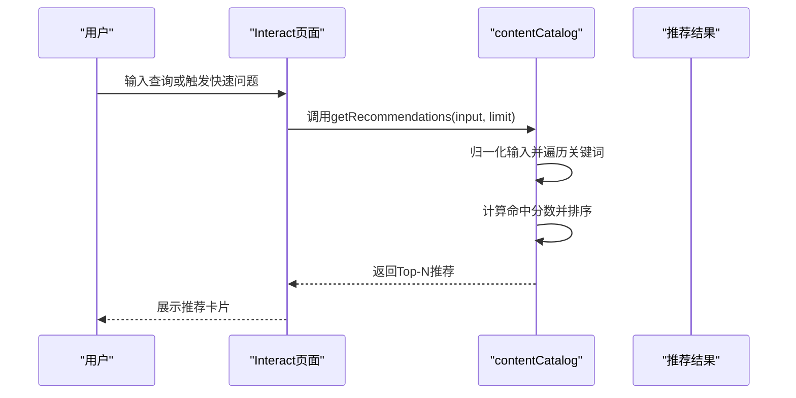
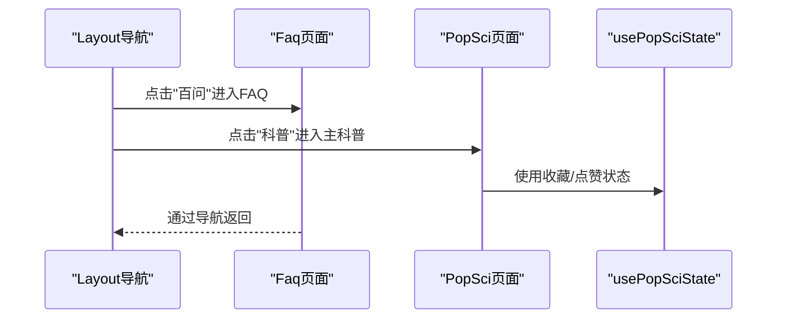
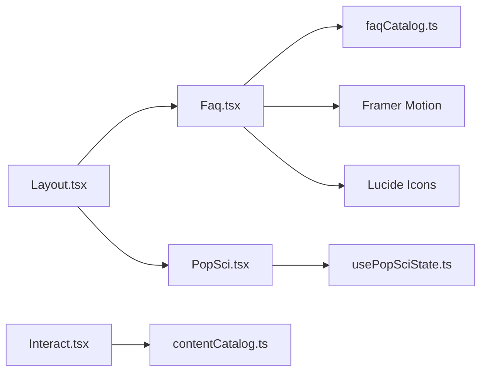

# 科普FAQ系统设计

<cite>
**本文档引用的文件**
- [2026-04-17-popsci-faq-design.md](file://docs/superpowers/specs/2026-04-17-popsci-faq-design.md)
- [Faq.tsx](file://src/pages/Faq.tsx)
- [faqCatalog.ts](file://src/data/faqCatalog.ts)
- [Layout.tsx](file://src/components/Layout.tsx)
- [PopSci.tsx](file://src/pages/PopSci.tsx)
- [contentCatalog.ts](file://src/data/contentCatalog.ts)
- [Interact.tsx](file://src/pages/Interact.tsx)
- [usePopSciState.ts](file://src/hooks/usePopSciState.ts)
- [noticeCatalog.ts](file://src/data/noticeCatalog.ts)
- [serviceCatalog.ts](file://src/data/serviceCatalog.ts)
- [Manage.tsx](file://src/pages/Manage.tsx)
- [package.json](file://package.json)
</cite>

## 目录
1. [简介](#简介)
2. [项目结构](#项目结构)
3. [核心组件](#核心组件)
4. [架构总览](#架构总览)
5. [详细组件分析](#详细组件分析)
6. [依赖关系分析](#依赖关系分析)
7. [性能考虑](#性能考虑)
8. [故障排除指南](#故障排除指南)
9. [结论](#结论)
10. [附录](#附录)

## 简介
本设计文档围绕“百问”（100 Questions FAQ）板块，系统阐述常见问题的分类体系、智能搜索与推荐机制、内容结构化管理、多语言支持与动态更新策略，以及用户搜索的语义理解、相关性排序与个性化展示方案。文档还覆盖FAQ系统数据模型、索引策略与查询优化，以及与用户反馈系统的集成、问题热度统计与内容优化建议。

## 项目结构
该项目采用移动端优先的单页应用架构，FAQ功能以独立页面存在，并与主科普模块、交互模块、通知与服务模块协同工作。FAQ页面通过路由导航接入整体布局，数据层提供FAQ目录与分类，UI层实现分类筛选与手风琴展开。

**图表来源**
- [Layout.tsx:10-17](file://src/components/Layout.tsx#L10-L17)
- [PopSci.tsx:9-28](file://src/pages/PopSci.tsx#L9-L28)
- [Faq.tsx:1-101](file://src/pages/Faq.tsx#L1-L101)
- [Interact.tsx:1-462](file://src/pages/Interact.tsx#L1-L462)
- [faqCatalog.ts:1-91](file://src/data/faqCatalog.ts#L1-L91)
- [contentCatalog.ts:1-101](file://src/data/contentCatalog.ts#L1-L101)
- [noticeCatalog.ts:1-59](file://src/data/noticeCatalog.ts#L1-L59)
- [serviceCatalog.ts:1-49](file://src/data/serviceCatalog.ts#L1-L49)
- [usePopSciState.ts:1-80](file://src/hooks/usePopSciState.ts#L1-L80)

**章节来源**
- [Layout.tsx:10-17](file://src/components/Layout.tsx#L10-L17)
- [PopSci.tsx:9-28](file://src/pages/PopSci.tsx#L9-L28)
- [Faq.tsx:1-101](file://src/pages/Faq.tsx#L1-L101)
- [faqCatalog.ts:1-91](file://src/data/faqCatalog.ts#L1-L91)

## 核心组件
- FAQ页面组件：负责渲染标题、分类筛选、问题列表与手风琴展开动画。
- FAQ数据目录：提供FAQ条目集合与分类去重后的类别列表。
- 布局与导航：统一的底部导航，包含“百问”入口。
- 内容推荐模块：基于关键词的简单相关性匹配，用于FAQ与AI互动场景下的内容推荐。
- 主科普状态钩子：用于收藏/点赞状态持久化，间接支撑个性化展示。

**章节来源**
- [Faq.tsx:1-101](file://src/pages/Faq.tsx#L1-L101)
- [faqCatalog.ts:1-91](file://src/data/faqCatalog.ts#L1-L91)
- [Layout.tsx:10-17](file://src/components/Layout.tsx#L10-L17)
- [contentCatalog.ts:69-99](file://src/data/contentCatalog.ts#L69-L99)
- [usePopSciState.ts:30-79](file://src/hooks/usePopSciState.ts#L30-L79)

## 架构总览
“百问”FAQ系统采用分层架构：
- 表现层：Faq页面组件负责UI交互与动画。
- 数据层：faqCatalog提供结构化FAQ数据与分类。
- 导航层：Layout统一入口，PopSci主科普页承载其他内容类型。
- 推荐层：contentCatalog提供关键词匹配的推荐能力，可扩展至FAQ相关性排序。
- 状态层：usePopSciState管理收藏/点赞状态，便于个性化展示。

**图表来源**
- [Faq.tsx:1-101](file://src/pages/Faq.tsx#L1-L101)
- [faqCatalog.ts:1-91](file://src/data/faqCatalog.ts#L1-L91)
- [Layout.tsx:10-17](file://src/components/Layout.tsx#L10-L17)
- [PopSci.tsx:26-32](file://src/pages/PopSci.tsx#L26-L32)
- [contentCatalog.ts:69-99](file://src/data/contentCatalog.ts#L69-L99)
- [usePopSciState.ts:30-79](file://src/hooks/usePopSciState.ts#L30-L79)

## 详细组件分析

### FAQ页面组件分析
- 状态管理：维护当前选中分类与展开项ID，确保手风琴行为一致。
- 过滤逻辑：当分类为“全部”时显示全部FAQ，否则按类别过滤。
- 动画与交互：使用Framer Motion实现卡片展开/收起的平滑过渡，提升用户体验。
- 可访问性：按钮具备焦点样式与ARIA标签，确保键盘与屏幕阅读器可用。

**图表来源**
- [Faq.tsx:7-14](file://src/pages/Faq.tsx#L7-L14)
- [Faq.tsx:48-96](file://src/pages/Faq.tsx#L48-L96)

**章节来源**
- [Faq.tsx:7-14](file://src/pages/Faq.tsx#L7-L14)
- [Faq.tsx:48-96](file://src/pages/Faq.tsx#L48-L96)

### FAQ数据模型与分类体系
- 数据模型：FAQ条目包含唯一ID、分类、问题文本与答案文本。
- 分类体系：支持“饮食”“用药”“康复”“日常”等类别，顶部提供“全部”聚合。
- 分类提取：通过集合去重生成完整分类列表，确保UI一致性。

**图表来源**
- [faqCatalog.ts:1-6](file://src/data/faqCatalog.ts#L1-L6)
- [faqCatalog.ts:8-91](file://src/data/faqCatalog.ts#L8-L91)

**章节来源**
- [faqCatalog.ts:1-6](file://src/data/faqCatalog.ts#L1-L6)
- [faqCatalog.ts:8-91](file://src/data/faqCatalog.ts#L8-L91)

### 智能搜索与推荐机制
- 当前实现：contentCatalog提供基于关键词的简单匹配，计算命中词数量作为相关性分数，并在不足时补充默认推荐。
- FAQ扩展点：可将FAQ问题与答案文本纳入关键词集合，或引入TF-IDF/向量相似度进行更精细的相关性排序。
- 个性化：结合用户浏览/收藏/点赞状态，对推荐结果进行加权。

**图表来源**
- [Interact.tsx:154-166](file://src/pages/Interact.tsx#L154-L166)
- [Interact.tsx:232-235](file://src/pages/Interact.tsx#L232-L235)
- [contentCatalog.ts:69-99](file://src/data/contentCatalog.ts#L69-L99)

**章节来源**
- [Interact.tsx:154-166](file://src/pages/Interact.tsx#L154-L166)
- [Interact.tsx:232-235](file://src/pages/Interact.tsx#L232-L235)
- [contentCatalog.ts:69-99](file://src/data/contentCatalog.ts#L69-L99)

### 与主科普模块的集成
- 导航集成：底部导航包含“百问”入口，PopSci主页面承载文章/视频等其他内容。
- 状态共享：主科普页使用usePopSciState管理收藏/点赞状态，FAQ页面可借鉴类似模式实现“收藏/点赞”等个性化功能。

**图表来源**
- [Layout.tsx:10-17](file://src/components/Layout.tsx#L10-L17)
- [PopSci.tsx:26-32](file://src/pages/PopSci.tsx#L26-L32)
- [usePopSciState.ts:30-79](file://src/hooks/usePopSciState.ts#L30-L79)

**章节来源**
- [Layout.tsx:10-17](file://src/components/Layout.tsx#L10-L17)
- [PopSci.tsx:26-32](file://src/pages/PopSci.tsx#L26-L32)
- [usePopSciState.ts:30-79](file://src/hooks/usePopSciState.ts#L30-L79)

### 用户反馈与热度统计
- 现状：FAQ页面未内置评分/反馈字段；主科普页通过usePopSciState记录收藏/点赞，可用于间接热度统计。
- 建议：在FAQ条目中增加“点赞/收藏”字段与后端接口，结合管理页的健康提醒与新闻模块，形成完整的反馈闭环。

**章节来源**
- [faqCatalog.ts:1-6](file://src/data/faqCatalog.ts#L1-L6)
- [usePopSciState.ts:30-79](file://src/hooks/usePopSciState.ts#L30-L79)
- [noticeCatalog.ts:1-59](file://src/data/noticeCatalog.ts#L1-L59)

## 依赖关系分析
- 组件依赖：Faq页面依赖faqCatalog的数据结构；Layout提供导航入口；Interact页面依赖contentCatalog进行推荐。
- 第三方库：Framer Motion用于动画；Lucide用于图标；Tailwind用于样式；Tesseract.js用于OCR（与FAQ无直接关联，但体现系统扩展能力）。

**图表来源**
- [Faq.tsx:1-101](file://src/pages/Faq.tsx#L1-L101)
- [faqCatalog.ts:1-91](file://src/data/faqCatalog.ts#L1-L91)
- [Layout.tsx:10-17](file://src/components/Layout.tsx#L10-L17)
- [PopSci.tsx:26-32](file://src/pages/PopSci.tsx#L26-L32)
- [Interact.tsx:1-462](file://src/pages/Interact.tsx#L1-L462)
- [contentCatalog.ts:1-101](file://src/data/contentCatalog.ts#L1-L101)
- [usePopSciState.ts:30-79](file://src/hooks/usePopSciState.ts#L30-L79)

**章节来源**
- [package.json:13-26](file://package.json#L13-L26)

## 性能考虑
- 渲染优化：FAQ列表使用memo化过滤，避免不必要的重渲染；手风琴展开使用条件渲染与动画库，减少DOM变更。
- 数据加载：FAQ数据为静态数组，无需网络请求；若扩展为远程API，建议引入分页与缓存策略。
- 推荐性能：contentCatalog的推荐算法为线性扫描，复杂度O(N×K)，N为内容条数，K为关键词数；可引入倒排索引或向量化检索优化。

[本节为通用指导，无需特定文件来源]

## 故障排除指南
- FAQ页面无数据：确认faqCatalog是否正确导出；检查分类列表生成逻辑。
- 分类筛选无效：确认状态更新与过滤逻辑；验证UI按钮的事件绑定。
- 动画异常：检查Framer Motion版本与依赖；确保容器高度在展开时允许自适应。
- 推荐无结果：确认contentCatalog的关键词字段是否存在；检查limit参数与默认推荐填充逻辑。

**章节来源**
- [faqCatalog.ts:8-91](file://src/data/faqCatalog.ts#L8-L91)
- [Faq.tsx:11-14](file://src/pages/Faq.tsx#L11-L14)
- [contentCatalog.ts:69-99](file://src/data/contentCatalog.ts#L69-L99)

## 结论
“百问”FAQ系统以简洁的数据模型与直观的UI实现了常见问题的高效检索与展示。通过与内容推荐模块的协同，系统具备进一步扩展为智能问答与个性化推荐的基础。建议后续引入语义搜索、向量索引与用户反馈机制，完善内容质量与热度统计，提升整体用户体验。

[本节为总结性内容，无需特定文件来源]

## 附录

### FAQ系统数据模型与索引策略
- 数据模型：FAQ条目包含ID、分类、问题、答案；分类列表通过集合去重生成。
- 索引策略：当前为内存数组扫描；建议引入倒排索引（按关键词映射到FAQ ID）与向量嵌入（用于语义相似度）。
- 查询优化：对高频查询建立缓存；对模糊匹配引入编辑距离或通配符优化。

**章节来源**
- [faqCatalog.ts:1-91](file://src/data/faqCatalog.ts#L1-L91)

### 多语言支持与动态更新
- 多语言：当前FAQ文本为中文；建议引入i18n框架，将问题与答案文本抽取为翻译键值。
- 动态更新：FAQ数据可由管理端推送；前端通过版本号或时间戳判断更新，避免强制刷新。

**章节来源**
- [faqCatalog.ts:1-91](file://src/data/faqCatalog.ts#L1-L91)

### 后台管理、版本控制与质量审核
- 后台管理：建议在管理页扩展FAQ条目的增删改查界面，支持批量导入/导出。
- 版本控制：为FAQ条目添加版本号与变更日志，支持回滚与对比。
- 质量审核：引入专家评审流程，对新增/修改的FAQ进行审核与标注。

**章节来源**
- [Manage.tsx:1-167](file://src/pages/Manage.tsx#L1-L167)
- [serviceCatalog.ts:1-49](file://src/data/serviceCatalog.ts#L1-L49)

### 与用户反馈系统的集成
- 反馈入口：在FAQ卡片下方增加“有用/无用”按钮与“问题反馈”入口。
- 热度统计：结合收藏/点赞与反馈数据，计算问题热度与质量得分。
- 内容优化：根据热度与反馈，定期优化高热度问题的答案结构与表述。

**章节来源**
- [usePopSciState.ts:30-79](file://src/hooks/usePopSciState.ts#L30-L79)
- [noticeCatalog.ts:1-59](file://src/data/noticeCatalog.ts#L1-L59)