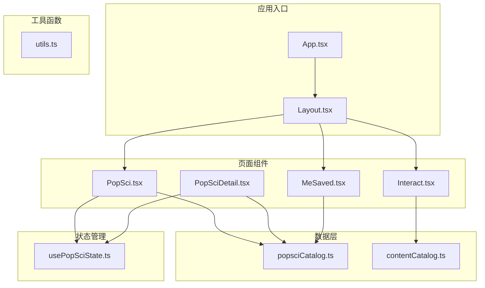
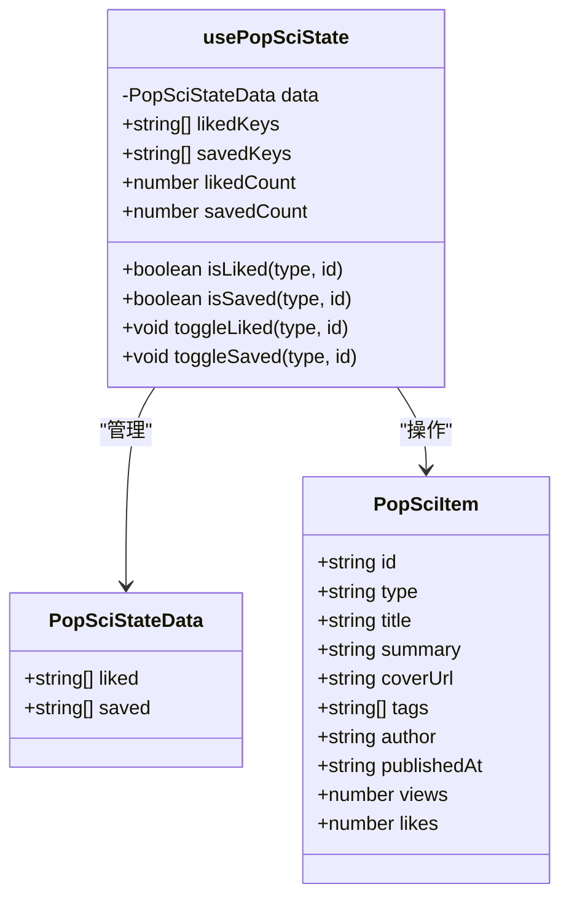
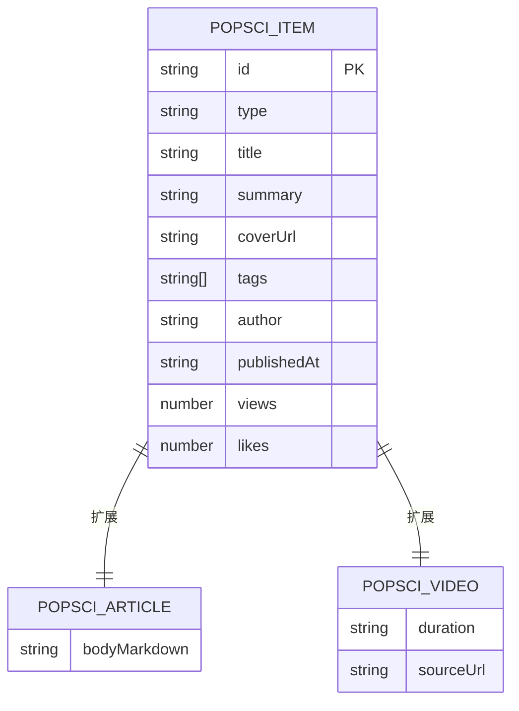
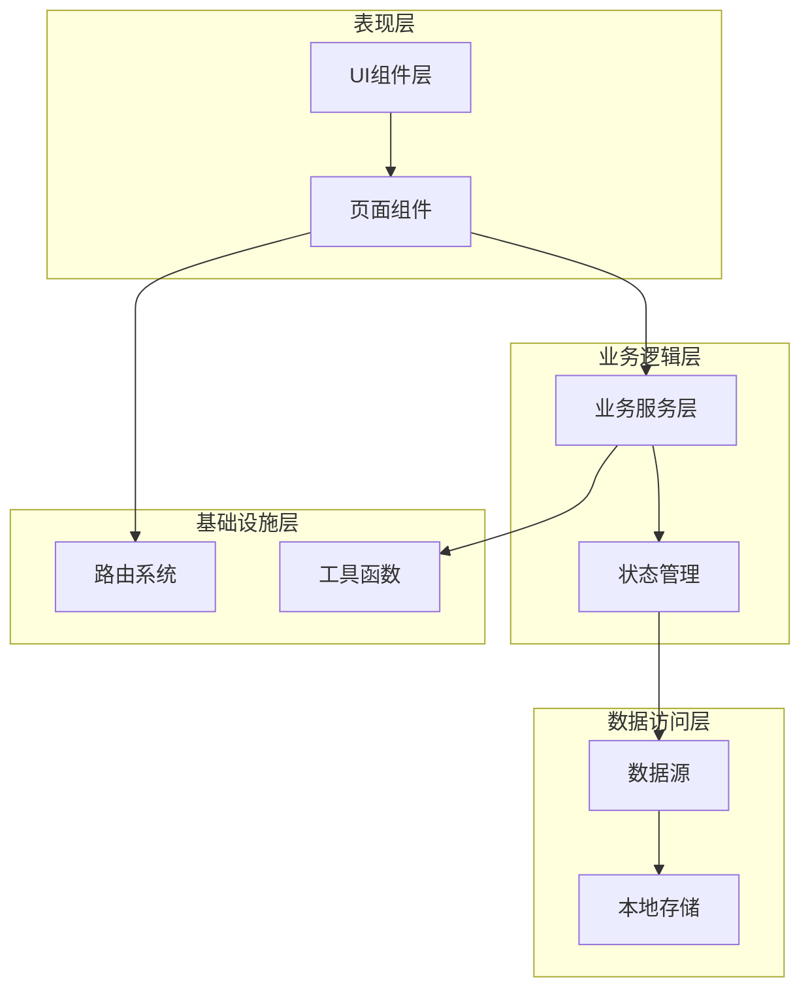
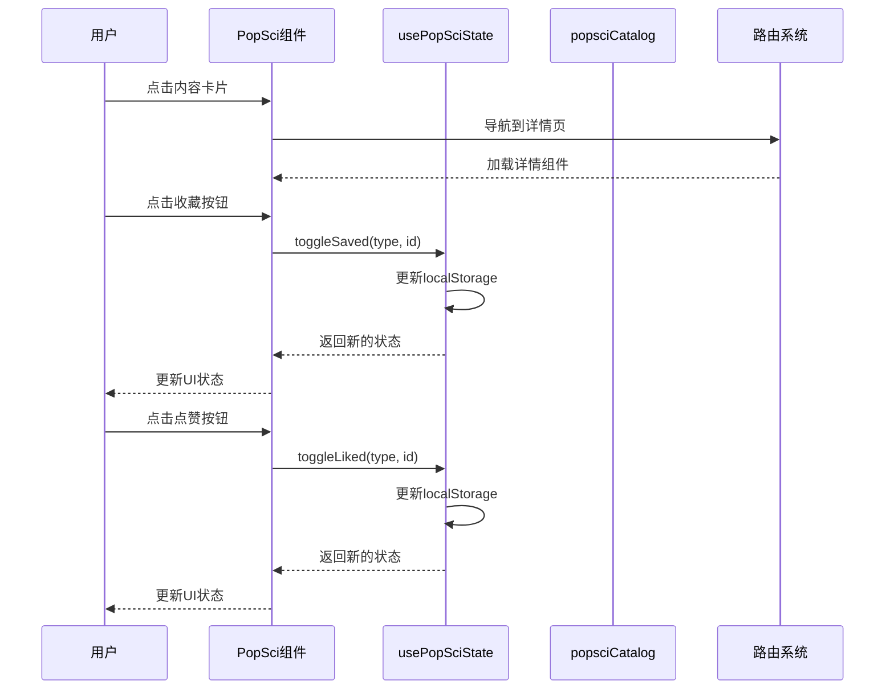
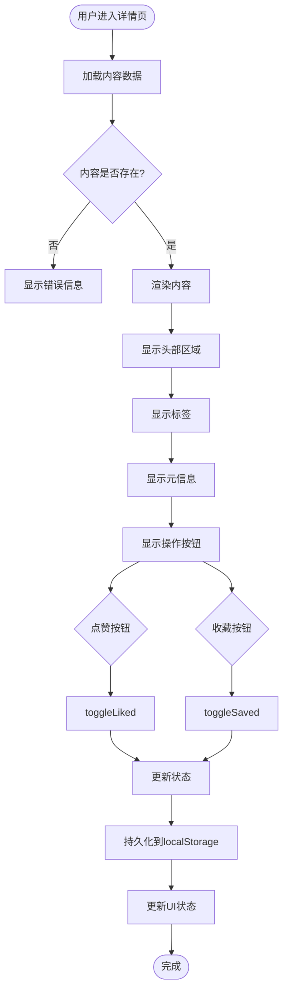
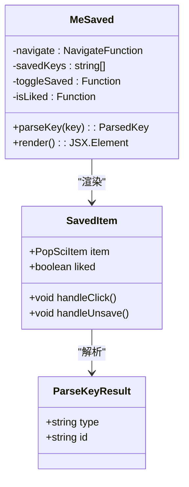
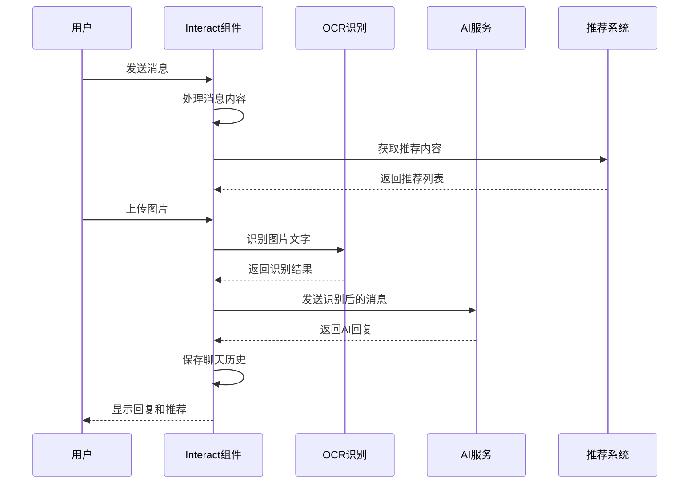
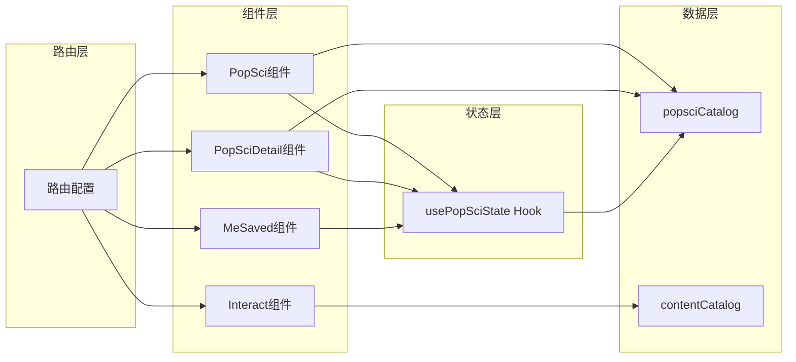
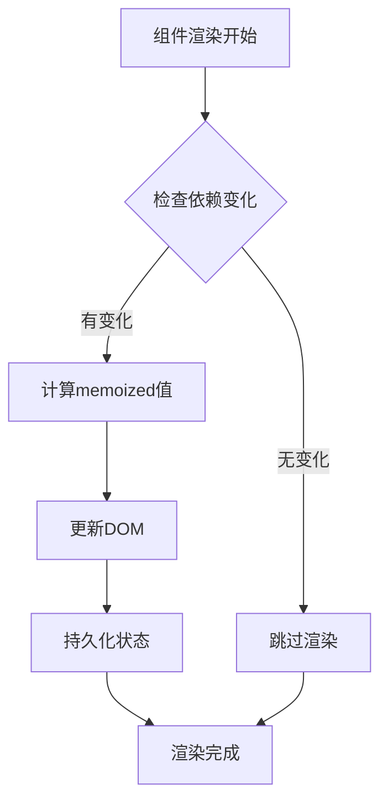

# 科普内容互动设计

<cite>
**本文档引用的文件**
- [2026-04-15-popsci-detail-like-save-design.md](file://docs/superpowers/specs/2026-04-15-popsci-detail-like-save-design.md)
- [Interact.tsx](file://src/pages/Interact.tsx)
- [MeSaved.tsx](file://src/pages/MeSaved.tsx)
- [usePopSciState.ts](file://src/hooks/usePopSciState.ts)
- [popsciCatalog.ts](file://src/data/popsciCatalog.ts)
- [PopSci.tsx](file://src/pages/PopSci.tsx)
- [PopSciDetail.tsx](file://src/pages/PopSciDetail.tsx)
- [contentCatalog.ts](file://src/data/contentCatalog.ts)
- [App.tsx](file://src/App.tsx)
- [Layout.tsx](file://src/components/Layout.tsx)
- [utils.ts](file://src/lib/utils.ts)
</cite>

## 目录
1. [引言](#引言)
2. [项目结构](#项目结构)
3. [核心组件](#核心组件)
4. [架构概览](#架构概览)
5. [详细组件分析](#详细组件分析)
6. [依赖关系分析](#依赖关系分析)
7. [性能考虑](#性能考虑)
8. [故障排除指南](#故障排除指南)
9. [结论](#结论)

## 引言

本项目是一个专注于健康科普内容的移动端应用，主要围绕"科普内容互动设计"这一核心目标进行开发。系统实现了完整的用户互动功能闭环，包括点赞、收藏、分享等核心功能，以及内容状态管理、用户操作持久化和数据一致性保证机制。

项目采用React + TypeScript + Vite技术栈构建，通过本地数据源和localStorage实现完全离线的互动功能体验。系统特别注重用户体验的流畅性和数据的一致性，确保用户在不同页面间的操作状态能够保持一致。

## 项目结构

项目采用模块化组织方式，按照功能域进行文件分离：

**图表来源**
- [App.tsx:19-51](file://src/App.tsx#L19-L51)
- [Layout.tsx:19-65](file://src/components/Layout.tsx#L19-L65)

**章节来源**
- [App.tsx:19-51](file://src/App.tsx#L19-L51)
- [Layout.tsx:19-65](file://src/components/Layout.tsx#L19-L65)

## 核心组件

### 用户互动状态管理

系统的核心是`usePopSciState`自定义Hook，它提供了完整的用户互动状态管理能力：

**图表来源**
- [usePopSciState.ts:30-79](file://src/hooks/usePopSciState.ts#L30-L79)
- [popsciCatalog.ts:3-27](file://src/data/popsciCatalog.ts#L3-L27)

### 内容数据模型

系统定义了统一的内容数据模型，支持文章和视频两种类型：

**图表来源**
- [popsciCatalog.ts:3-27](file://src/data/popsciCatalog.ts#L3-L27)

**章节来源**
- [usePopSciState.ts:30-79](file://src/hooks/usePopSciState.ts#L30-L79)
- [popsciCatalog.ts:3-27](file://src/data/popsciCatalog.ts#L3-L27)

## 架构概览

系统采用分层架构设计，确保各层职责清晰、耦合度低：

**图表来源**
- [App.tsx:25-49](file://src/App.tsx#L25-L49)
- [usePopSciState.ts:30-79](file://src/hooks/usePopSciState.ts#L30-L79)

系统的核心设计理念是"本地数据闭环"，所有用户互动数据都存储在浏览器的localStorage中，确保数据的私密性和离线可用性。

## 详细组件分析

### 科普内容列表组件

PopSci组件负责展示科普内容列表，实现了完整的互动功能：

**图表来源**
- [PopSci.tsx:34-36](file://src/pages/PopSci.tsx#L34-L36)
- [PopSci.tsx:110-140](file://src/pages/PopSci.tsx#L110-L140)
- [usePopSciState.ts:50-64](file://src/hooks/usePopSciState.ts#L50-L64)

### 详情页组件

PopSciDetail组件提供内容详情展示和互动功能：

**图表来源**
- [PopSciDetail.tsx:15-19](file://src/pages/PopSciDetail.tsx#L15-L19)
- [PopSciDetail.tsx:49-72](file://src/pages/PopSciDetail.tsx#L49-L72)
- [usePopSciState.ts:50-64](file://src/hooks/usePopSciState.ts#L50-L64)

### 我的收藏页面

MeSaved组件专门处理用户收藏内容的展示和管理：

**图表来源**
- [MeSaved.tsx:16-28](file://src/pages/MeSaved.tsx#L16-L28)
- [MeSaved.tsx:65-125](file://src/pages/MeSaved.tsx#L65-L125)

### 互动聊天组件

Interact组件提供AI健康助手功能，集成了OCR识别和个性化推荐：

**图表来源**
- [Interact.tsx:250-261](file://src/pages/Interact.tsx#L250-L261)
- [Interact.tsx:86-142](file://src/pages/Interact.tsx#L86-L142)
- [contentCatalog.ts:69-99](file://src/data/contentCatalog.ts#L69-L99)

**章节来源**
- [PopSci.tsx:26-270](file://src/pages/PopSci.tsx#L26-L270)
- [PopSciDetail.tsx:15-150](file://src/pages/PopSciDetail.tsx#L15-L150)
- [MeSaved.tsx:16-132](file://src/pages/MeSaved.tsx#L16-L132)
- [Interact.tsx:37-462](file://src/pages/Interact.tsx#L37-L462)

## 依赖关系分析

系统采用松耦合的设计模式，各组件间通过清晰的接口进行通信：

**图表来源**
- [App.tsx:28-47](file://src/App.tsx#L28-L47)
- [usePopSciState.ts:30-79](file://src/hooks/usePopSciState.ts#L30-L79)

### 数据一致性保证

系统通过以下机制确保数据一致性：

1. **原子性操作**：每个toggle操作都是原子性的，确保状态更新的完整性
2. **本地存储同步**：状态变更立即同步到localStorage，防止数据丢失
3. **类型安全**：使用TypeScript确保数据类型的正确性
4. **错误处理**：完善的try-catch机制处理潜在的异常情况

**章节来源**
- [usePopSciState.ts:13-24](file://src/hooks/usePopSciState.ts#L13-L24)
- [usePopSciState.ts:36-38](file://src/hooks/usePopSciState.ts#L36-L38)

## 性能考虑

### 内存优化

系统采用了多项内存优化策略：

1. **懒加载**：路由组件按需加载，减少初始内存占用
2. **状态缓存**：useMemo和useCallback确保状态计算的高效性
3. **图片优化**：使用响应式图片和适当的尺寸控制

### 渲染性能

**图表来源**
- [PopSci.tsx:32](file://src/pages/PopSci.tsx#L32)
- [usePopSciState.ts:66-78](file://src/hooks/usePopSciState.ts#L66-L78)

### 缓存策略

系统实现了多层次的缓存机制：

1. **状态缓存**：localStorage持久化用户偏好
2. **组件缓存**：useMemo避免重复计算
3. **图片缓存**：浏览器自动缓存静态资源

## 故障排除指南

### 常见问题及解决方案

| 问题类型 | 症状描述 | 可能原因 | 解决方案 |
|---------|---------|---------|---------|
| 状态不同步 | 收藏/点赞状态在不同页面不一致 | localStorage访问异常 | 清除浏览器缓存，检查localStorage权限 |
| 数据丢失 | 刷新后收藏内容消失 | 浏览器禁用localStorage | 检查浏览器设置，允许第三方Cookie |
| 性能问题 | 页面切换卡顿 | 组件重渲染过多 | 使用React DevTools分析渲染性能 |
| 图片加载失败 | 内容图片无法显示 | 网络连接问题 | 检查网络连接，刷新页面 |

### 调试工具

系统提供了完善的调试支持：

1. **React DevTools**：分析组件树和状态变化
2. **浏览器开发者工具**：监控localStorage使用情况
3. **网络面板**：检查API调用和响应时间

**章节来源**
- [usePopSciState.ts:13-24](file://src/hooks/usePopSciState.ts#L13-L24)
- [Interact.tsx:70-84](file://src/pages/Interact.tsx#L70-L84)

## 结论

本项目成功实现了完整的科普内容互动功能设计，具有以下特点：

### 技术优势

1. **本地数据闭环**：完全基于localStorage实现，确保数据私密性和离线可用性
2. **类型安全**：完整的TypeScript类型系统，提供编译时错误检测
3. **性能优化**：采用多种优化策略，确保流畅的用户体验
4. **可维护性**：清晰的模块化架构，便于后续功能扩展

### 功能完整性

系统实现了用户期望的所有核心功能：
- 点赞、收藏、分享等互动操作
- 完整的内容状态管理
- 本地数据持久化
- 个性化推荐集成
- 错误处理和性能优化

### 扩展性考虑

项目为未来的功能扩展预留了充足的空间：
- 用户认证系统的集成点
- 后端API的对接接口
- 更复杂的推荐算法
- 多设备同步机制

通过精心设计的状态管理和数据流，系统为用户提供了一个稳定、可靠且具有良好扩展性的科普内容互动平台。