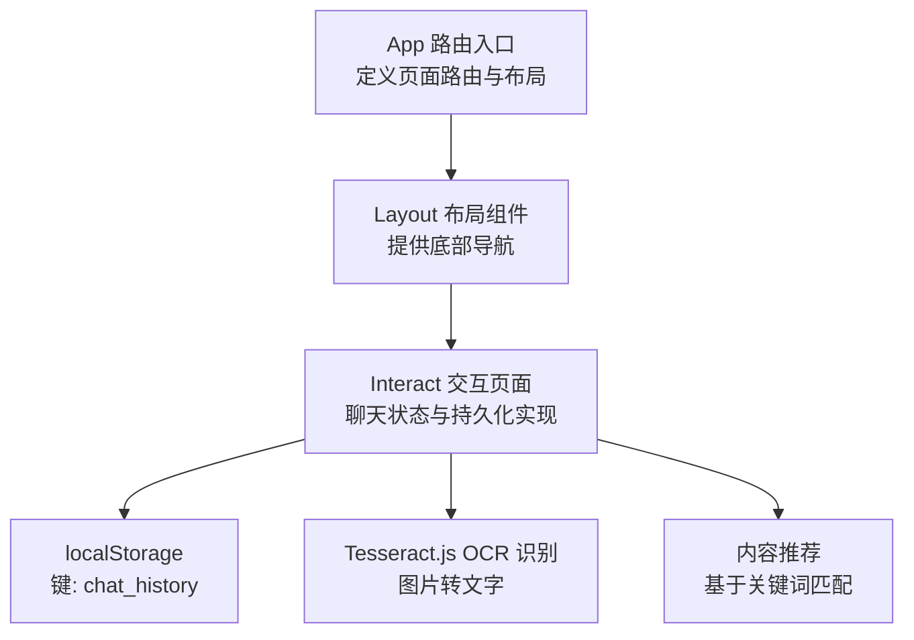
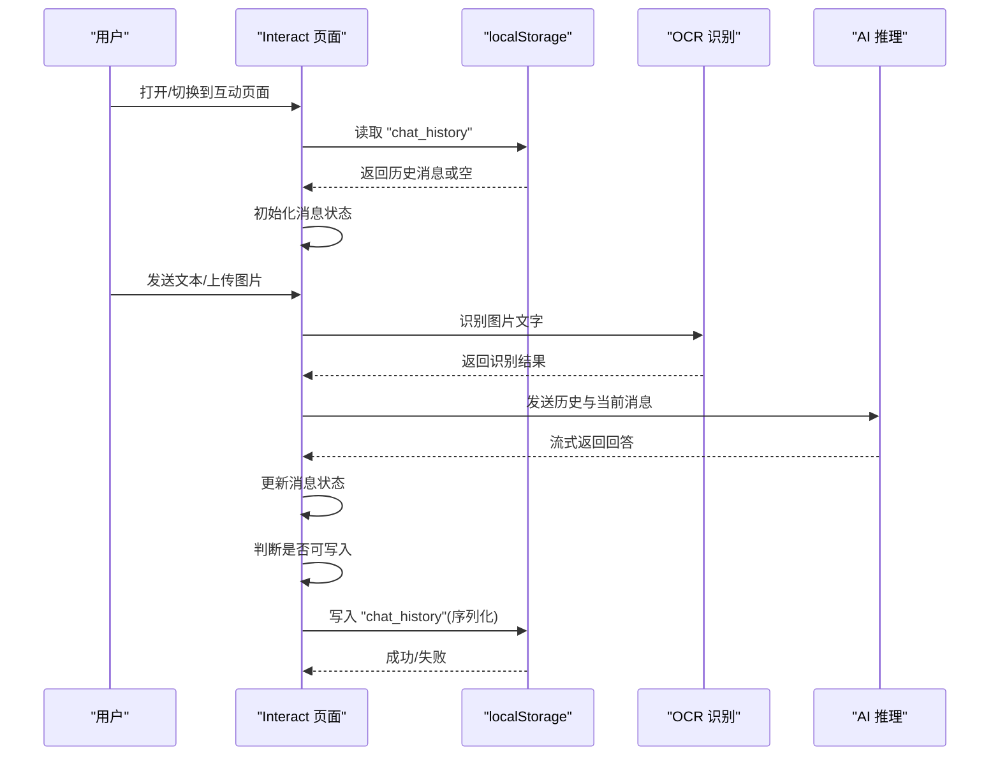
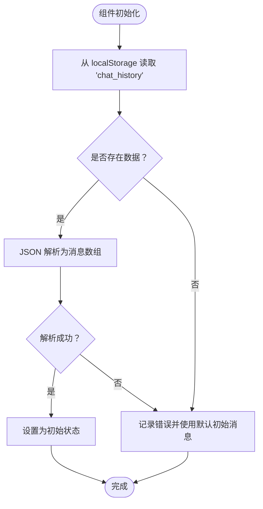
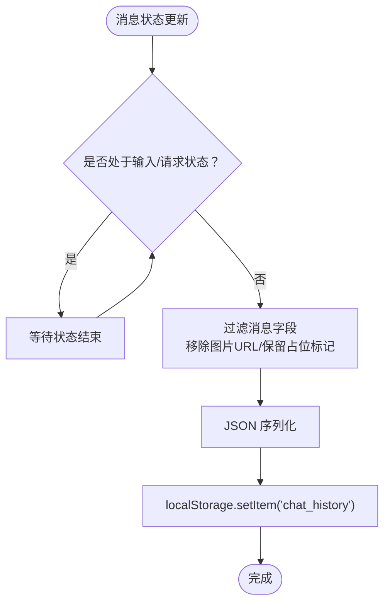
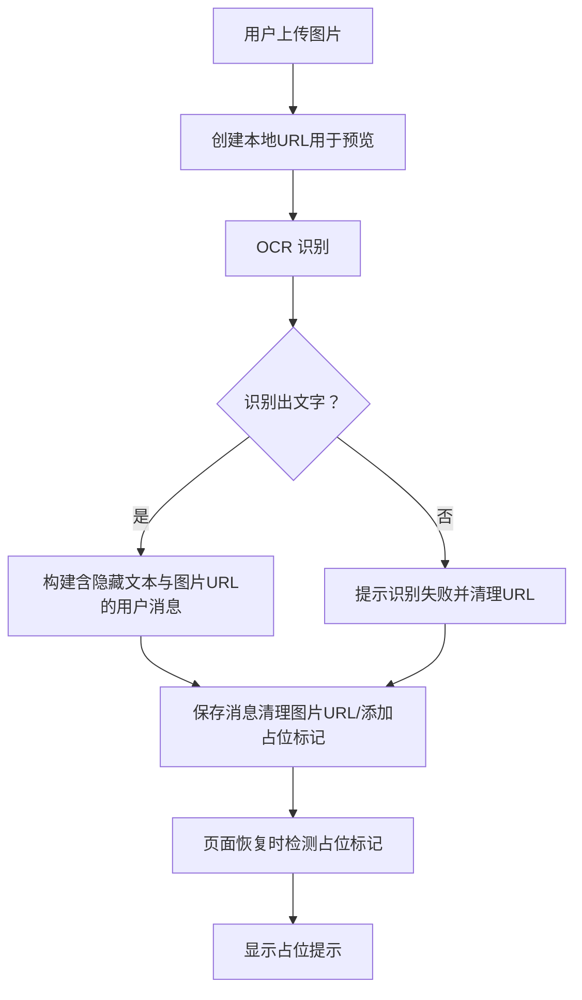
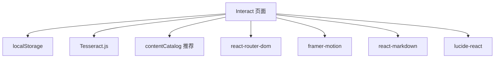

# 聊天历史持久化设计

<cite>
**本文档引用的文件**
- [Interact.tsx](file://src/pages/Interact.tsx)
- [2026-04-14-chat-persistence-design.md](file://docs/superpowers/specs/2026-04-14-chat-persistence-design.md)
- [App.tsx](file://src/App.tsx)
- [Layout.tsx](file://src/components/Layout.tsx)
- [usePopSciState.ts](file://src/hooks/usePopSciState.ts)
- [contentCatalog.ts](file://src/data/contentCatalog.ts)
- [package.json](file://package.json)
</cite>

## 目录
1. [引言](#引言)
2. [项目结构](#项目结构)
3. [核心组件](#核心组件)
4. [架构总览](#架构总览)
5. [详细组件分析](#详细组件分析)
6. [依赖关系分析](#依赖关系分析)
7. [性能考量](#性能考量)
8. [故障排查指南](#故障排查指南)
9. [结论](#结论)
10. [附录](#附录)

## 引言
本设计文档围绕聊天历史持久化展开，目标是解决用户在页面切换或刷新后聊天记录丢失的问题。通过对现有实现的深入分析，明确为何选择 localStorage 作为持久化方案，并系统阐述其数据读取、写入机制、图片处理策略、序列化与状态监听、存储空间管理以及图片 URL 失效的应对方法。同时提供性能优化建议、错误处理与边界情况处理的最佳实践，以提升用户体验与系统稳定性。

## 项目结构
本项目采用 React + TypeScript + Vite 技术栈，聊天历史持久化主要集中在交互页面组件中实现。路由由应用入口统一管理，底部导航提供页面切换能力，交互页面负责聊天状态与持久化逻辑。

**图表来源**
- [App.tsx: 19-51:19-51](file://src/App.tsx#L19-L51)
- [Layout.tsx: 19-65:19-65](file://src/components/Layout.tsx#L19-L65)
- [Interact.tsx: 37-462:37-462](file://src/pages/Interact.tsx#L37-L462)

**章节来源**
- [App.tsx: 19-51:19-51](file://src/App.tsx#L19-L51)
- [Layout.tsx: 19-65:19-65](file://src/components/Layout.tsx#L19-L65)

## 核心组件
- 交互页面（Interact.tsx）
  - 负责聊天消息的渲染、输入处理、OCR 图片识别、AI 对话流式响应、内容推荐以及持久化逻辑。
  - 关键职责包括：从 localStorage 恢复聊天历史、在合适时机序列化并写入 localStorage、对图片消息进行清理与占位展示。
- 路由与布局（App.tsx、Layout.tsx）
  - App 定义页面路由，Layout 提供底部导航，用户可在不同页面间切换，验证聊天历史在页面切换后的持久性。
- 内容推荐（contentCatalog.ts）
  - 提供关键词匹配与推荐内容生成，用于在 AI 回答中附加相关内容卡片。
- 其他持久化参考（usePopSciState.ts）
  - 展示了另一个 localStorage 的使用范式，可用于借鉴其安全解析与监听写入模式。

**章节来源**
- [Interact.tsx: 37-462:37-462](file://src/pages/Interact.tsx#L37-L462)
- [contentCatalog.ts: 65-101:65-101](file://src/data/contentCatalog.ts#L65-L101)
- [usePopSciState.ts: 30-79:30-79](file://src/hooks/usePopSciState.ts#L30-L79)

## 架构总览
聊天历史持久化架构围绕 Interact 页面展开，结合 localStorage 实现跨页面与刷新的持久化。系统流程包括：组件初始化时从 localStorage 读取历史 -> 用户交互产生新消息 -> 在合适时机序列化写入 localStorage -> UI 根据消息类型与标记进行渲染（含图片占位）。

**图表来源**
- [Interact.tsx: 37-462:37-462](file://src/pages/Interact.tsx#L37-L462)
- [2026-04-14-chat-persistence-design.md: 11-18:11-18](file://docs/superpowers/specs/2026-04-14-chat-persistence-design.md#L11-L18)

## 详细组件分析

### 1) 为什么需要持久化：从组件状态到持久化存储
- 现状：消息仅保存在组件状态中，切换路由或刷新会导致组件重新挂载，状态丢失。
- 目标：确保用户在不同页面间切换或刷新后，聊天历史得以保留，提升连续性体验。
- 方案选择：localStorage（简单易用、跨页面/刷新不丢失）、sessionStorage（关闭标签页即丢失）、IndexedDB（复杂度高、适合海量数据）。

**章节来源**
- [2026-04-14-chat-persistence-design.md: 3-10:3-10](file://docs/superpowers/specs/2026-04-14-chat-persistence-design.md#L3-L10)

### 2) 数据读取机制：初始化与恢复
- 初始化阶段：组件构造函数中从 localStorage 读取 "chat_history" 键值，若存在则解析为消息数组，否则使用默认初始消息。
- 容错处理：解析失败时记录错误并回退到默认初始消息，保证系统可用性。

**图表来源**
- [Interact.tsx: 37-49:37-49](file://src/pages/Interact.tsx#L37-L49)

**章节来源**
- [Interact.tsx: 37-49:37-49](file://src/pages/Interact.tsx#L37-L49)

### 3) 数据写入机制：序列化与监听
- 写入触发条件：当非输入/请求状态（isTyping、isOcrProcessing）时，才进行写入，避免频繁写入影响性能。
- 序列化策略：对消息进行映射，过滤掉可能占用空间的图片 URL 字段，必要时添加占位标记，随后 JSON 序列化并写入 localStorage。
- 监听方式：通过 useEffect 监听消息状态变化，实现自动持久化。

**图表来源**
- [Interact.tsx: 70-84:70-84](file://src/pages/Interact.tsx#L70-L84)

**章节来源**
- [Interact.tsx: 70-84:70-84](file://src/pages/Interact.tsx#L70-L84)

### 4) 图片处理策略：URL 清理与占位展示
- 上传与预览：使用 URL.createObjectURL 生成本地图片 URL 用于预览，识别完成后根据结果决定是否保留 URL。
- 存储策略：在保存前清理消息中的图片 URL，避免 localStorage 溢出；同时为曾经包含图片的消息添加占位标记。
- 展示策略：恢复时若检测到占位标记或缺失图片 URL，UI 显示占位提示（如“已过期的图片”），告知用户图片不可见但历史仍在。

**图表来源**
- [Interact.tsx: 86-142:86-142](file://src/pages/Interact.tsx#L86-L142)
- [Interact.tsx: 316-333:316-333](file://src/pages/Interact.tsx#L316-L333)

**章节来源**
- [Interact.tsx: 86-142:86-142](file://src/pages/Interact.tsx#L86-L142)
- [Interact.tsx: 316-333:316-333](file://src/pages/Interact.tsx#L316-L333)

### 5) 状态监听与 UI 渲染
- 滚动监听：每次消息变化时自动滚动到底部，保证用户看到最新消息。
- 输入禁用：在 OCR 或 AI 响应期间禁用输入，避免并发状态引发异常。
- 占位渲染：当消息被标记为图片占位时，UI 显示占位图标或提示，增强可感知性。

**章节来源**
- [Interact.tsx: 64-68:64-68](file://src/pages/Interact.tsx#L64-L68)
- [Interact.tsx: 410-421:410-421](file://src/pages/Interact.tsx#L410-L421)
- [Interact.tsx: 325-333:325-333](file://src/pages/Interact.tsx#L325-L333)

### 6) 数据迁移与错误处理
- 解析容错：初始化时对 localStorage 数据进行 JSON 解析，失败则记录错误并回退到默认初始消息。
- 写入容错：在写入前进行状态判断，避免在输入/请求期间写入；识别失败时及时清理本地 URL。
- 边界情况：空数据、非法 JSON、存储空间不足（通过字段清理缓解）、图片 URL 失效（通过占位提示与标记处理）。

**章节来源**
- [Interact.tsx: 42-47:42-47](file://src/pages/Interact.tsx#L42-L47)
- [Interact.tsx: 128-136:128-136](file://src/pages/Interact.tsx#L128-L136)

### 7) 与其他持久化方案的对比与选择理由
- localStorage
  - 优点：简单易用、跨页面/刷新不丢失、容量适中（约 5MB）。
  - 适用：聊天历史这类中等体量数据，配合字段清理可满足需求。
- sessionStorage
  - 优点：简单易用。
  - 缺点：关闭标签页即丢失，不适合聊天历史持久化。
- IndexedDB
  - 优点：支持大量数据与二进制存储。
  - 缺点：实现复杂、开发成本高，当前项目体量无需此方案。

**章节来源**
- [2026-04-14-chat-persistence-design.md: 6-10:6-10](file://docs/superpowers/specs/2026-04-14-chat-persistence-design.md#L6-L10)

### 8) 与内容推荐的集成
- 当 AI 回答完成后，系统根据用户查询内容调用推荐模块，生成相关内容卡片并附加到消息中。
- 推荐模块基于关键词匹配与默认推荐集，确保在无 API 密钥时仍能提供基础体验。

**章节来源**
- [Interact.tsx: 231-235:231-235](file://src/pages/Interact.tsx#L231-L235)
- [contentCatalog.ts: 69-99:69-99](file://src/data/contentCatalog.ts#L69-L99)

## 依赖关系分析
- 组件耦合
  - Interact 与 localStorage：通过键 "chat_history" 进行读写，耦合度低，便于替换其他存储方案。
  - Interact 与 OCR：依赖 Tesseract.js 进行图片识别，识别结果参与消息构建。
  - Interact 与推荐：依赖 contentCatalog 的关键词匹配与默认推荐集。
- 外部依赖
  - react-router-dom：提供路由与页面切换能力，验证持久化在页面切换后的有效性。
  - framer-motion、react-markdown、lucide-react：提供动画与渲染能力，不影响持久化逻辑。

**图表来源**
- [Interact.tsx: 1-10:1-10](file://src/pages/Interact.tsx#L1-L10)
- [package.json: 13-26:13-26](file://package.json#L13-L26)

**章节来源**
- [package.json: 13-26:13-26](file://package.json#L13-L26)

## 性能考量
- 写入频率控制：仅在非输入/请求状态时写入，减少不必要的存储操作。
- 序列化成本：对消息进行字段清理后再序列化，降低存储体积，缓解 localStorage 容量压力。
- UI 渲染优化：使用动画与懒加载策略，避免在大量消息场景下出现卡顿。
- OCR 与流式响应：识别与流式响应在后台执行，避免阻塞主线程；识别失败时及时清理本地 URL，释放内存。

**章节来源**
- [Interact.tsx: 70-84:70-84](file://src/pages/Interact.tsx#L70-L84)
- [Interact.tsx: 94-142:94-142](file://src/pages/Interact.tsx#L94-L142)

## 故障排查指南
- 无法恢复历史
  - 检查 localStorage 中 "chat_history" 是否存在且为合法 JSON。
  - 若解析失败，确认是否被其他逻辑覆盖或被浏览器清理。
- 写入不生效
  - 确认当前是否处于输入/请求状态（isTyping、isOcrProcessing），只有在非输入/请求状态下才会写入。
  - 检查浏览器是否禁用了 localStorage 或存储空间是否已满。
- 图片无法显示
  - 确认消息是否被标记为图片占位；若是，UI 将显示占位提示。
  - 检查本地 URL 是否被清理或失效。
- OCR 识别失败
  - 查看控制台错误日志，确认识别流程是否正常终止与清理。
  - 确认文件类型与大小是否符合要求。

**章节来源**
- [Interact.tsx: 42-47:42-47](file://src/pages/Interact.tsx#L42-L47)
- [Interact.tsx: 128-136:128-136](file://src/pages/Interact.tsx#L128-L136)

## 结论
通过在 Interact 页面中引入 localStorage 持久化，有效解决了页面切换与刷新导致的聊天记录丢失问题。结合状态监听、序列化与图片字段清理策略，既保证了用户体验的连续性，又在有限的存储空间内实现了稳定运行。未来如需扩展至更大体量或更复杂的场景，可考虑引入 IndexedDB 或服务端同步方案。

## 附录
- 相关实现路径
  - 初始化与恢复：[Interact.tsx: 37-49:37-49](file://src/pages/Interact.tsx#L37-L49)
  - 写入监听与序列化：[Interact.tsx: 70-84:70-84](file://src/pages/Interact.tsx#L70-L84)
  - 图片上传与占位：[Interact.tsx: 86-142:86-142](file://src/pages/Interact.tsx#L86-L142)、[Interact.tsx: 316-333:316-333](file://src/pages/Interact.tsx#L316-L333)
  - 推荐集成：[Interact.tsx: 231-235:231-235](file://src/pages/Interact.tsx#L231-L235)、[contentCatalog.ts: 69-99:69-99](file://src/data/contentCatalog.ts#L69-L99)
  - 路由与布局：[App.tsx: 19-51:19-51](file://src/App.tsx#L19-L51)、[Layout.tsx: 19-65:19-65](file://src/components/Layout.tsx#L19-L65)
  - 参考持久化模式：[usePopSciState.ts: 30-79:30-79](file://src/hooks/usePopSciState.ts#L30-L79)