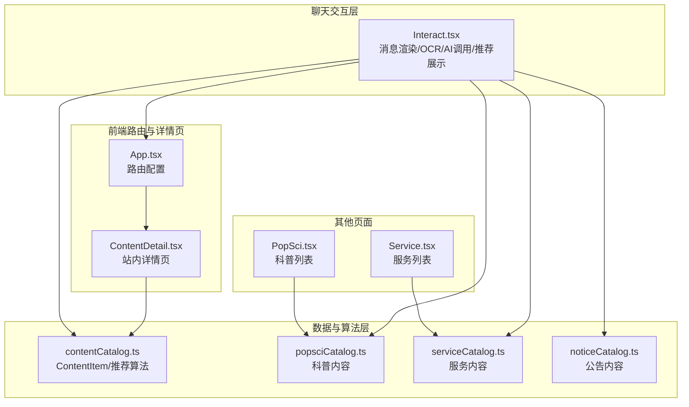
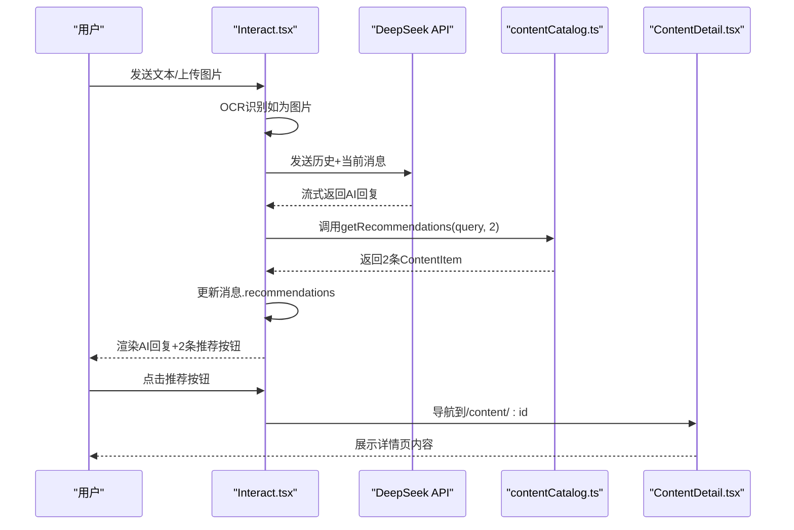
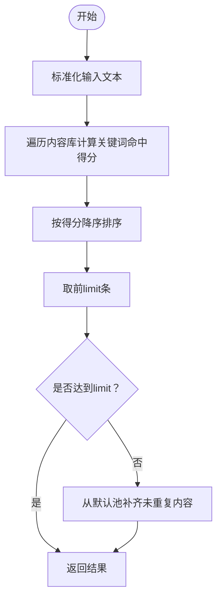
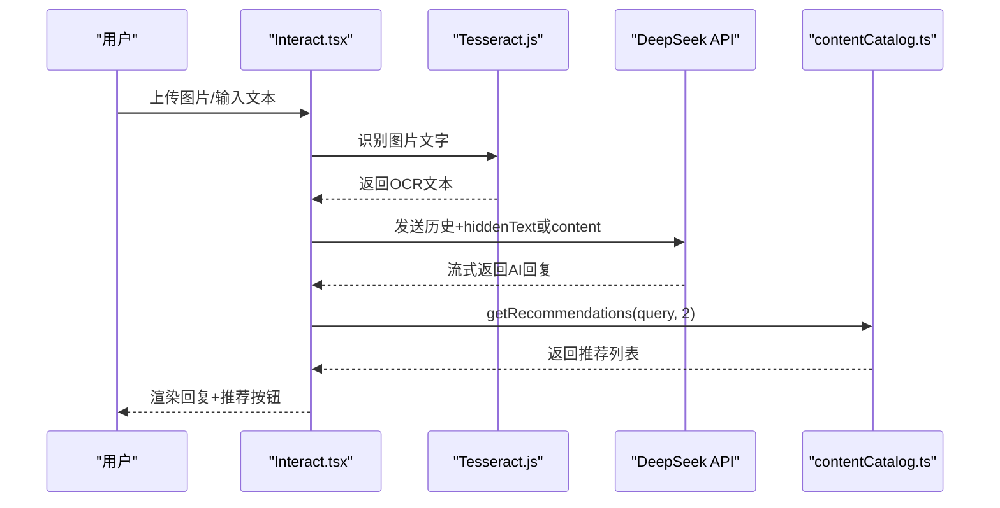
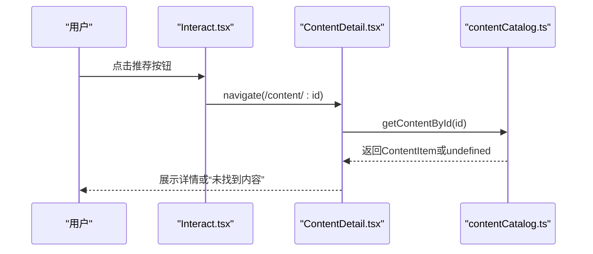
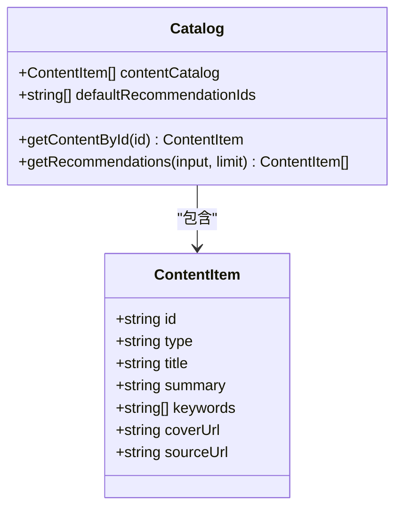
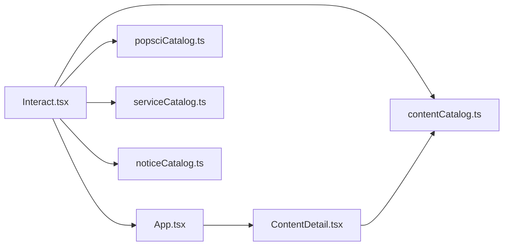

# 聊天推荐系统设计

<cite>
**本文档引用的文件**
- [2026-04-14-chat-recommendations-design.md](file://docs/superpowers/specs/2026-04-14-chat-recommendations-design.md)
- [Interact.tsx](file://src/pages/Interact.tsx)
- [contentCatalog.ts](file://src/data/contentCatalog.ts)
- [ContentDetail.tsx](file://src/pages/ContentDetail.tsx)
- [App.tsx](file://src/App.tsx)
- [popsciCatalog.ts](file://src/data/popsciCatalog.ts)
- [serviceCatalog.ts](file://src/data/serviceCatalog.ts)
- [noticeCatalog.ts](file://src/data/noticeCatalog.ts)
- [PopSci.tsx](file://src/pages/PopSci.tsx)
- [Service.tsx](file://src/pages/Service.tsx)
</cite>

## 目录
1. [简介](#简介)
2. [项目结构](#项目结构)
3. [核心组件](#核心组件)
4. [架构总览](#架构总览)
5. [详细组件分析](#详细组件分析)
6. [依赖关系分析](#依赖关系分析)
7. [性能考虑](#性能考虑)
8. [故障排查指南](#故障排查指南)
9. [结论](#结论)
10. [附录](#附录)

## 简介
本设计文档面向AI健康助手的聊天推荐系统，聚焦于对话后的智能推荐机制。系统在用户每次提问并收到AI回复后，在AI消息气泡下方自动展示2条相关推荐内容，引导用户继续阅读科普内容、观看视频或了解服务包/商品。推荐内容来源于本地固定内容库，采用关键词规则匹配，确保稳定性与可控性。点击推荐项将导航至站内详情页，实现闭环体验。

## 项目结构
推荐系统涉及的核心文件分布如下：
- 规划文档：定义推荐策略、数据结构与验收标准
- 交互页面：负责消息渲染、OCR识别、AI调用与推荐展示
- 内容库：统一的内容数据结构与推荐算法实现
- 详情页：站内详情页路由与内容展示
- 路由配置：新增`/content/:id`路由
- 其他内容模块：科普、服务、公告等作为内容生态的一部分

图表来源
- [Interact.tsx:1-462](file://src/pages/Interact.tsx#L1-L462)
- [contentCatalog.ts:1-101](file://src/data/contentCatalog.ts#L1-L101)
- [App.tsx:1-52](file://src/App.tsx#L1-L52)
- [ContentDetail.tsx:1-134](file://src/pages/ContentDetail.tsx#L1-L134)
- [popsciCatalog.ts:1-98](file://src/data/popsciCatalog.ts#L1-L98)
- [serviceCatalog.ts:1-49](file://src/data/serviceCatalog.ts#L1-L49)
- [noticeCatalog.ts:1-59](file://src/data/noticeCatalog.ts#L1-L59)
- [PopSci.tsx:1-270](file://src/pages/PopSci.tsx#L1-L270)
- [Service.tsx:1-133](file://src/pages/Service.tsx#L1-L133)

章节来源
- [Interact.tsx:1-462](file://src/pages/Interact.tsx#L1-L462)
- [contentCatalog.ts:1-101](file://src/data/contentCatalog.ts#L1-L101)
- [App.tsx:1-52](file://src/App.tsx#L1-L52)

## 核心组件
- 推荐策略与算法
  - 输入文本：优先使用OCR隐藏文本（含报告解读引导语），否则使用用户输入文本
  - 匹配规则：对每条内容的关键词执行包含匹配，命中一个关键词得1分，按分数倒序取前2条；不足时使用默认池补齐，去重保证唯一性
  - 输出：返回最多2条ContentItem，供UI渲染为推荐按钮
- 消息数据结构增强
  - AI消息新增recommendations字段，承载推荐结果
- 站内详情页
  - 路由：/content/:id
  - 展示：标题、类型标签、摘要、关键词、相关服务入口、外链按钮（如有）

章节来源
- [2026-04-14-chat-recommendations-design.md:55-102](file://docs/superpowers/specs/2026-04-14-chat-recommendations-design.md#L55-L102)
- [contentCatalog.ts:69-99](file://src/data/contentCatalog.ts#L69-L99)
- [Interact.tsx:18-27](file://src/pages/Interact.tsx#L18-L27)
- [Interact.tsx:353-376](file://src/pages/Interact.tsx#L353-L376)
- [ContentDetail.tsx:14-134](file://src/pages/ContentDetail.tsx#L14-L134)

## 架构总览
推荐系统采用“本地固定内容库 + 规则匹配”的轻量级架构，确保低延迟与高稳定性。AI回复完成后，系统根据对话上下文调用推荐算法，将结果注入消息对象并在UI中渲染推荐按钮。点击按钮导航至站内详情页，形成从“对话—推荐—详情—服务/商品”的完整闭环。

图表来源
- [Interact.tsx:144-248](file://src/pages/Interact.tsx#L144-L248)
- [contentCatalog.ts:69-99](file://src/data/contentCatalog.ts#L69-L99)
- [ContentDetail.tsx:14-134](file://src/pages/ContentDetail.tsx#L14-L134)

## 详细组件分析

### 推荐算法组件分析
- 数据结构
  - ContentItem：统一的文章/视频/服务/商品结构，包含id、type、title、summary、keywords等
  - 默认推荐池：固定id集合，用于无命中时补齐
- 匹配与排序
  - 将输入文本标准化为小写，遍历内容库逐条统计关键词命中数
  - 按命中数降序排序，取前limit条
  - 若不足limit条，则从默认池中挑选未重复的内容补齐
- 性能特征
  - 时间复杂度：O(N×K)，N为内容库规模，K为平均关键词数量
  - 空间复杂度：O(N)
  - 优化建议：可引入关键词索引、缓存命中结果、限制输入长度

图表来源
- [contentCatalog.ts:69-99](file://src/data/contentCatalog.ts#L69-L99)

章节来源
- [contentCatalog.ts:1-101](file://src/data/contentCatalog.ts#L1-L101)
- [2026-04-14-chat-recommendations-design.md:55-68](file://docs/superpowers/specs/2026-04-14-chat-recommendations-design.md#L55-L68)

### 交互页面组件分析
- 消息渲染
  - 支持用户/AI消息气泡、图片展示、Markdown渲染
  - AI消息气泡下方渲染recommendations按钮列表
- OCR与图片处理
  - 使用tesseract.js进行OCR识别，生成隐藏文本hiddenText仅用于AI模型
  - 本地预览图片URL，识别完成后终止worker并清理URL
- AI调用与流式响应
  - 构造历史对话记录，优先使用hiddenText
  - 调用DeepSeek API，启用流式传输，逐步更新AI回复
  - 异常兜底：API失败时仍返回本地推荐
- 推荐展示
  - 按类型标签、标题渲染推荐按钮，点击导航至站内详情页

图表来源
- [Interact.tsx:86-142](file://src/pages/Interact.tsx#L86-L142)
- [Interact.tsx:144-248](file://src/pages/Interact.tsx#L144-L248)
- [contentCatalog.ts:69-99](file://src/data/contentCatalog.ts#L69-L99)

章节来源
- [Interact.tsx:18-27](file://src/pages/Interact.tsx#L18-L27)
- [Interact.tsx:353-376](file://src/pages/Interact.tsx#L353-L376)
- [Interact.tsx:144-248](file://src/pages/Interact.tsx#L144-L248)

### 站内详情页组件分析
- 路由与导航
  - 新增/content/:id路由，点击推荐按钮触发导航
- 内容展示
  - 标题、类型标签、摘要、关键词
  - 相关服务入口与外链按钮（若有sourceUrl）
- 错误处理
  - 当id不存在时，展示友好提示与返回按钮

图表来源
- [App.tsx:45](file://src/App.tsx#L45)
- [ContentDetail.tsx:14-134](file://src/pages/ContentDetail.tsx#L14-L134)
- [contentCatalog.ts:65-67](file://src/data/contentCatalog.ts#L65-L67)

章节来源
- [App.tsx:45](file://src/App.tsx#L45)
- [ContentDetail.tsx:14-134](file://src/pages/ContentDetail.tsx#L14-L134)
- [contentCatalog.ts:65-67](file://src/data/contentCatalog.ts#L65-L67)

### 内容库与数据模型
- 统一内容模型
  - ContentItem：文章/视频/服务/商品的统一结构，便于跨类型推荐
- 内容类型与关键词
  - 关键词用于规则匹配，提升推荐相关性
- 默认推荐池
  - 固定id集合，保障无命中时的推荐稳定性

图表来源
- [contentCatalog.ts:3-11](file://src/data/contentCatalog.ts#L3-L11)
- [contentCatalog.ts:13-67](file://src/data/contentCatalog.ts#L13-L67)
- [contentCatalog.ts:69-99](file://src/data/contentCatalog.ts#L69-L99)

章节来源
- [contentCatalog.ts:1-101](file://src/data/contentCatalog.ts#L1-L101)

## 依赖关系分析
- 组件耦合
  - Interact.tsx依赖contentCatalog.ts的推荐算法与内容查询
  - App.tsx新增路由，ContentDetail.tsx依赖contentCatalog.ts进行内容检索
- 数据流向
  - 用户输入→OCR/历史拼接→AI流式响应→推荐算法→消息对象→UI渲染
- 外部依赖
  - DeepSeek API用于AI回复
  - Tesseract.js用于图片OCR
  - React Router用于站内导航

图表来源
- [Interact.tsx:1-462](file://src/pages/Interact.tsx#L1-L462)
- [contentCatalog.ts:1-101](file://src/data/contentCatalog.ts#L1-L101)
- [App.tsx:1-52](file://src/App.tsx#L1-L52)
- [ContentDetail.tsx:1-134](file://src/pages/ContentDetail.tsx#L1-L134)
- [popsciCatalog.ts:1-98](file://src/data/popsciCatalog.ts#L1-L98)
- [serviceCatalog.ts:1-49](file://src/data/serviceCatalog.ts#L1-L49)
- [noticeCatalog.ts:1-59](file://src/data/noticeCatalog.ts#L1-L59)

章节来源
- [Interact.tsx:1-462](file://src/pages/Interact.tsx#L1-L462)
- [App.tsx:1-52](file://src/App.tsx#L1-L52)

## 性能考虑
- 推荐算法优化
  - 引入关键词索引：为每个ContentItem的keywords建立反向索引，降低查找成本
  - 结果缓存：对常见查询进行本地缓存，避免重复计算
  - 输入长度限制：对OCR文本与用户输入进行截断，控制匹配复杂度
- UI渲染优化
  - 推荐按钮使用浅渲染，避免不必要的重绘
  - 滚动容器使用虚拟化（如需扩展）
- 网络与API
  - 流式响应已降低首屏等待
  - 增加重试与超时控制，提升鲁棒性
- 存储与历史
  - 本地历史记录仅保存必要字段，避免图片数据膨胀
  - 定期清理过期图片占位

[本节为通用性能建议，无需特定文件来源]

## 故障排查指南
- OCR识别失败
  - 现象：图片上传后无OCR文本或报错
  - 排查：确认图片格式、清晰度；检查worker终止与URL清理逻辑
- API调用异常
  - 现象：AI回复失败，但仍返回本地推荐
  - 排查：检查环境变量VITE_DEEPSEEK_API_KEY；查看网络与权限
- 推荐无命中
  - 现象：推荐列表为空或少于2条
  - 排查：检查输入文本是否包含关键词；确认默认池id有效且未重复
- 详情页空白
  - 现象：/content/:id显示“未找到内容”
  - 排查：确认id存在；检查contentCatalog中是否存在该id

章节来源
- [Interact.tsx:86-142](file://src/pages/Interact.tsx#L86-L142)
- [Interact.tsx:144-248](file://src/pages/Interact.tsx#L144-L248)
- [ContentDetail.tsx:43-56](file://src/pages/ContentDetail.tsx#L43-L56)
- [contentCatalog.ts:69-99](file://src/data/contentCatalog.ts#L69-L99)

## 结论
本推荐系统以“本地固定内容库 + 规则匹配”为核心，实现了低延迟、高稳定的对话后推荐能力。通过清晰的消息数据结构、完善的OCR与AI集成、以及站内详情页的闭环设计，系统在不引入外部推荐接口的前提下，提供了可控且可扩展的个性化体验。未来可在关键词索引、缓存策略与A/B测试等方面进一步优化，以提升推荐质量与用户转化。

[本节为总结性内容，无需特定文件来源]

## 附录

### 推荐系统与AI交互模块的集成方式
- 数据流转
  - 用户输入→OCR识别→历史拼接→AI流式响应→推荐算法→消息对象→UI渲染
- 关键集成点
  - Interact.tsx中fetchAIResponse负责历史构造与流式解析
  - 推荐算法在AI回复完成后调用，确保上下文相关性
  - 点击推荐按钮导航至站内详情页，形成闭环

章节来源
- [Interact.tsx:144-248](file://src/pages/Interact.tsx#L144-L248)
- [contentCatalog.ts:69-99](file://src/data/contentCatalog.ts#L69-L99)

### 推荐效果监控与持续改进
- 监控指标（建议）
  - 推荐命中率：推荐列表中至少1条命中的比例
  - 点击率：推荐按钮点击次数/AI回复展示次数
  - 跳失率：进入详情页后未产生后续动作的比例
  - 平均停留时长：详情页停留时长
- A/B测试方案（建议）
  - 对比关键词匹配阈值、默认池权重、推荐类型多样性
  - 对比UI样式与文案，评估对点击率的影响
- 持续改进机制（建议）
  - 基于用户行为日志与反馈，动态调整关键词权重与默认池
  - 引入用户偏好信号（收藏、点赞、浏览时长）优化排序

[本节为通用方法论建议，无需特定文件来源]