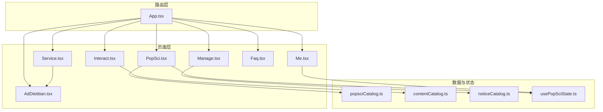
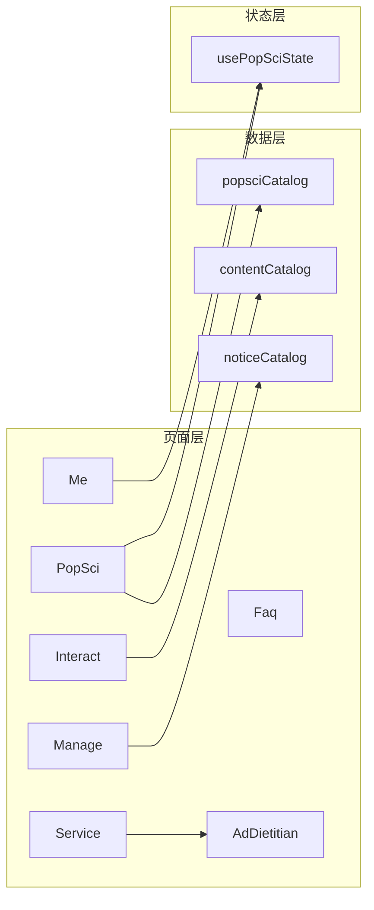
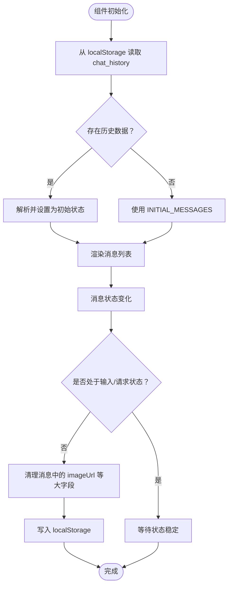
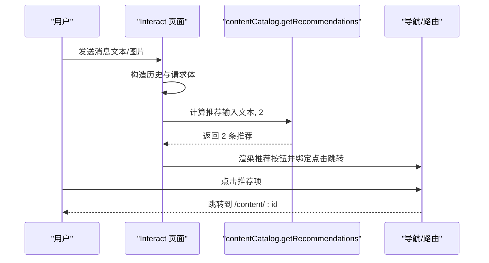
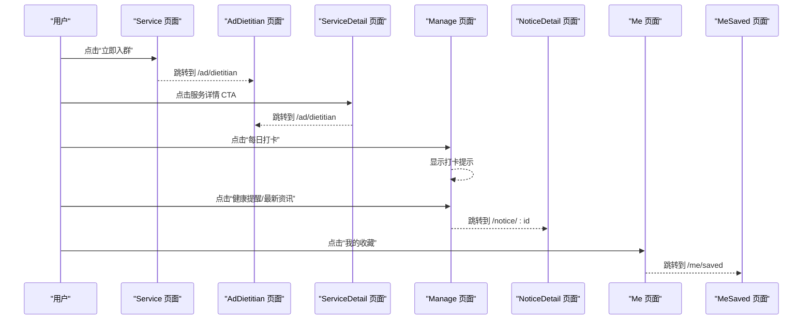
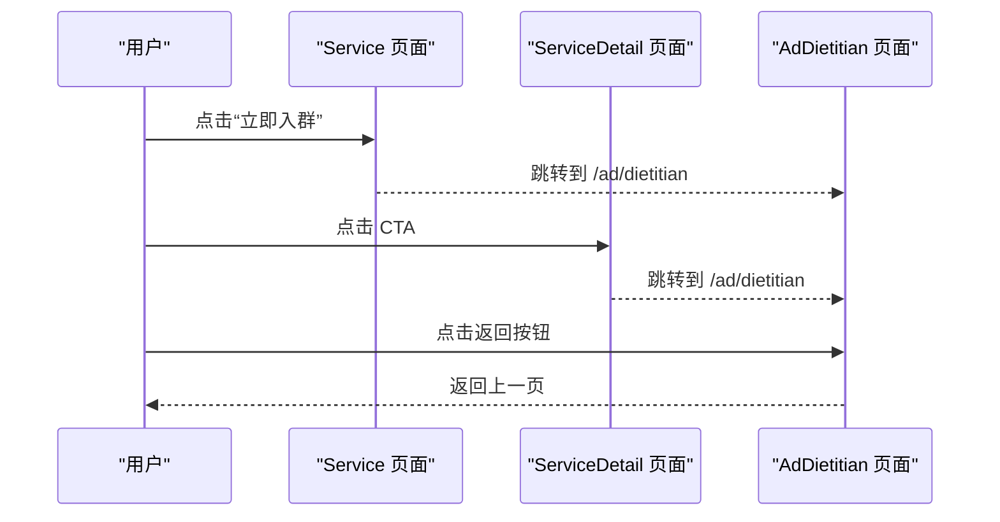
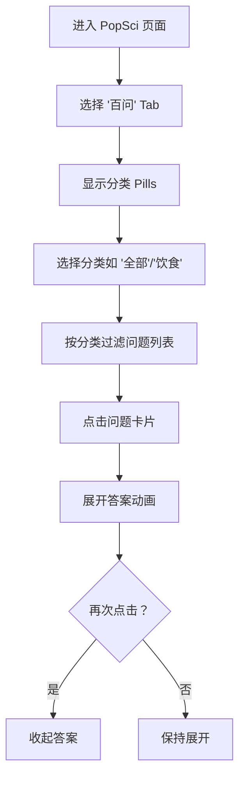
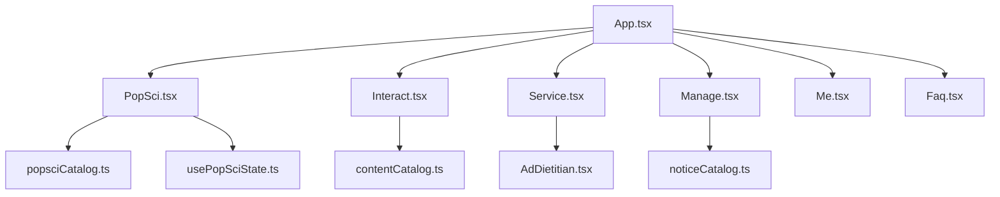

# 设计规范与文档

<cite>
**本文引用的文件**
- [聊天历史持久化设计.md](file://docs/superpowers/specs/2026-04-14-chat-persistence-design.md)
- [对话后推荐内容设计.md](file://docs/superpowers/specs/2026-04-14-chat-recommendations-design.md)
- [科普内容完善：详情页 + 收藏/点赞（本地数据闭环）设计.md](file://docs/superpowers/specs/2026-04-15-popsci-detail-like-save-design.md)
- [服务页/管理页/我的页按钮闭环（第一期：跳转闭环）设计.md](file://docs/superpowers/specs/2026-04-15-service-manage-me-actions-design.md)
- [Nutritionist Management Plan Ad Page 设计.md](file://docs/superpowers/specs/2026-04-17-ad-dietitian-design.md)
- [“百问”(100 Questions FAQ) Section 设计.md](file://docs/superpowers/specs/2026-04-17-popsci-faq-design.md)
- [Interact.tsx](file://src/pages/Interact.tsx)
- [PopSci.tsx](file://src/pages/PopSci.tsx)
- [Service.tsx](file://src/pages/Service.tsx)
- [Manage.tsx](file://src/pages/Manage.tsx)
- [Me.tsx](file://src/pages/Me.tsx)
- [App.tsx](file://src/App.tsx)
- [popsciCatalog.ts](file://src/data/popsciCatalog.ts)
- [contentCatalog.ts](file://src/data/contentCatalog.ts)
- [noticeCatalog.ts](file://src/data/noticeCatalog.ts)
- [usePopSciState.ts](file://src/hooks/usePopSciState.ts)
- [AdDietitian.tsx](file://src/pages/AdDietitian.tsx)
- [Faq.tsx](file://src/pages/Faq.tsx)
</cite>

## 目录
1. 引言
2. 项目结构
3. 核心组件
4. 架构总览
5. 详细组件分析
6. 依赖关系分析
7. 性能考量
8. 故障排查指南
9. 结论
10. 附录

## 引言
本文件面向项目的设计规范与架构文档库，围绕以下核心功能展开：聊天持久化设计、聊天推荐系统、科普内容点赞与收藏机制、服务管理动作设计、广告营养师集成、科普FAQ系统。文档从技术背景、业务需求、实现方案、性能考量、设计权衡、扩展性与演进方向等方面进行系统化梳理，并提供设计与开发衔接机制、质量保障措施以及版本管理与协作指南，帮助团队高效协作、降低技术债并确保交付质量。

## 项目结构
项目采用前端单页应用（SPA）架构，基于 React + Vite + React Router，页面按功能域划分，数据与状态通过本地存储与本地数据源驱动，UI 使用 Tailwind CSS 与 Framer Motion 实现流畅动画与一致的视觉风格。



图示来源
- [App.tsx:28-49](file://src/App.tsx#L28-L49)
- [PopSci.tsx:1-270](file://src/pages/PopSci.tsx#L1-L270)
- [Interact.tsx:1-462](file://src/pages/Interact.tsx#L1-L462)
- [Service.tsx:1-133](file://src/pages/Service.tsx#L1-L133)
- [Manage.tsx:1-167](file://src/pages/Manage.tsx#L1-L167)
- [Me.tsx:1-65](file://src/pages/Me.tsx#L1-L65)
- [Faq.tsx:1-101](file://src/pages/Faq.tsx#L1-L101)
- [AdDietitian.tsx:1-125](file://src/pages/AdDietitian.tsx#L1-L125)
- [popsciCatalog.ts:1-98](file://src/data/popsciCatalog.ts#L1-L98)
- [contentCatalog.ts:1-101](file://src/data/contentCatalog.ts#L1-L101)
- [noticeCatalog.ts:1-59](file://src/data/noticeCatalog.ts#L1-L59)
- [usePopSciState.ts:1-80](file://src/hooks/usePopSciState.ts#L1-L80)

章节来源
- [App.tsx:19-51](file://src/App.tsx#L19-L51)

## 核心组件
- 聊天页面（Interact）：负责消息渲染、OCR 图片识别、AI 流式响应、推荐内容注入与本地持久化。
- 科普页面（PopSci）：Tab 切换、卡片列表、收藏/点赞交互、详情页跳转。
- 服务页面（Service）：服务入口与广告落地页跳转。
- 管理页面（Manage）：健康提醒与资讯列表、每日打卡。
- 我的页面（Me）：菜单入口、收藏列表。
- FAQ 页面（Faq）：分类过滤与手风琴展开。
- 广告落地页（AdDietitian）：营养师计划推广页。
- 数据与状态：
  - 科普数据源（popsciCatalog）
  - 内容推荐数据源（contentCatalog）
  - 通知数据源（noticeCatalog）
  - 科普状态钩子（usePopSciState）

章节来源
- [Interact.tsx:37-462](file://src/pages/Interact.tsx#L37-L462)
- [PopSci.tsx:26-270](file://src/pages/PopSci.tsx#L26-L270)
- [Service.tsx:6-133](file://src/pages/Service.tsx#L6-L133)
- [Manage.tsx:7-167](file://src/pages/Manage.tsx#L7-L167)
- [Me.tsx:4-65](file://src/pages/Me.tsx#L4-L65)
- [Faq.tsx:7-101](file://src/pages/Faq.tsx#L7-L101)
- [AdDietitian.tsx:4-125](file://src/pages/AdDietitian.tsx#L4-L125)
- [popsciCatalog.ts:29-98](file://src/data/popsciCatalog.ts#L29-L98)
- [contentCatalog.ts:13-101](file://src/data/contentCatalog.ts#L13-L101)
- [noticeCatalog.ts:12-59](file://src/data/noticeCatalog.ts#L12-L59)
- [usePopSciState.ts:30-80](file://src/hooks/usePopSciState.ts#L30-L80)

## 架构总览
整体采用“页面-数据-状态”三层结构：
- 页面层：负责视图渲染与用户交互，调用路由与导航。
- 数据层：本地数据源（catalog）提供内容与元数据。
- 状态层：本地存储与自定义 Hook 管理用户行为状态（收藏/点赞）。



图示来源
- [Interact.tsx:9-9](file://src/pages/Interact.tsx#L9-L9)
- [PopSci.tsx:6-7](file://src/pages/PopSci.tsx#L6-L7)
- [Service.tsx:4-4](file://src/pages/Service.tsx#L4-L4)
- [Manage.tsx:5-5](file://src/pages/Manage.tsx#L5-L5)
- [Me.tsx:1-1](file://src/pages/Me.tsx#L1-L1)
- [Faq.tsx:5-5](file://src/pages/Faq.tsx#L5-L5)
- [AdDietitian.tsx:1-1](file://src/pages/AdDietitian.tsx#L1-L1)
- [popsciCatalog.ts:1-27](file://src/data/popsciCatalog.ts#L1-L27)
- [contentCatalog.ts:1-11](file://src/data/contentCatalog.ts#L1-L11)
- [noticeCatalog.ts:1-10](file://src/data/noticeCatalog.ts#L1-L10)
- [usePopSciState.ts:1-9](file://src/hooks/usePopSciState.ts#L1-L9)

## 详细组件分析

### 聊天持久化设计
- 技术背景：当前聊天记录仅驻留在组件状态，切换页面会丢失历史。
- 业务需求：用户希望跨页面/刷新保留对话历史，提升连续性体验。
- 技术实现：
  - 初始化：从 localStorage 恢复 chat_history，失败回退至初始消息。
  - 写入：监听消息状态变化，在非输入/请求状态时序列化并写入 localStorage。
  - 图片处理：保存前清理 imageUrl，避免存储溢出；恢复时对曾含图片的消息显示占位提示。
- 性能考量：localStorage 读写为同步操作，消息频繁更新时应避免在渲染路径中重复序列化；当前通过条件写入与清理策略降低开销。
- 设计权衡：localStorage 容量有限，不适合大体量数据；本方案通过清理与占位提示规避风险。
- 扩展性：未来可引入 IndexedDB 以支持更大容量与二进制存储，同时保持 API 兼容。



图示来源
- [聊天历史持久化设计.md:14-18](file://docs/superpowers/specs/2026-04-14-chat-persistence-design.md#L14-L18)
- [Interact.tsx:37-84](file://src/pages/Interact.tsx#L37-L84)

章节来源
- [聊天历史持久化设计.md:1-22](file://docs/superpowers/specs/2026-04-14-chat-persistence-design.md#L1-L22)
- [Interact.tsx:37-84](file://src/pages/Interact.tsx#L37-L84)

### 聊天推荐系统（方案A：本地固定列表 + 站内详情页）
- 背景与目标：在 AI 回复后自动展示 2 条相关推荐，引导用户继续阅读/了解服务。
- 数据模型：ContentItem（文章/视频/服务/商品），keywords 用于规则匹配。
- 推荐策略：基于输入文本与 keywords 的包含匹配计分，取前 2 条；不足时用默认池补齐。
- UI/交互：在 AI 消息气泡下方渲染推荐按钮，点击跳转站内详情页。
- 错误处理：无命中时展示默认推荐；OCR 文本仅用于匹配，不直接渲染。
- 验收标准：回复后出现 2 条推荐，点击进入详情页。



图示来源
- [对话后推荐内容设计.md:20-28](file://docs/superpowers/specs/2026-04-14-chat-recommendations-design.md#L20-L28)
- [contentCatalog.ts:69-99](file://src/data/contentCatalog.ts#L69-L99)
- [Interact.tsx:154-247](file://src/pages/Interact.tsx#L154-L247)

章节来源
- [对话后推荐内容设计.md:1-103](file://docs/superpowers/specs/2026-04-14-chat-recommendations-design.md#L1-L103)
- [contentCatalog.ts:13-101](file://src/data/contentCatalog.ts#L13-L101)
- [Interact.tsx:154-247](file://src/pages/Interact.tsx#L154-L247)

### 科普内容完善：详情页 + 收藏/点赞（本地数据闭环）
- 目标：实现“列表-详情-收藏/点赞”的本地闭环，支持跨页面持久化。
- 路由设计：/popsci/article/:id、/popsci/video/:id。
- 数据模型：PopSciItem（文章/视频），包含 bodyMarkdown、sourceUrl 等。
- 状态设计：localStorage key 为 popsci_state_v1，结构包含 liked/saved 两组键集合。
- 行为规则：列表页与详情页均可点赞/收藏，toggle 切换，刷新后保留。
- UI/交互：列表卡片点击跳转详情；详情页渲染 Markdown 或外链视频。
- 验收标准：点击卡片进入详情页，收藏/点赞可切换并持久化。

```mermaid
classDiagram
class PopSciState {
+liked : string[]
+saved : string[]
+isLiked(type,id) boolean
+isSaved(type,id) boolean
+toggleLiked(type,id) void
+toggleSaved(type,id) void
}
class PopSciItem {
+id : string
+type : "article"|"video"
+title : string
+summary : string
+coverUrl : string
+tags : string[]
+author? : string
+publishedAt? : string
+views? : number
+likes? : number
}
class PopSciArticle {
+bodyMarkdown : string
}
class PopSciVideo {
+duration? : string
+sourceUrl : string
}
PopSciState --> PopSciItem : "键集合由 type : id 组成"
PopSciArticle --|> PopSciItem
PopSciVideo --|> PopSciItem
```

图示来源
- [科普内容完善：详情页 + 收藏/点赞（本地数据闭环）设计.md:28-56](file://docs/superpowers/specs/2026-04-15-popsci-detail-like-save-design.md#L28-L56)
- [usePopSciState.ts:30-80](file://src/hooks/usePopSciState.ts#L30-L80)
- [popsciCatalog.ts:1-27](file://src/data/popsciCatalog.ts#L1-L27)

章节来源
- [科普内容完善：详情页 + 收藏/点赞（本地数据闭环）设计.md:1-109](file://docs/superpowers/specs/2026-04-15-popsci-detail-like-save-design.md#L1-L109)
- [popsciCatalog.ts:29-98](file://src/data/popsciCatalog.ts#L29-L98)
- [usePopSciState.ts:30-80](file://src/hooks/usePopSciState.ts#L30-L80)
- [PopSci.tsx:26-270](file://src/pages/PopSci.tsx#L26-L270)

### 服务页/管理页/我的页按钮闭环（第一期：跳转闭环）
- 目标：完善服务/管理/我的页占位按钮为可用跳转，形成可验证闭环。
- 路由设计：/service/:slug、/notice/:id、/me/saved、/me/history、/me/settings、/me/help、/me/about。
- 交互设计：服务页“立即入群”外链；服务详情提供外链 CTA；管理页“每日打卡”轻量提示；我的页“我的收藏”跳转到 /me/saved。
- 状态与数据：服务详情数据来自本地 serviceCatalog；通知数据来自 noticeCatalog；收藏状态复用 usePopSciState。
- 验收标准：所有按钮均有明确跳转或外链动作；收藏页可展示收藏列表并支持进入详情。



图示来源
- [服务页/管理页/我的页按钮闭环（第一期：跳转闭环）设计.md:19-53](file://docs/superpowers/specs/2026-04-15-service-manage-me-actions-design.md#L19-L53)
- [Service.tsx:6-133](file://src/pages/Service.tsx#L6-L133)
- [AdDietitian.tsx:1-125](file://src/pages/AdDietitian.tsx#L1-L125)
- [Manage.tsx:1-167](file://src/pages/Manage.tsx#L1-L167)
- [noticeCatalog.ts:12-59](file://src/data/noticeCatalog.ts#L12-L59)
- [Me.tsx:4-65](file://src/pages/Me.tsx#L4-L65)
- [App.tsx:35-46](file://src/App.tsx#L35-L46)

章节来源
- [服务页/管理页/我的页按钮闭环（第一期：跳转闭环）设计.md:1-54](file://docs/superpowers/specs/2026-04-15-service-manage-me-actions-design.md#L1-L54)
- [Service.tsx:6-133](file://src/pages/Service.tsx#L6-L133)
- [Manage.tsx:7-167](file://src/pages/Manage.tsx#L7-L167)
- [Me.tsx:4-65](file://src/pages/Me.tsx#L4-L65)
- [noticeCatalog.ts:12-59](file://src/data/noticeCatalog.ts#L12-L59)
- [App.tsx:35-46](file://src/App.tsx#L35-L46)

### 广告营养师集成（Nutritionist Management Plan Ad Page）
- 目标：将服务页外部链接替换为内部“广告落地页”，提供平滑体验。
- 路由与页面：/ad/dietitian，组件 AdDietitian.tsx。
- UI/UX：头部返回按钮、英雄区、特性列表、计划包含、底部粘性 CTA。
- 数据流：服务页/服务详情页点击后路由到广告页，返回按钮返回上一页。
- 验收标准：点击“立即入群/快速入口/服务详情 CTA”均跳转到 /ad/dietitian；移动端适配良好。



图示来源
- [Nutritionist Management Plan Ad Page 设计.md:35-47](file://docs/superpowers/specs/2026-04-17-ad-dietitian-design.md#L35-L47)
- [Service.tsx:6-133](file://src/pages/Service.tsx#L6-L133)
- [AdDietitian.tsx:1-125](file://src/pages/AdDietitian.tsx#L1-L125)

章节来源
- [Nutritionist Management Plan Ad Page 设计.md:1-47](file://docs/superpowers/specs/2026-04-17-ad-dietitian-design.md#L1-L47)
- [Service.tsx:6-133](file://src/pages/Service.tsx#L6-L133)
- [AdDietitian.tsx:1-125](file://src/pages/AdDietitian.tsx#L1-L125)

### 科普FAQ系统
- 目标：在 PopSci 页面新增“百问”Tab，提供常见问题与标准答案，支持分类过滤与手风琴展开。
- 数据层：新增 faqCatalog.ts，导出问题列表与分类集合。
- UI/UX：Tab 新增“百问”，水平滚动分类 Pills，问题卡片支持展开/折叠。
- 交互流：选择分类 -> 过滤列表 -> 点击问题卡片展开答案。
- 验收标准：Tab 可选；分类过滤正确；手风琴动画流畅。



图示来源
- [“百问”(100 Questions FAQ) Section 设计.md:29-40](file://docs/superpowers/specs/2026-04-17-popsci-faq-design.md#L29-L40)
- [Faq.tsx:7-101](file://src/pages/Faq.tsx#L7-L101)

章节来源
- [“百问”(100 Questions FAQ) Section 设计.md:1-40](file://docs/superpowers/specs/2026-04-17-popsci-faq-design.md#L1-L40)
- [Faq.tsx:7-101](file://src/pages/Faq.tsx#L7-L101)

## 依赖关系分析
- 页面与数据源：
  - PopSci 依赖 popsciCatalog 与 usePopSciState。
  - Interact 依赖 contentCatalog（推荐）与 localStorage（持久化）。
  - Manage 依赖 noticeCatalog。
  - Service 与 AdDietitian 之间通过路由连接。
- 状态与存储：
  - usePopSciState 通过 localStorage 实现收藏/点赞的本地持久化。
- 路由与导航：
  - App.tsx 统一声明路由，页面间通过 react-router 导航。



图示来源
- [App.tsx:28-49](file://src/App.tsx#L28-L49)
- [PopSci.tsx:6-7](file://src/pages/PopSci.tsx#L6-L7)
- [Interact.tsx:9-9](file://src/pages/Interact.tsx#L9-L9)
- [Manage.tsx:5-5](file://src/pages/Manage.tsx#L5-L5)
- [Service.tsx:4-4](file://src/pages/Service.tsx#L4-L4)
- [Me.tsx:1-1](file://src/pages/Me.tsx#L1-L1)
- [Faq.tsx:5-5](file://src/pages/Faq.tsx#L5-L5)
- [AdDietitian.tsx:1-1](file://src/pages/AdDietitian.tsx#L1-L1)

章节来源
- [App.tsx:28-49](file://src/App.tsx#L28-L49)

## 性能考量
- 本地存储与序列化：
  - 聊天持久化在非输入/请求状态时写入 localStorage，避免频繁序列化。
  - 推荐计算基于本地数组映射与排序，limit=2，复杂度 O(n)。
- 渲染优化：
  - 使用 Framer Motion 的 AnimatePresence 与 layoutId 减少布局抖动。
  - 列表项使用 memo 化与 key 唯一标识，降低重渲染。
- 图片与 OCR：
  - 上传图片通过 URL.createObjectURL 本地预览，保存时清理 imageUrl，防止存储溢出。
  - OCR 文本仅用于推荐与模型请求，不直接渲染，避免冗余 DOM。
- 路由与懒加载：
  - 页面级路由按需加载，减少首屏负担。

## 故障排查指南
- 聊天历史丢失：
  - 检查 localStorage 是否被清理或容量超限；确认写入时机（非输入/请求状态）。
  - 参考：[聊天历史持久化设计.md:20-22](file://docs/superpowers/specs/2026-04-14-chat-persistence-design.md#L20-L22)
- 推荐无命中：
  - 确认输入文本与 keywords 是否匹配；检查默认池是否为空。
  - 参考：[contentCatalog.ts:69-99](file://src/data/contentCatalog.ts#L69-L99)
- 收藏/点赞不生效：
  - 检查 localStorage key 与结构；确认 usePopSciState 的 toggle 方法调用。
  - 参考：[usePopSciState.ts:30-80](file://src/hooks/usePopSciState.ts#L30-L80)
- 详情页路由 404：
  - 确认 App.tsx 路由声明与页面路径一致。
  - 参考：[App.tsx:31-32](file://src/App.tsx#L31-L32)
- 打卡无提示：
  - 检查 Manage 页面的提示状态与定时器逻辑。
  - 参考：[Manage.tsx:89-93](file://src/pages/Manage.tsx#L89-L93)

章节来源
- [聊天历史持久化设计.md:20-22](file://docs/superpowers/specs/2026-04-14-chat-persistence-design.md#L20-L22)
- [contentCatalog.ts:69-99](file://src/data/contentCatalog.ts#L69-L99)
- [usePopSciState.ts:30-80](file://src/hooks/usePopSciState.ts#L30-L80)
- [App.tsx:31-32](file://src/App.tsx#L31-L32)
- [Manage.tsx:89-93](file://src/pages/Manage.tsx#L89-L93)

## 结论
本设计文档库系统化梳理了聊天持久化、聊天推荐、科普内容闭环、服务管理动作、广告落地页与 FAQ 系统的设计理念与实现方案。通过本地数据源与状态钩子，结合路由与 UI 动画，实现了稳定的用户体验与良好的可维护性。未来可在推荐算法、存储容量与路由懒加载方面进一步优化，并逐步引入后端能力以支撑更多业务场景。

## 附录
- 版本管理与变更追踪：
  - 设计文档位于 docs/superpowers/specs，采用日期命名，便于追溯。
  - 建议每次变更在文档末尾添加“变更记录”小节，标注修改人、时间与摘要。
- 团队协作指南：
  - 设计评审：功能设计需在 specs 中明确验收标准与边界条件。
  - 开发对接：页面与数据源的契约（类型、方法）在 data 层集中定义，便于前后端协作。
  - 质量保证：为关键流程（推荐、收藏/点赞、路由跳转）编写端到端测试用例。
- 设计与开发衔接机制：
  - 设计文档提供数据模型与交互流程，开发据此实现页面与状态。
  - 代码中通过 TypeScript 类型约束与 Hooks 封装，降低耦合与提升可测试性。