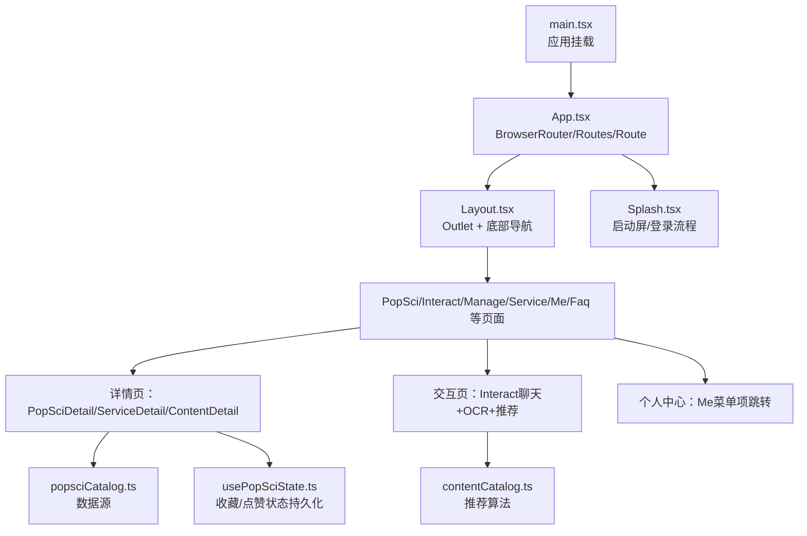
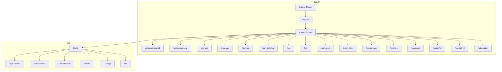
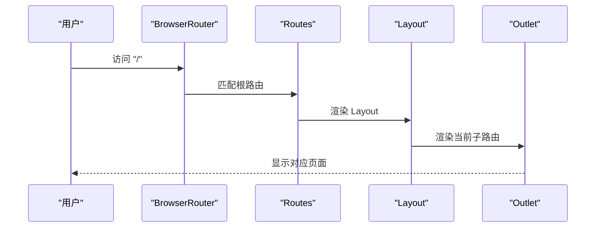
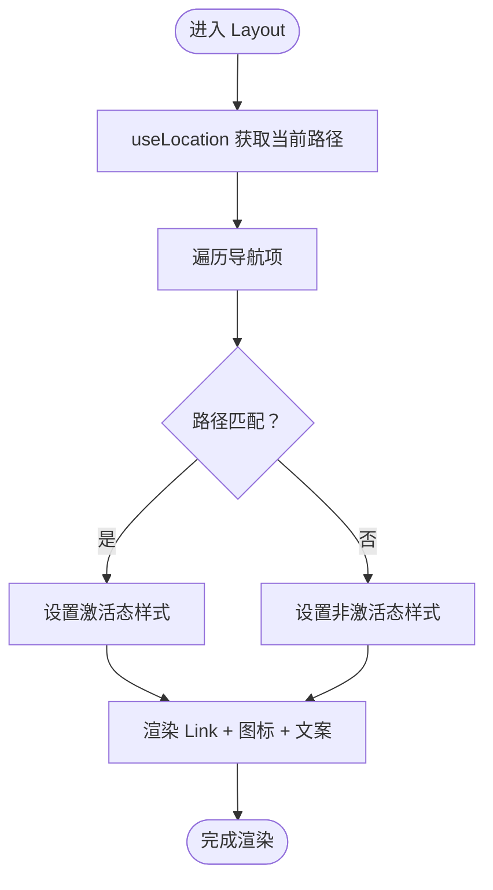
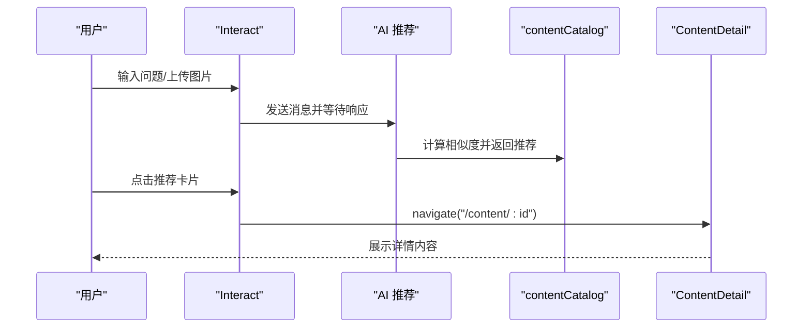
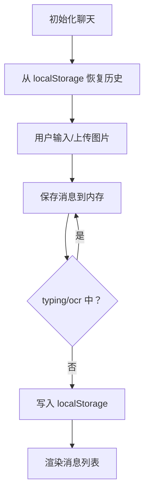
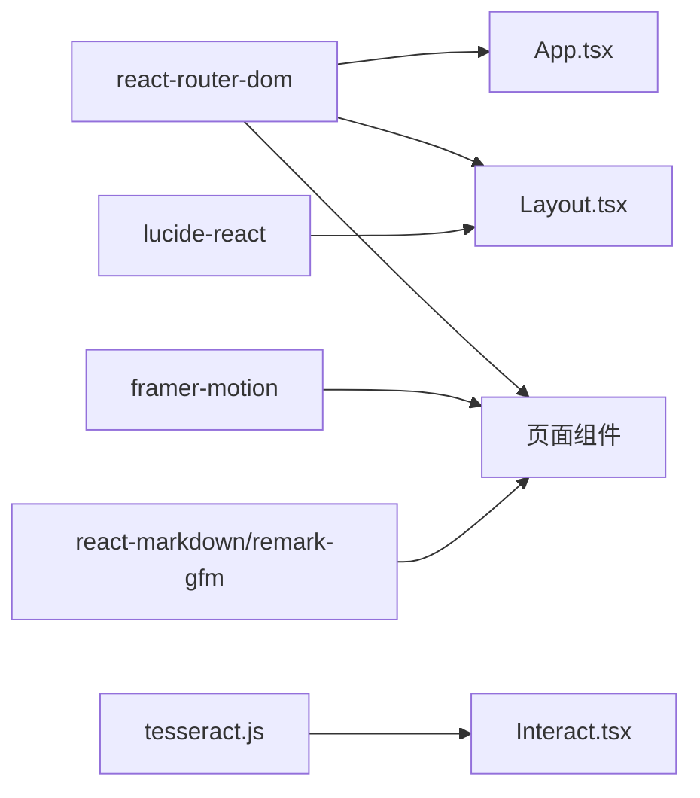

# 路由与导航

<cite>
**本文引用的文件**
- [App.tsx](file://src/App.tsx)
- [main.tsx](file://src/main.tsx)
- [Layout.tsx](file://src/components/Layout.tsx)
- [Splash.tsx](file://src/components/Splash.tsx)
- [Me.tsx](file://src/pages/Me.tsx)
- [Interact.tsx](file://src/pages/Interact.tsx)
- [Manage.tsx](file://src/pages/Manage.tsx)
- [PopSciDetail.tsx](file://src/pages/PopSciDetail.tsx)
- [ServiceDetail.tsx](file://src/pages/ServiceDetail.tsx)
- [ContentDetail.tsx](file://src/pages/ContentDetail.tsx)
- [popsciCatalog.ts](file://src/data/popsciCatalog.ts)
- [contentCatalog.ts](file://src/data/contentCatalog.ts)
- [usePopSciState.ts](file://src/hooks/usePopSciState.ts)
- [package.json](file://package.json)
</cite>

## 目录
1. [简介](#简介)
2. [项目结构](#项目结构)
3. [核心组件](#核心组件)
4. [架构总览](#架构总览)
5. [详细组件分析](#详细组件分析)
6. [依赖分析](#依赖分析)
7. [性能考量](#性能考量)
8. [故障排查指南](#故障排查指南)
9. [结论](#结论)
10. [附录](#附录)

## 简介
本文件面向应用的路由系统与导航机制，围绕以下目标展开：
- 深入解析 React Router 的配置与嵌套路由设计
- 页面间导航关系与参数传递机制
- 底部导航的实现策略与交互体验
- 路由守卫与权限控制的使用场景
- 导航状态持久化与历史记录管理
- 路由懒加载、代码分割与性能优化
- 路由配置最佳实践、错误处理与调试技巧
- 导航组件的复用模式与扩展方法

## 项目结构
应用采用基于文件系统的路由组织方式，主入口负责注册路由与根布局，页面组件按功能模块划分，数据与状态钩子分别位于 data 与 hooks 目录。

图表来源
- [main.tsx:1-11](file://src/main.tsx#L1-L11)
- [App.tsx:19-51](file://src/App.tsx#L19-L51)
- [Layout.tsx:19-65](file://src/components/Layout.tsx#L19-L65)
- [Splash.tsx:9-171](file://src/components/Splash.tsx#L9-L171)
- [Interact.tsx:37-462](file://src/pages/Interact.tsx#L37-L462)
- [Manage.tsx:7-167](file://src/pages/Manage.tsx#L7-L167)
- [Me.tsx:4-65](file://src/pages/Me.tsx#L4-L65)
- [PopSciDetail.tsx:15-150](file://src/pages/PopSciDetail.tsx#L15-L150)
- [ServiceDetail.tsx:6-75](file://src/pages/ServiceDetail.tsx#L6-L75)
- [ContentDetail.tsx:14-134](file://src/pages/ContentDetail.tsx#L14-L134)
- [popsciCatalog.ts:1-98](file://src/data/popsciCatalog.ts#L1-L98)
- [contentCatalog.ts:1-101](file://src/data/contentCatalog.ts#L1-L101)
- [usePopSciState.ts:30-80](file://src/hooks/usePopSciState.ts#L30-L80)

章节来源
- [main.tsx:1-11](file://src/main.tsx#L1-L11)
- [App.tsx:19-51](file://src/App.tsx#L19-L51)

## 核心组件
- 应用根节点：注册浏览器路由、定义根布局与所有页面路由
- 根布局：承载 Outlet 与底部导航栏，统一页面容器与导航样式
- 启动屏：控制首屏登录/游客流程，完成后渲染主路由
- 页面组件：覆盖首页、互动、管理、服务、个人中心、FAQ、各类详情页
- 数据与状态：内容与推荐数据、收藏/点赞状态持久化

章节来源
- [App.tsx:19-51](file://src/App.tsx#L19-L51)
- [Layout.tsx:19-65](file://src/components/Layout.tsx#L19-L65)
- [Splash.tsx:9-171](file://src/components/Splash.tsx#L9-L171)
- [Interact.tsx:37-462](file://src/pages/Interact.tsx#L37-L462)
- [Manage.tsx:7-167](file://src/pages/Manage.tsx#L7-L167)
- [Me.tsx:4-65](file://src/pages/Me.tsx#L4-L65)
- [PopSciDetail.tsx:15-150](file://src/pages/PopSciDetail.tsx#L15-L150)
- [ServiceDetail.tsx:6-75](file://src/pages/ServiceDetail.tsx#L6-L75)
- [ContentDetail.tsx:14-134](file://src/pages/ContentDetail.tsx#L14-L134)
- [popsciCatalog.ts:1-98](file://src/data/popsciCatalog.ts#L1-L98)
- [contentCatalog.ts:1-101](file://src/data/contentCatalog.ts#L1-L101)
- [usePopSciState.ts:30-80](file://src/hooks/usePopSciState.ts#L30-L80)

## 架构总览
应用采用 React Router v6 的嵌套路由模式，根路由包裹一个布局路由，其下挂载多个页面路由；底部导航通过 Link 组件与 useLocation 状态联动，实现移动端底部导航体验；部分页面通过 useNavigate 实现内部跳转与返回。

图表来源
- [App.tsx:28-47](file://src/App.tsx#L28-L47)
- [Layout.tsx:19-65](file://src/components/Layout.tsx#L19-L65)

## 详细组件分析

### 根路由与嵌套路由设计
- 使用 BrowserRouter 包裹整个应用，Routes 定义顶层路由
- 根路由 "/" 下挂载 Layout，作为全局布局容器
- Layout 内部通过 Outlet 渲染当前匹配的子路由
- 子路由覆盖首页、互动、管理、服务、个人中心、FAQ、以及若干详情页
- 参数路由示例：/popsci/article/:id、/popsci/video/:id、/service/:slug、/content/:id、/notice/:id

图表来源
- [App.tsx:28-47](file://src/App.tsx#L28-L47)
- [Layout.tsx:26](file://src/components/Layout.tsx#L26)

章节来源
- [App.tsx:28-47](file://src/App.tsx#L28-L47)

### 底部导航实现策略
- 导航项数组集中维护，包含路径、标签与图标
- 通过 useLocation 获取当前路径，计算激活态
- 使用 Link 组件进行导航，激活态带有颜色、缩放与背景动画
- 支持前缀匹配（如 /me/history 也视为 /me 激活）

图表来源
- [Layout.tsx:10-17](file://src/components/Layout.tsx#L10-L17)
- [Layout.tsx:20](file://src/components/Layout.tsx#L20)
- [Layout.tsx:31-62](file://src/components/Layout.tsx#L31-L62)

章节来源
- [Layout.tsx:10-17](file://src/components/Layout.tsx#L10-L17)
- [Layout.tsx:20](file://src/components/Layout.tsx#L20)
- [Layout.tsx:31-62](file://src/components/Layout.tsx#L31-L62)

### 页面间导航关系与参数传递
- 详情页通过 useParams 读取路由参数，结合数据目录函数获取内容
- 交互页在聊天中根据用户输入触发推荐，点击推荐项跳转到内容详情页
- 管理页与个人中心页通过 useNavigate 在列表项点击时跳转到通知或内容详情页
- 返回行为统一使用 navigate(-1) 或显式 navigate(相对路径)

图表来源
- [Interact.tsx:250-261](file://src/pages/Interact.tsx#L250-L261)
- [Interact.tsx:359](file://src/pages/Interact.tsx#L359)
- [contentCatalog.ts:69-99](file://src/data/contentCatalog.ts#L69-L99)
- [ContentDetail.tsx:14-134](file://src/pages/ContentDetail.tsx#L14-L134)

章节来源
- [PopSciDetail.tsx:15-150](file://src/pages/PopSciDetail.tsx#L15-L150)
- [ServiceDetail.tsx:6-75](file://src/pages/ServiceDetail.tsx#L6-L75)
- [ContentDetail.tsx:14-134](file://src/pages/ContentDetail.tsx#L14-L134)
- [Interact.tsx:250-261](file://src/pages/Interact.tsx#L250-L261)
- [Manage.tsx:106-149](file://src/pages/Manage.tsx#L106-L149)
- [Me.tsx:7-11](file://src/pages/Me.tsx#L7-L11)

### 路由守卫与权限控制
- 当前路由层未实现显式的路由守卫（如基于角色的访问控制）
- 启动屏 Splash 提供登录/游客流程，可作为“应用级权限”的前置校验
- 可扩展方向：在 Layout 上层增加受保护路由组，结合上下文或 Zustand 管理登录态

章节来源
- [Splash.tsx:9-171](file://src/components/Splash.tsx#L9-L171)

### 导航状态持久化与历史记录管理
- 互动页聊天历史通过 localStorage 持久化，避免刷新丢失
- 详情页返回使用 navigate(-1)，利用浏览器历史栈
- 收藏/点赞状态通过 usePopSciState 与 localStorage 同步

图表来源
- [Interact.tsx:38-84](file://src/pages/Interact.tsx#L38-L84)

章节来源
- [Interact.tsx:38-84](file://src/pages/Interact.tsx#L38-L84)
- [usePopSciState.ts:30-80](file://src/hooks/usePopSciState.ts#L30-L80)

### 路由懒加载与代码分割
- 当前路由直接导入页面组件，未使用动态 import 的懒加载
- 性能优化建议：对大型页面（如 Interact、Manage）使用 React.lazy 与 Suspense 实现按需加载
- 结合 Vite 的动态导入能力，可在路由层按需拆分包

章节来源
- [App.tsx:5-17](file://src/App.tsx#L5-L17)
- [package.json:21](file://package.json#L21)

### 错误处理与健壮性
- 详情页在找不到内容时提供返回引导
- 交互页在 OCR 识别失败或 API 请求异常时提供兜底文案
- 推荐算法在关键词匹配不足时回退默认推荐

章节来源
- [PopSciDetail.tsx:77-86](file://src/pages/PopSciDetail.tsx#L77-L86)
- [ServiceDetail.tsx:33-44](file://src/pages/ServiceDetail.tsx#L33-L44)
- [Interact.tsx:128-141](file://src/pages/Interact.tsx#L128-L141)
- [Interact.tsx:237-247](file://src/pages/Interact.tsx#L237-L247)
- [contentCatalog.ts:88-99](file://src/data/contentCatalog.ts#L88-L99)

### 导航组件复用与扩展
- Layout 抽象出统一的导航栏与 Outlet，便于跨页面复用
- 通过集中维护导航项数组，可统一扩展图标、标签与路由映射
- 详情页与列表页之间建立稳定的参数约定，利于扩展更多类型详情页

章节来源
- [Layout.tsx:10-17](file://src/components/Layout.tsx#L10-L17)
- [Layout.tsx:19-65](file://src/components/Layout.tsx#L19-L65)
- [PopSciDetail.tsx:15-150](file://src/pages/PopSciDetail.tsx#L15-L150)
- [ServiceDetail.tsx:6-75](file://src/pages/ServiceDetail.tsx#L6-L75)
- [ContentDetail.tsx:14-134](file://src/pages/ContentDetail.tsx#L14-L134)

## 依赖分析
- react-router-dom：提供 BrowserRouter、Routes、Route、Outlet、Link、useNavigate、useLocation、useParams 等
- lucide-react：提供导航与操作图标
- framer-motion：用于页面与元素的过渡动画
- tesseract.js：用于图片 OCR 识别
- react-markdown/remark-gfm：用于 Markdown 渲染

图表来源
- [package.json:13-26](file://package.json#L13-L26)
- [App.tsx:2](file://src/App.tsx#L2)
- [Layout.tsx:1](file://src/components/Layout.tsx#L1)
- [Interact.tsx:8](file://src/pages/Interact.tsx#L8)

章节来源
- [package.json:13-26](file://package.json#L13-L26)

## 性能考量
- 路由懒加载：对大型页面使用动态 import，减少首屏体积
- 代码分割：按功能模块拆分包，结合路由层级进行分块
- 动画与渲染：合理使用轻量动画，避免在滚动或高频交互中造成掉帧
- 数据缓存：详情页与推荐结果可引入内存缓存，降低重复请求
- 存储策略：聊天历史与收藏状态使用 localStorage，注意序列化与大小限制

## 故障排查指南
- 路由不生效：确认路由路径与参数是否与 App.tsx 中定义一致
- 底部导航高亮异常：检查 useLocation 与路径匹配逻辑
- 详情页空白：检查 useParams 是否正确，数据目录函数是否存在对应 id
- 聊天历史丢失：检查 localStorage 权限与键名一致性
- OCR 失败：检查图片格式与 Tesseract 语言包加载

章节来源
- [App.tsx:28-47](file://src/App.tsx#L28-L47)
- [Layout.tsx:32](file://src/components/Layout.tsx#L32)
- [PopSciDetail.tsx:17-19](file://src/pages/PopSciDetail.tsx#L17-L19)
- [Interact.tsx:38-84](file://src/pages/Interact.tsx#L38-L84)
- [Interact.tsx:95-141](file://src/pages/Interact.tsx#L95-L141)

## 结论
本应用的路由系统以 React Router v6 为基础，采用嵌套路由与集中布局的设计，配合底部导航与参数化详情页，形成清晰的页面导航体系。当前实现注重可用性与交互体验，未来可在路由守卫、权限控制、懒加载与性能优化方面进一步完善。

## 附录
- 路由配置最佳实践
  - 将导航项集中管理，统一维护图标与标签
  - 为详情页提供默认回退路径与错误提示
  - 对大型页面启用懒加载与代码分割
  - 使用 useLocation 与 Link 实现底部导航激活态
- 调试技巧
  - 使用浏览器开发者工具查看路由状态与参数
  - 检查 localStorage 中的持久化数据键名
  - 在交互页中打印关键事件日志辅助定位问题