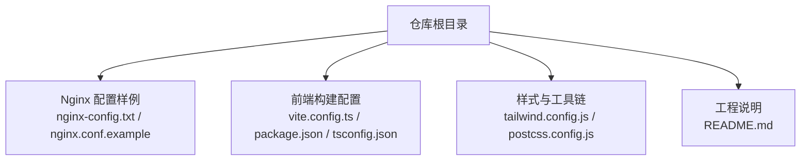
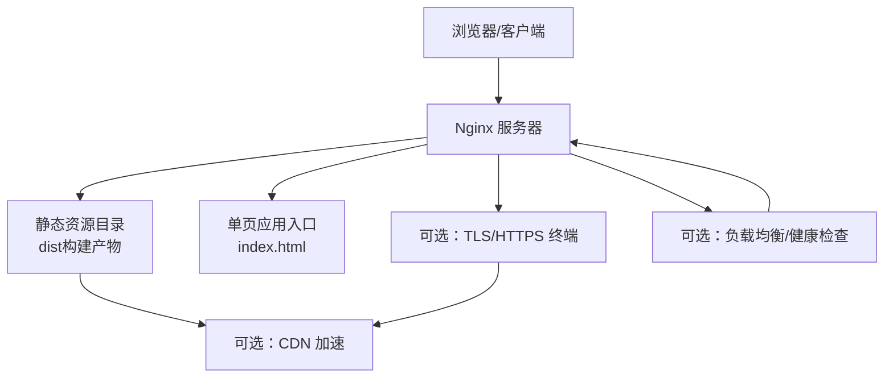
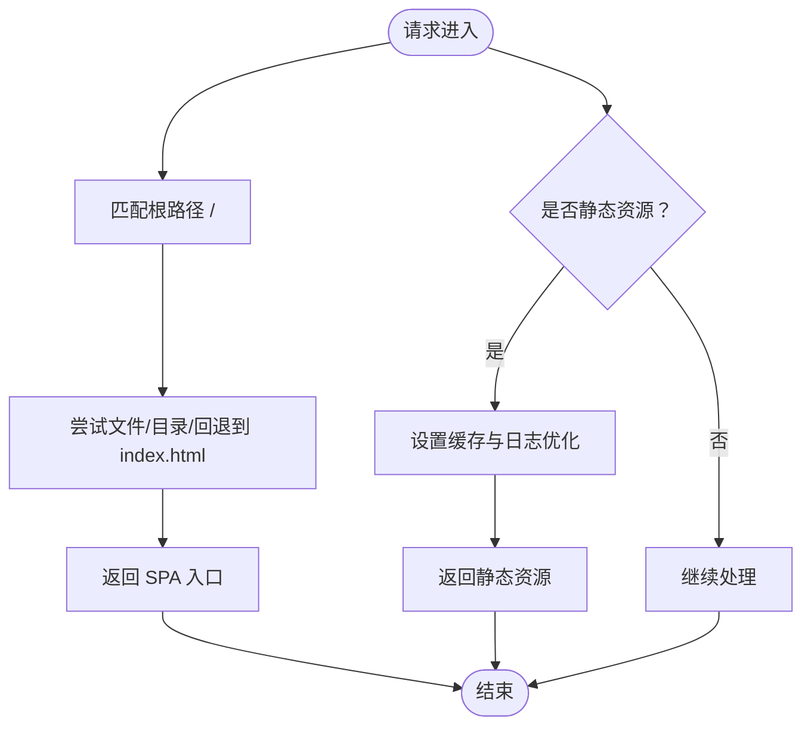
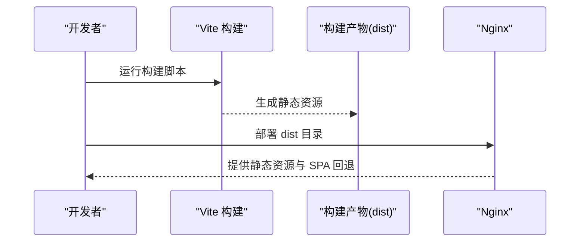
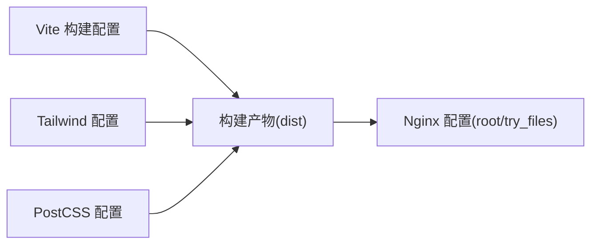

# 服务器配置

<cite>
**本文引用的文件**
- [nginx-config.txt](file://nginx-config.txt)
- [nginx.conf.example](file://nginx.conf.example)
- [package.json](file://package.json)
- [vite.config.ts](file://vite.config.ts)
- [tsconfig.json](file://tsconfig.json)
- [tailwind.config.js](file://tailwind.config.js)
- [postcss.config.js](file://postcss.config.js)
- [README.md](file://README.md)
</cite>

## 目录
1. [简介](#简介)
2. [项目结构](#项目结构)
3. [核心组件](#核心组件)
4. [架构总览](#架构总览)
5. [详细组件分析](#详细组件分析)
6. [依赖关系分析](#依赖关系分析)
7. [性能考虑](#性能考虑)
8. [故障排查指南](#故障排查指南)
9. [结论](#结论)
10. [附录](#附录)

## 简介
本文件面向需要在生产环境中部署与运维基于 Nginx 的前端应用（React + Vite）的工程团队，系统性梳理从安装、配置到优化的全流程，覆盖反向代理、静态文件服务与缓存策略、SSL/TLS 与 HTTP/2、安全头、负载均衡与健康检查、Docker 容器化与环境变量管理、进程监控、域名绑定、CDN 集成以及安全防护等主题。同时结合仓库中的 Nginx 示例配置与前端构建配置，给出可落地的实践建议与最佳实践。

## 项目结构
该仓库为一个前端工程（React + TypeScript + Vite），包含构建脚本、样式工具链与示例 Nginx 配置。与服务器配置直接相关的关键文件如下：
- Nginx 配置样例：nginx-config.txt、nginx.conf.example
- 前端构建与开发配置：vite.config.ts、package.json、tsconfig.json
- 样式与工具链：tailwind.config.js、postcss.config.js
- 工程说明：README.md

**图表来源**
- [nginx-config.txt:1-22](file://nginx-config.txt#L1-L22)
- [nginx.conf.example:1-23](file://nginx.conf.example#L1-L23)
- [vite.config.ts:1-22](file://vite.config.ts#L1-L22)
- [package.json:1-48](file://package.json#L1-L48)
- [tsconfig.json:1-38](file://tsconfig.json#L1-L38)
- [tailwind.config.js:1-16](file://tailwind.config.js#L1-L16)
- [postcss.config.js:1-11](file://postcss.config.js#L1-L11)
- [README.md:1-58](file://README.md#L1-L58)

**章节来源**
- [nginx-config.txt:1-22](file://nginx-config.txt#L1-L22)
- [nginx.conf.example:1-23](file://nginx.conf.example#L1-L23)
- [vite.config.ts:1-22](file://vite.config.ts#L1-L22)
- [package.json:1-48](file://package.json#L1-L48)
- [tsconfig.json:1-38](file://tsconfig.json#L1-L38)
- [tailwind.config.js:1-16](file://tailwind.config.js#L1-L16)
- [postcss.config.js:1-11](file://postcss.config.js#L1-L11)
- [README.md:1-58](file://README.md#L1-L58)

## 核心组件
- Nginx 配置组件
  - 监听与域名绑定：监听 80 端口，绑定 server_name
  - 静态文件根目录与索引页：root 指向构建产物目录，index 指定首页
  - SPA 路由回退：location / 使用 try_files 将未命中路由回退至 index.html
  - 静态资源缓存：对常见静态资源类型设置 expires max，并关闭 404 日志噪声
  - 可选重定向：注释掉的 HTTP 到 HTTPS 重定向示例
- 前端构建组件
  - 构建产物：Vite 构建生成静态资源，供 Nginx 提供服务
  - 开发与预览：dev、build、preview 脚本
  - 源码映射：隐藏源码映射（hidden）
  - 样式工具链：Tailwind + PostCSS

**章节来源**
- [nginx-config.txt:1-22](file://nginx-config.txt#L1-L22)
- [nginx.conf.example:1-23](file://nginx.conf.example#L1-L23)
- [vite.config.ts:1-22](file://vite.config.ts#L1-L22)
- [package.json:6-12](file://package.json#L6-L12)
- [tailwind.config.js:1-16](file://tailwind.config.js#L1-L16)
- [postcss.config.js:1-11](file://postcss.config.js#L1-L11)

## 架构总览
下图展示从客户端到前端构建产物与 Nginx 的典型访问路径，以及可选的安全与性能增强点（如 SSL/TLS、HTTP/2、缓存与安全头）。

[此图为概念性架构示意，不直接映射具体源文件，故无“图表来源”]

## 详细组件分析

### Nginx 配置组件
- 监听与域名绑定
  - 监听 80 端口，绑定 server_name，用于接收来自公网或内网的请求
- 静态文件根目录与索引页
  - root 指向构建产物目录，index 指定首页文件
- SPA 路由回退
  - 在 location / 中使用 try_files 将未匹配的请求回退到 index.html，避免刷新 404
- 静态资源缓存
  - 对 JS/CSS/图片/字体等静态资源设置长缓存与日志优化
- 可选重定向
  - 注释掉的 HTTP 到 HTTPS 重定向示例，便于后续启用 TLS

**图表来源**
- [nginx-config.txt:11-21](file://nginx-config.txt#L11-L21)
- [nginx.conf.example:13-21](file://nginx.conf.example#L13-L21)

**章节来源**
- [nginx-config.txt:1-22](file://nginx-config.txt#L1-L22)
- [nginx.conf.example:1-23](file://nginx.conf.example#L1-L23)

### 前端构建与发布流程
- 构建产物
  - Vite 构建生成静态资源，位于构建输出目录（由 Vite 配置决定）
- 开发与预览
  - dev 启动本地开发服务器；preview 启动本地预览服务器；build 执行类型检查与打包
- 源码映射
  - 生产构建采用隐藏源码映射，兼顾调试与安全
- 样式工具链
  - Tailwind 与 PostCSS 配合，确保样式按需生成与兼容性

**图表来源**
- [vite.config.ts:8-10](file://vite.config.ts#L8-L10)
- [package.json:6-12](file://package.json#L6-L12)

**章节来源**
- [vite.config.ts:1-22](file://vite.config.ts#L1-L22)
- [package.json:6-12](file://package.json#L6-L12)
- [tsconfig.json:1-38](file://tsconfig.json#L1-L38)
- [tailwind.config.js:1-16](file://tailwind.config.js#L1-L16)
- [postcss.config.js:1-11](file://postcss.config.js#L1-L11)

### SSL/TLS 与 HTTP/2 优化
- TLS 终端
  - 在 Nginx 中启用 HTTPS，配置证书与私钥路径
- HTTP/2
  - 在 listen 指令中启用 http2，提升多路复用与连接效率
- 安全头
  - 设置安全响应头（如 Strict-Transport-Security、Content-Security-Policy、Referrer-Policy 等），建议通过 Nginx headers 模块实现
- 密码套件与协议
  - 限制仅使用现代 TLS 版本与密码套件，禁用过时算法

[本节为通用优化建议，不直接分析具体源文件，故无“章节来源”]

### 缓存策略与 CDN 集成
- 强缓存
  - 对静态资源设置 expires max 或 Cache-Control: immutable，降低带宽与延迟
- 服务端缓存
  - Nginx 层面开启 gzip/deflate 压缩，合理设置 proxy_cache（若存在后端）
- CDN 集成
  - 将静态资源指向 CDN，利用边缘节点加速；对动态内容保留直连或配合缓存策略
- 渐进式失效
  - 采用文件名指纹化（由构建工具生成），实现强缓存下的版本控制

[本节为通用优化建议，不直接分析具体源文件，故无“章节来源”]

### 负载均衡、健康检查与故障转移
- 负载均衡
  - upstream 段落定义后端实例列表；server 指令配置权重与状态
- 健康检查
  - 使用 Nginx Plus 或第三方模块实现 TCP/HTTP 健康检查；或通过外部探针定期探测
- 故障转移
  - 当某节点不可用时自动切换至备用节点；结合熔断与降级策略
- 会话保持
  - 根据业务需求选择 ip_hash 或基于 Cookie 的会话亲和

[本节为通用优化建议，不直接分析具体源文件，故无“章节来源”]

### Docker 容器化部署与环境变量管理
- 容器镜像
  - 使用 Nginx 官方镜像作为运行时，将构建产物复制到 Nginx 默认站点目录
- 环境变量
  - 通过 Docker 环境变量注入运行参数（如站点域名、日志级别等）
- 进程监控
  - 使用容器编排平台的健康检查与重启策略；结合日志采集与告警
- 动态配置
  - 支持通过挂载卷或 init 容器在启动时生成最终 Nginx 配置

[本节为通用优化建议，不直接分析具体源文件，故无“章节来源”]

### 域名绑定与 DNS 配置
- A/AAAA 记录
  - 将域名指向服务器 IP；如使用 CDN，指向 CDN 提供的地址
- CNAME 与 ALIAS
  - 根据云厂商支持情况选择合适记录类型
- 多域名与通配符
  - 通过 server_name 支持多个域名与子域；注意证书覆盖范围

[本节为通用优化建议，不直接分析具体源文件，故无“章节来源”]

### 安全防护措施
- Web 应用防火墙（WAF）
  - 阻止常见攻击（SQL 注入、XSS、CC 攻击等）
- 速率限制
  - 限制单客户端请求频率，防止滥用
- 最小权限原则
  - Nginx 运行用户仅授予必要权限；静态资源目录权限最小化
- 审计与日志
  - 启用访问与错误日志；定期轮转与归档；敏感信息脱敏

[本节为通用优化建议，不直接分析具体源文件，故无“章节来源”]

## 依赖关系分析
- Nginx 配置依赖于构建产物目录结构（root 与 try_files 的前提）
- 前端构建配置影响静态资源指纹与缓存策略（由构建工具决定）
- 样式工具链影响资源体积与加载性能（Tailwind 与 PostCSS）

**图表来源**
- [vite.config.ts:8-10](file://vite.config.ts#L8-L10)
- [nginx-config.txt:8-14](file://nginx-config.txt#L8-L14)
- [tailwind.config.js:1-16](file://tailwind.config.js#L1-L16)
- [postcss.config.js:1-11](file://postcss.config.js#L1-L11)

**章节来源**
- [vite.config.ts:1-22](file://vite.config.ts#L1-L22)
- [nginx-config.txt:1-22](file://nginx-config.txt#L1-L22)
- [tailwind.config.js:1-16](file://tailwind.config.js#L1-L16)
- [postcss.config.js:1-11](file://postcss.config.js#L1-L11)

## 性能考虑
- 静态资源优化
  - 启用 gzip/deflate 压缩；合理设置缓存头；使用指纹化文件名
- 连接与传输
  - 启用 HTTP/2；合并请求；减少不必要的重定向
- 资源加载
  - 将关键 CSS 内联；异步加载非关键资源；优先使用现代格式（如 WebP、AVIF）
- 监控与调优
  - 基于指标（TTFB、P95 延迟、带宽利用率）持续优化

[本节提供通用指导，不直接分析具体源文件，故无“章节来源”]

## 故障排查指南
- 404 刷新问题
  - 确认 location / 中的 try_files 是否正确回退到 index.html
- 静态资源 404 或缓存异常
  - 检查 root 路径是否指向正确的构建产物目录；确认静态资源类型匹配正则
- HTTPS 重定向
  - 若启用 TLS，请取消注释并验证证书链与私钥权限
- 构建产物未更新
  - 确认构建脚本已执行且 dist 目录已同步至 Nginx 根目录

**章节来源**
- [nginx-config.txt:11-21](file://nginx-config.txt#L11-L21)
- [nginx.conf.example:13-21](file://nginx.conf.example#L13-L21)
- [package.json:6-12](file://package.json#L6-L12)

## 结论
本文件基于仓库中的 Nginx 配置与前端构建配置，给出了从安装、配置到优化的完整实践路线。建议在具备 TLS 终端与 HTTP/2 的基础上，进一步完善缓存策略、安全头、负载均衡与健康检查，并结合 Docker 实现标准化部署与监控。对于 CDN 与 WAF 等能力，应根据业务规模与合规要求逐步引入。

## 附录
- 快速对照清单
  - Nginx：监听 80、server_name、root、try_files、静态资源缓存
  - 构建：dev/build/preview 脚本可用，隐藏源码映射
  - 样式：Tailwind 与 PostCSS 已配置
  - TLS：预留 HTTPS 与 HTTP/2 配置位置
  - 缓存：静态资源长缓存策略
  - 安全：建议添加安全头与 WAF
  - 部署：建议使用 Docker 并结合健康检查

**章节来源**
- [nginx-config.txt:1-22](file://nginx-config.txt#L1-L22)
- [nginx.conf.example:1-23](file://nginx.conf.example#L1-L23)
- [vite.config.ts:1-22](file://vite.config.ts#L1-L22)
- [package.json:6-12](file://package.json#L6-L12)
- [tailwind.config.js:1-16](file://tailwind.config.js#L1-L16)
- [postcss.config.js:1-11](file://postcss.config.js#L1-L11)
- [README.md:1-58](file://README.md#L1-L58)