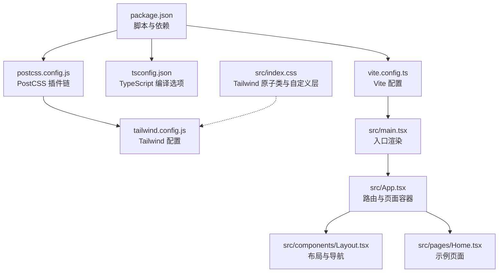
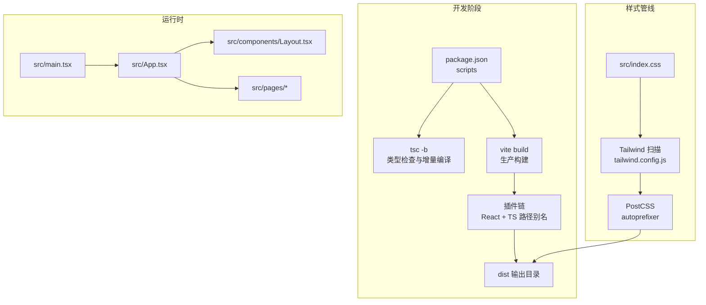
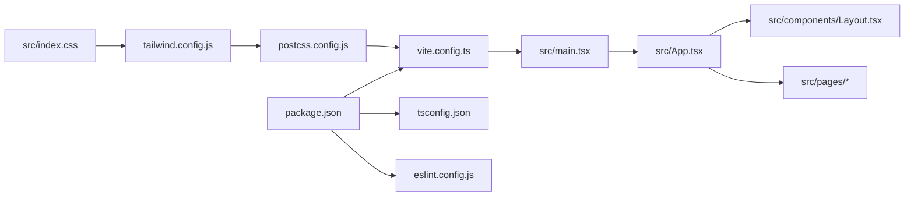

# 构建与部署

<cite>
**本文引用的文件**
- [vite.config.ts](file://vite.config.ts)
- [package.json](file://package.json)
- [tsconfig.json](file://tsconfig.json)
- [tailwind.config.js](file://tailwind.config.js)
- [postcss.config.js](file://postcss.config.js)
- [eslint.config.js](file://eslint.config.js)
- [nginx-config.txt](file://nginx-config.txt)
- [nginx.conf.example](file://nginx.conf.example)
- [src/main.tsx](file://src/main.tsx)
- [src/App.tsx](file://src/App.tsx)
- [src/components/Layout.tsx](file://src/components/Layout.tsx)
- [src/index.css](file://src/index.css)
- [src/pages/Home.tsx](file://src/pages/Home.tsx)
- [README.md](file://README.md)
- [test-tesseract.js](file://test-tesseract.js)
</cite>

## 目录
1. [简介](#简介)
2. [项目结构](#项目结构)
3. [核心组件](#核心组件)
4. [架构总览](#架构总览)
5. [详细组件分析](#详细组件分析)
6. [依赖关系分析](#依赖关系分析)
7. [性能考量](#性能考量)
8. [故障排查指南](#故障排查指南)
9. [结论](#结论)
10. [附录](#附录)

## 简介
本指南面向前端工程团队与运维人员，系统性讲解基于 Vite + React + TypeScript 的构建与部署流程，覆盖以下主题：
- Vite 构建流程与生产环境优化策略
- TypeScript 编译配置与类型检查最佳实践
- 代码分割与打包优化技术
- 静态资源处理、CSS 预处理器与 Tailwind CSS 优化
- 构建产物分析、性能基准测试与部署前检查清单
- 多环境配置管理、版本控制与发布流程
- 构建错误排查、性能优化技巧与内存使用优化方案

## 项目结构
该项目采用 Vite 官方模板，结合 React 与 TypeScript，配合 Tailwind CSS 实现样式体系，并通过 PostCSS 自动前缀与按需生成 CSS。构建脚本通过 TypeScript 编译器与 Vite 并行执行，确保类型安全与快速构建。

图示来源
- [package.json:1-48](file://package.json#L1-L48)
- [vite.config.ts:1-22](file://vite.config.ts#L1-L22)
- [tsconfig.json:1-38](file://tsconfig.json#L1-L38)
- [postcss.config.js:1-11](file://postcss.config.js#L1-L11)
- [tailwind.config.js:1-16](file://tailwind.config.js#L1-L16)
- [src/main.tsx:1-11](file://src/main.tsx#L1-L11)
- [src/App.tsx:1-52](file://src/App.tsx#L1-L52)
- [src/components/Layout.tsx:1-66](file://src/components/Layout.tsx#L1-L66)
- [src/pages/Home.tsx:1-3](file://src/pages/Home.tsx#L1-L3)
- [src/index.css:1-61](file://src/index.css#L1-L61)

章节来源
- [package.json:1-48](file://package.json#L1-L48)
- [vite.config.ts:1-22](file://vite.config.ts#L1-L22)
- [tsconfig.json:1-38](file://tsconfig.json#L1-L38)
- [postcss.config.js:1-11](file://postcss.config.js#L1-L11)
- [tailwind.config.js:1-16](file://tailwind.config.js#L1-L16)
- [src/main.tsx:1-11](file://src/main.tsx#L1-L11)
- [src/App.tsx:1-52](file://src/App.tsx#L1-L52)
- [src/components/Layout.tsx:1-66](file://src/components/Layout.tsx#L1-L66)
- [src/pages/Home.tsx:1-3](file://src/pages/Home.tsx#L1-L3)
- [src/index.css:1-61](file://src/index.css#L1-L61)

## 核心组件
- Vite 构建配置：启用隐藏 Source Map，集成 React 与 TypeScript 路径别名插件，以及开发定位辅助插件。
- TypeScript 编译：以 ESNext 模块解析，JSX 使用 React JSX 转换，严格模式关闭以便快速迭代，路径别名映射至 src。
- CSS 与 Tailwind：通过 PostCSS 自动前缀与 Tailwind 按需扫描，支持暗色模式与 Typography 插件。
- ESLint：推荐配置，扩展类型感知规则，适配 React Hooks 与刷新策略。
- Nginx：单页应用路由回退至 index.html，静态资源缓存与日志优化。

章节来源
- [vite.config.ts:1-22](file://vite.config.ts#L1-L22)
- [package.json:1-48](file://package.json#L1-L48)
- [tsconfig.json:1-38](file://tsconfig.json#L1-L38)
- [postcss.config.js:1-11](file://postcss.config.js#L1-L11)
- [tailwind.config.js:1-16](file://tailwind.config.js#L1-L16)
- [eslint.config.js:1-29](file://eslint.config.js#L1-L29)
- [nginx-config.txt:1-22](file://nginx-config.txt#L1-L22)
- [nginx.conf.example:1-23](file://nginx.conf.example#L1-L23)

## 架构总览
下图展示了从源码到生产构建产物的关键流程与组件交互：

图示来源
- [package.json:6-12](file://package.json#L6-L12)
- [vite.config.ts:7-21](file://vite.config.ts#L7-L21)
- [tsconfig.json:1-38](file://tsconfig.json#L1-L38)
- [postcss.config.js:5-10](file://postcss.config.js#L5-L10)
- [tailwind.config.js:3-15](file://tailwind.config.js#L3-L15)
- [src/main.tsx:1-11](file://src/main.tsx#L1-L11)
- [src/App.tsx:1-52](file://src/App.tsx#L1-L52)
- [src/components/Layout.tsx:1-66](file://src/components/Layout.tsx#L1-L66)

## 详细组件分析

### Vite 构建配置与生产优化
- 构建输出：启用隐藏 Source Map，兼顾调试与产物体积控制。
- 插件链：React 插件集成 Babel 与开发定位插件；TS 路径别名提升导入体验。
- 生产优化建议：
  - 启用压缩与资源内联策略，结合浏览器缓存与 CDN。
  - 使用动态导入进行路由级代码分割，减少首屏包体。
  - 开启预加载与预连接，优化关键资源加载顺序。

章节来源
- [vite.config.ts:7-21](file://vite.config.ts#L7-L21)

### TypeScript 编译配置与类型检查
- 目标与模块：ES2020 与 ESNext 模块解析，保证现代浏览器兼容与 Tree-shaking。
- 路径别名：通过 baseUrl 与 paths 将 @ 映射至 src，简化导入路径。
- 严格性：关闭严格模式与未使用检测，便于快速迭代；可在 CI 中开启更严格规则。
- 类型检查：通过独立脚本执行全量类型检查，避免构建阶段阻塞。

章节来源
- [tsconfig.json:1-38](file://tsconfig.json#L1-L38)
- [package.json:6-12](file://package.json#L6-L12)
- [README.md:10-32](file://README.md#L10-L32)

### CSS 预处理器与 Tailwind 优化
- PostCSS：自动前缀与 Tailwind 集成，确保跨浏览器兼容与最小化 CSS。
- Tailwind：按需扫描 HTML 与组件文件，支持暗色模式与 Typography 插件增强排版。
- 样式组织：通过原子类与自定义 CSS 变量实现主题一致性，减少重复样式。

章节来源
- [postcss.config.js:5-10](file://postcss.config.js#L5-L10)
- [tailwind.config.js:3-15](file://tailwind.config.js#L3-L15)
- [src/index.css:1-61](file://src/index.css#L1-L61)

### 代码分割与打包优化
- 动态导入：对路由页面与重型依赖使用动态导入，实现按需加载。
- 分包策略：利用 Vite 的 rollupOptions 对第三方库进行拆分，结合 CDN 降低主包体积。
- 资源优化：对图片与字体进行压缩与格式优化，启用 WebP/AVIF 并提供回退方案。

章节来源
- [vite.config.ts:7-21](file://vite.config.ts#L7-L21)

### 部署与 Nginx 配置
- 单页应用路由：将所有未匹配路径回退至 index.html，避免刷新 404。
- 静态资源缓存：对 JS/CSS/媒体与字体设置长期缓存，减少带宽消耗。
- 安全与性能：建议启用 HTTPS 重定向与安全响应头，结合 Gzip/Brotli 压缩。

章节来源
- [nginx-config.txt:1-22](file://nginx-config.txt#L1-L22)
- [nginx.conf.example:1-23](file://nginx.conf.example#L1-L23)

### ESLint 规则与质量保障
- 推荐配置：启用类型感知规则与 React Hooks 最佳实践，减少潜在错误。
- 扩展规则：可引入 React X 与 React DOM 插件，进一步强化规范。

章节来源
- [eslint.config.js:1-29](file://eslint.config.js#L1-L29)
- [README.md:10-57](file://README.md#L10-L57)

### 构建产物分析与性能基准
- 产物分析：使用 Vite 内置可视化工具或第三方 Bundle Analyzer，识别超大模块与重复依赖。
- 性能基准：以 Lighthouse、WebPageTest 或 PageSpeed Insights 评估首屏时间、交互延迟与资源大小。
- 指标监控：建立构建体积阈值与加载时间基线，CI 中失败阈值触发告警。

章节来源
- [vite.config.ts:7-21](file://vite.config.ts#L7-L21)

### 多环境配置管理与版本控制
- 环境变量：区分 dev/staging/prod，使用 .env.* 文件管理敏感配置，避免硬编码。
- 版本控制：遵循语义化版本，使用 Git Tag 与 Changelog 记录发布版本。
- 发布流程：自动化流水线执行类型检查、单元测试、构建与部署，确保一致性与可追溯性。

章节来源
- [package.json:6-12](file://package.json#L6-L12)

## 依赖关系分析
下图展示关键配置文件之间的耦合关系与影响范围：

图示来源
- [package.json:1-48](file://package.json#L1-L48)
- [vite.config.ts:1-22](file://vite.config.ts#L1-L22)
- [tsconfig.json:1-38](file://tsconfig.json#L1-L38)
- [eslint.config.js:1-29](file://eslint.config.js#L1-L29)
- [src/main.tsx:1-11](file://src/main.tsx#L1-L11)
- [src/App.tsx:1-52](file://src/App.tsx#L1-L52)
- [src/components/Layout.tsx:1-66](file://src/components/Layout.tsx#L1-L66)
- [src/index.css:1-61](file://src/index.css#L1-L61)
- [tailwind.config.js:1-16](file://tailwind.config.js#L1-L16)
- [postcss.config.js:1-11](file://postcss.config.js#L1-L11)

章节来源
- [package.json:1-48](file://package.json#L1-L48)
- [vite.config.ts:1-22](file://vite.config.ts#L1-L22)
- [tsconfig.json:1-38](file://tsconfig.json#L1-L38)
- [eslint.config.js:1-29](file://eslint.config.js#L1-L29)
- [src/main.tsx:1-11](file://src/main.tsx#L1-L11)
- [src/App.tsx:1-52](file://src/App.tsx#L1-L52)
- [src/components/Layout.tsx:1-66](file://src/components/Layout.tsx#L1-L66)
- [src/index.css:1-61](file://src/index.css#L1-L61)
- [tailwind.config.js:1-16](file://tailwind.config.js#L1-L16)
- [postcss.config.js:1-11](file://postcss.config.js#L1-L11)

## 性能考量
- 构建性能
  - 启用并行编译与增量构建，减少重复工作。
  - 使用更快的解析器（如 SWC）替代 Babel，缩短编译时间。
- 运行时性能
  - 优先使用轻量级依赖与按需加载，避免一次性引入大型库。
  - 利用浏览器缓存与 HTTP/2 多路复用，优化资源加载。
- 内存使用
  - 控制单页应用状态规模，避免大对象频繁深拷贝。
  - 对长列表与图片懒加载，减少峰值内存占用。

## 故障排查指南
- 构建失败
  - 类型错误：先执行类型检查脚本，修复后再构建。
  - 插件冲突：逐项禁用插件定位问题来源。
- 样式异常
  - Tailwind 未生效：确认扫描路径与内容配置正确。
  - CSS 未压缩：检查 PostCSS 插件顺序与生产模式。
- 部署 404
  - 单页路由：确认 Nginx 回退规则与静态资源缓存配置。
- 性能瓶颈
  - 使用构建分析工具定位大包与重复依赖，实施拆分与去重。
  - 对图片与字体进行压缩与格式优化，启用合适的缓存策略。

章节来源
- [package.json:6-12](file://package.json#L6-L12)
- [tailwind.config.js:5](file://tailwind.config.js#L5)
- [postcss.config.js:5-10](file://postcss.config.js#L5-L10)
- [nginx.conf.example:12-15](file://nginx.conf.example#L12-L15)

## 结论
本指南提供了从配置到部署的完整路径：以 Vite 为核心，结合 TypeScript、Tailwind CSS 与 PostCSS，形成高效、可维护的前端工程体系。通过合理的代码分割、资源优化与部署策略，可显著提升首屏性能与用户体验。建议在持续集成中加入构建分析与性能基线校验，确保质量与稳定性。

## 附录

### 构建与预览命令
- 开发：启动本地开发服务器，支持热更新与类型检查。
- 构建：先执行类型检查与增量编译，再进行生产构建。
- 预览：本地预览生产构建产物，验证打包结果与路由行为。

章节来源
- [package.json:6-12](file://package.json#L6-L12)

### 示例：Tesseract OCR 初始化（用于离线测试）
- 用途：初始化 OCR 工作进程，便于在无网络环境下验证图像识别能力。
- 注意：终止工作进程以释放内存，避免长时间占用。

章节来源
- [test-tesseract.js:1-6](file://test-tesseract.js#L1-L6)