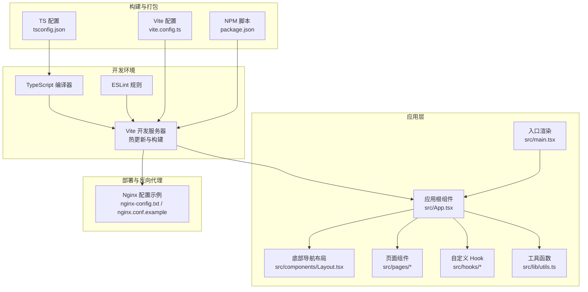
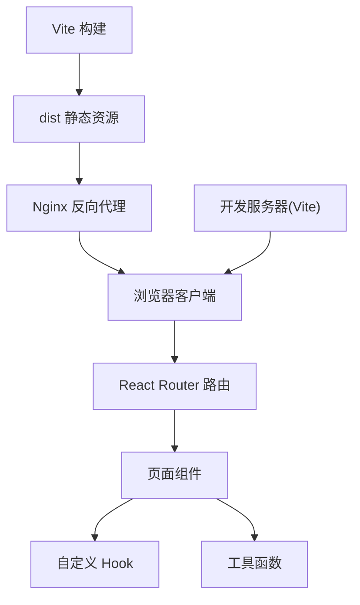
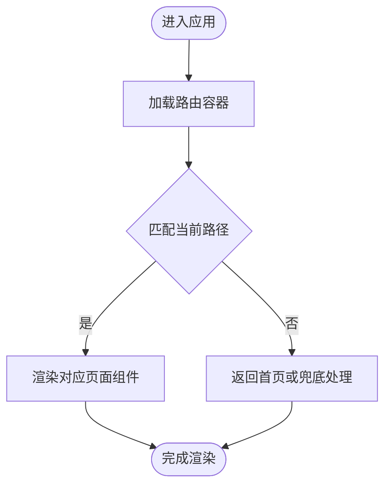
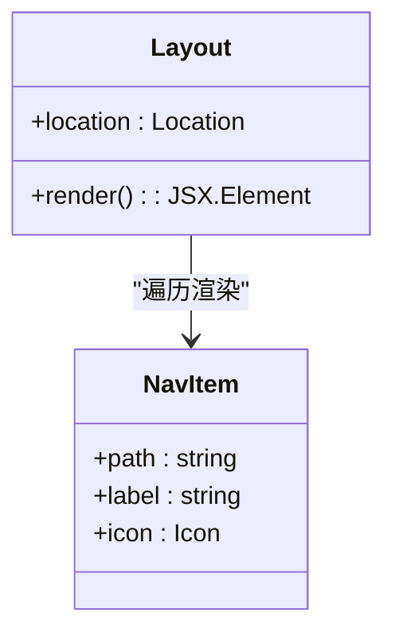
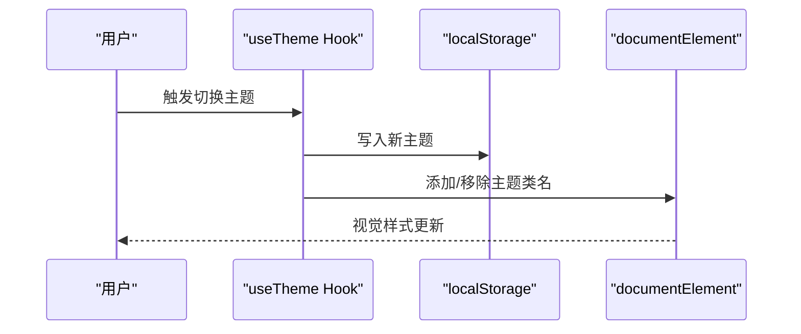
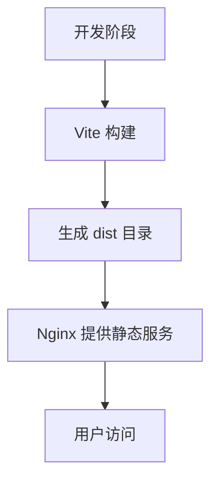
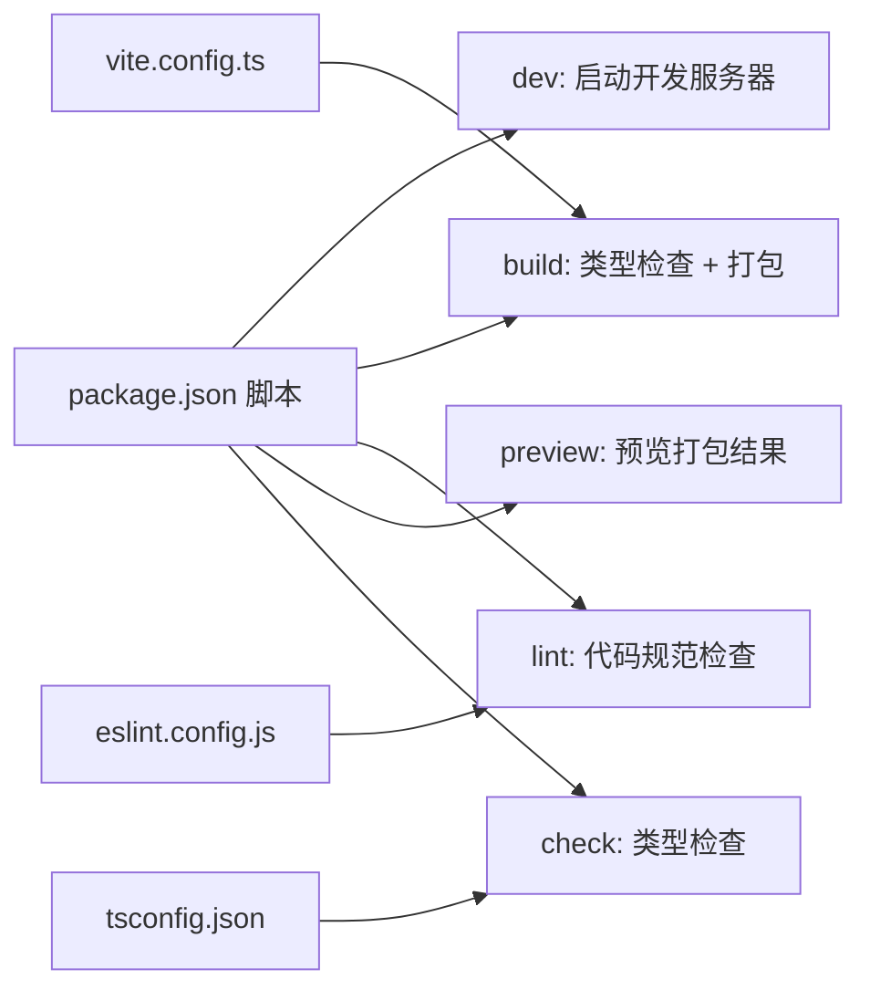
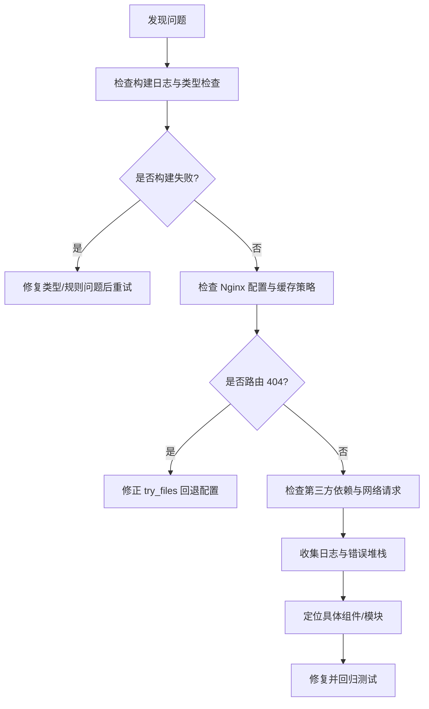

# 监控与维护

<cite>
**本文引用的文件**
- [README.md](file://README.md)
- [package.json](file://package.json)
- [vite.config.ts](file://vite.config.ts)
- [nginx-config.txt](file://nginx-config.txt)
- [nginx.conf.example](file://nginx.conf.example)
- [eslint.config.js](file://eslint.config.js)
- [tsconfig.json](file://tsconfig.json)
- [src/main.tsx](file://src/main.tsx)
- [src/App.tsx](file://src/App.tsx)
- [src/components/Layout.tsx](file://src/components/Layout.tsx)
- [src/hooks/useTheme.ts](file://src/hooks/useTheme.ts)
- [src/lib/utils.ts](file://src/lib/utils.ts)
- [test-tesseract.js](file://test-tesseract.js)
</cite>

## 目录
1. [简介](#简介)
2. [项目结构](#项目结构)
3. [核心组件](#核心组件)
4. [架构总览](#架构总览)
5. [详细组件分析](#详细组件分析)
6. [依赖分析](#依赖分析)
7. [性能考虑](#性能考虑)
8. [故障排查指南](#故障排查指南)
9. [结论](#结论)
10. [附录](#附录)

## 简介
本指南面向前端工程团队，聚焦于应用性能监控、日志管理与故障排查流程，结合现有仓库中的构建与运行配置，给出可落地的监控与维护实践。内容涵盖：
- 关键指标监控与错误追踪
- 用户体验分析方法
- 自动化运维脚本与部署配置
- 备份策略与灾难恢复建议
- 安全审计、漏洞扫描与合规检查
- 维护窗口规划、变更管理与回滚策略
- 团队协作工具、问题跟踪与知识管理最佳实践

## 项目结构
该仓库为基于 React + TypeScript + Vite 的前端项目，采用单页应用（SPA）架构，路由由浏览器历史模式驱动，构建产物通过 Nginx 提供静态服务。

图表来源
- [src/main.tsx:1-11](file://src/main.tsx#L1-L11)
- [src/App.tsx:1-52](file://src/App.tsx#L1-L52)
- [src/components/Layout.tsx:1-66](file://src/components/Layout.tsx#L1-L66)
- [vite.config.ts:1-22](file://vite.config.ts#L1-L22)
- [tsconfig.json:1-38](file://tsconfig.json#L1-L38)
- [package.json:1-48](file://package.json#L1-L48)
- [nginx-config.txt:1-22](file://nginx-config.txt#L1-L22)
- [nginx.conf.example:1-23](file://nginx.conf.example#L1-L23)

章节来源
- [src/main.tsx:1-11](file://src/main.tsx#L1-L11)
- [src/App.tsx:1-52](file://src/App.tsx#L1-L52)
- [src/components/Layout.tsx:1-66](file://src/components/Layout.tsx#L1-L66)
- [vite.config.ts:1-22](file://vite.config.ts#L1-L22)
- [tsconfig.json:1-38](file://tsconfig.json#L1-L38)
- [package.json:1-48](file://package.json#L1-L48)
- [nginx-config.txt:1-22](file://nginx-config.txt#L1-L22)
- [nginx.conf.example:1-23](file://nginx.conf.example#L1-L23)

## 核心组件
- 入口与渲染
  - 应用通过入口文件挂载根组件，使用严格模式与路由容器包裹，确保全局状态与导航可用。
- 应用根组件
  - 路由组织页面集合，包含多个业务页面与占位页面，便于后续扩展。
- 布局与导航
  - 底部导航栏提供移动端友好的交互入口，支持当前路由高亮与图标动画。
- 自定义 Hook 与工具
  - 主题切换 Hook 支持本地持久化与系统偏好检测；通用工具函数提供样式合并能力。

章节来源
- [src/main.tsx:1-11](file://src/main.tsx#L1-L11)
- [src/App.tsx:1-52](file://src/App.tsx#L1-L52)
- [src/components/Layout.tsx:1-66](file://src/components/Layout.tsx#L1-L66)
- [src/hooks/useTheme.ts:1-29](file://src/hooks/useTheme.ts#L1-L29)
- [src/lib/utils.ts:1-7](file://src/lib/utils.ts#L1-L7)

## 架构总览
前端采用 SPA 架构，构建产物由 Vite 生成，通过 Nginx 提供静态服务。路由采用浏览器历史模式，需在 Nginx 中配置回退至 index.html，以避免刷新导致的 404。

图表来源
- [src/App.tsx:1-52](file://src/App.tsx#L1-L52)
- [src/components/Layout.tsx:1-66](file://src/components/Layout.tsx#L1-L66)
- [vite.config.ts:1-22](file://vite.config.ts#L1-L22)
- [nginx-config.txt:1-22](file://nginx-config.txt#L1-L22)

## 详细组件分析

### 组件一：应用根组件与路由
- 职责
  - 统一组织页面路由，承载页面级逻辑与状态。
- 关键点
  - 使用路由容器包裹，定义多条路径与嵌套路由，便于扩展新页面。
  - 包含若干占位页面，可用于后续对接真实数据或功能模块。
- 性能与可维护性
  - 将页面拆分为独立模块，降低耦合度，提升可测试性。

图表来源
- [src/App.tsx:19-51](file://src/App.tsx#L19-L51)

章节来源
- [src/App.tsx:1-52](file://src/App.tsx#L1-L52)

### 组件二：底部导航布局
- 职责
  - 提供移动端底部导航，支持当前路由高亮与图标动画。
- 关键点
  - 使用链接组件绑定路由路径，根据当前路径动态计算激活状态。
  - 图标与文字样式随激活状态变化，增强用户反馈。
- 可扩展性
  - 导航项数组可配置化，便于按需增删。

图表来源
- [src/components/Layout.tsx:10-62](file://src/components/Layout.tsx#L10-L62)

章节来源
- [src/components/Layout.tsx:1-66](file://src/components/Layout.tsx#L1-L66)

### 组件三：主题切换 Hook
- 职责
  - 管理主题状态并在本地存储中持久化，同时响应系统偏好。
- 关键点
  - 初始值优先读取本地存储，其次检测系统深色模式偏好。
  - 切换时更新根元素类名，影响全局样式。
- 可靠性
  - 通过副作用同步到本地存储，避免刷新丢失状态。

图表来源
- [src/hooks/useTheme.ts:14-18](file://src/hooks/useTheme.ts#L14-L18)

章节来源
- [src/hooks/useTheme.ts:1-29](file://src/hooks/useTheme.ts#L1-L29)

### 组件四：构建与部署配置
- Vite 配置
  - 启用隐藏源码映射，减少生产包体积与泄露风险。
  - 集成 React 插件与路径别名插件，提升开发体验。
- TypeScript 配置
  - 设置严格性与路径别名，保证类型安全与模块解析。
- Nginx 配置
  - 静态资源缓存与 SPA 路由回退至 index.html，避免刷新 404。
  - 可选 HTTPS 重定向与缓存策略，提升安全性与性能。

图表来源
- [vite.config.ts:8-21](file://vite.config.ts#L8-L21)
- [tsconfig.json:26-31](file://tsconfig.json#L26-L31)
- [nginx-config.txt:8-21](file://nginx-config.txt#L8-L21)

章节来源
- [vite.config.ts:1-22](file://vite.config.ts#L1-L22)
- [tsconfig.json:1-38](file://tsconfig.json#L1-L38)
- [nginx-config.txt:1-22](file://nginx-config.txt#L1-L22)
- [nginx.conf.example:1-23](file://nginx.conf.example#L1-L23)

## 依赖分析
- 构建与开发工具
  - Vite、TypeScript、ESLint、TailwindCSS 等构成开发与构建基础。
- 运行时依赖
  - React 生态与 UI 工具库，提供页面与组件能力。
- 脚本与任务
  - dev、build、lint、preview、check 等脚本覆盖开发、构建、校验与预览流程。

图表来源
- [package.json:6-11](file://package.json#L6-L11)
- [vite.config.ts:1-22](file://vite.config.ts#L1-L22)
- [eslint.config.js:1-29](file://eslint.config.js#L1-L29)
- [tsconfig.json:1-38](file://tsconfig.json#L1-L38)

章节来源
- [package.json:1-48](file://package.json#L1-L48)
- [eslint.config.js:1-29](file://eslint.config.js#L1-L29)
- [tsconfig.json:1-38](file://tsconfig.json#L1-L38)

## 性能考虑
- 构建优化
  - 启用隐藏源码映射，减少生产包体积与泄露风险。
  - 使用路径别名与模块解析优化，缩短模块查找时间。
- 运行时优化
  - 按需引入与懒加载页面组件，降低首屏负载。
  - 使用 CSS-in-JS 或原子化工具（如 Tailwind）减少样式体积。
- 静态资源与缓存
  - Nginx 对静态资源启用长期缓存，减少带宽消耗。
  - SPA 路由回退策略避免刷新导致的重复请求与 404。
- 监控指标建议
  - 首屏渲染时间、TTFB、FP/FCP/LCP、INP、CLS 等 Web Vitals 指标。
  - 错误率、崩溃率、接口超时率、资源加载失败率。
  - 用户行为路径与关键转化漏斗。

## 故障排查指南
- 构建与预览
  - 若构建失败，先执行类型检查脚本定位类型问题。
  - 使用预览命令在本地验证打包产物是否可正常访问。
- 路由与刷新
  - 若刷新出现 404，检查 Nginx 是否正确配置回退至 index.html。
  - 确认静态资源缓存策略未阻断最新资源加载。
- 开发调试
  - 使用 ESLint 规则与类型检查尽早发现潜在问题。
  - 在入口文件与根组件处添加必要日志或错误边界，快速定位异常。
- 第三方依赖
  - 对 OCR 功能等第三方库进行最小化复现测试，确认依赖版本与兼容性。

章节来源
- [package.json:6-11](file://package.json#L6-L11)
- [nginx-config.txt:11-14](file://nginx-config.txt#L11-L14)
- [test-tesseract.js:1-6](file://test-tesseract.js#L1-L6)

## 结论
本指南基于现有仓库配置，给出了前端监控与维护的实施要点：以 Vite 与 Nginx 为基础，结合路由与构建配置，建立从开发到生产的质量与稳定性保障。建议在现有基础上逐步引入性能监控、错误追踪与日志管理方案，并完善自动化运维与安全合规流程。

## 附录
- 团队协作与知识管理
  - 使用版本控制与分支策略，配合变更日志与发布说明。
  - 将设计文档与技术规范沉淀到仓库内，形成可检索的知识库。
- 问题跟踪与维护窗口
  - 建立问题分级与响应机制，规划定期维护窗口与紧急预案。
- 安全与合规
  - 定期进行依赖漏洞扫描与安全审计，确保第三方库版本可控。
  - 在 Nginx 层面启用安全头与 HTTPS，保护传输安全。