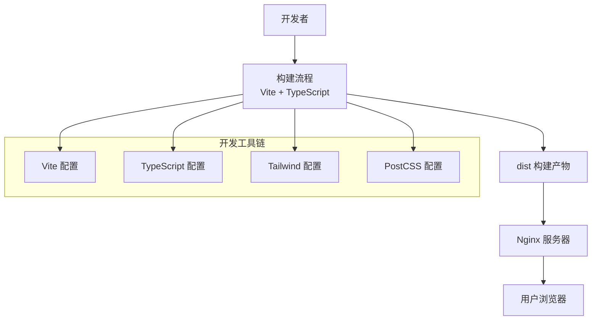
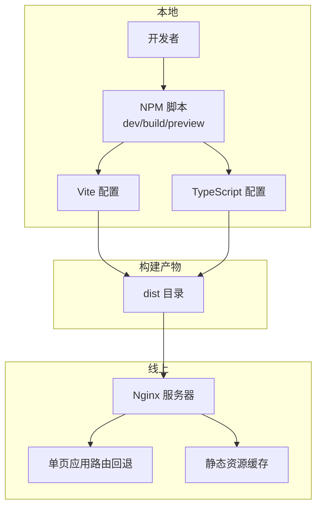
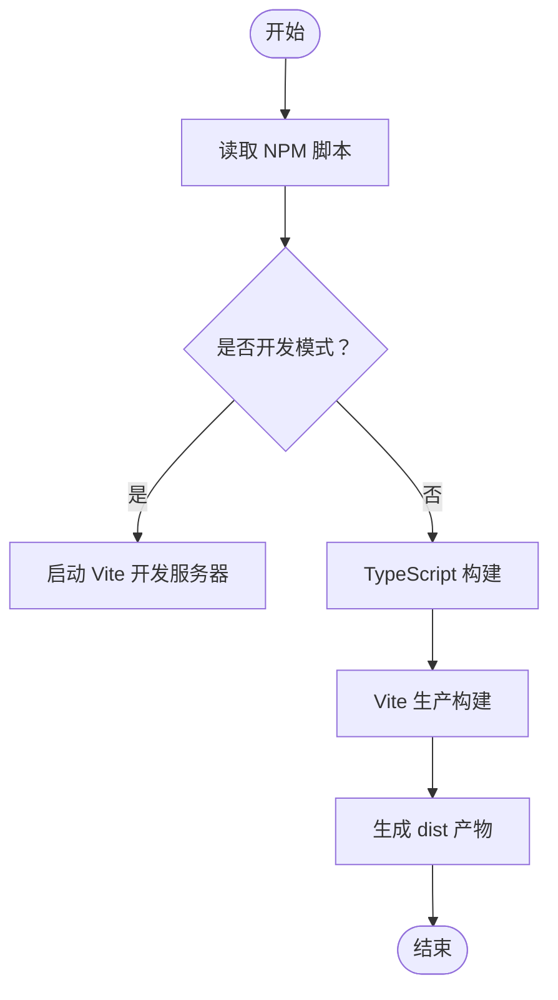
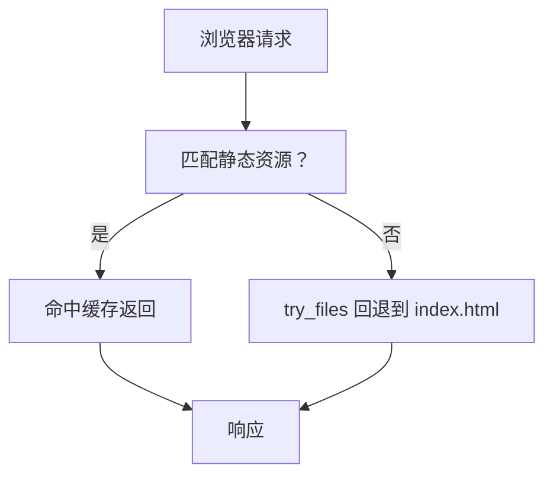
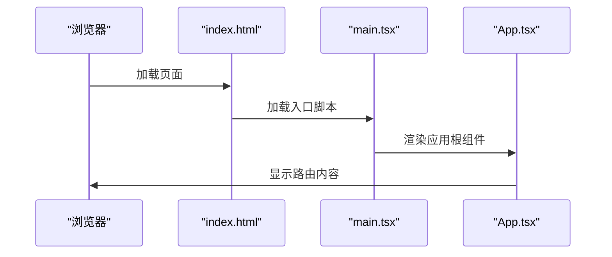
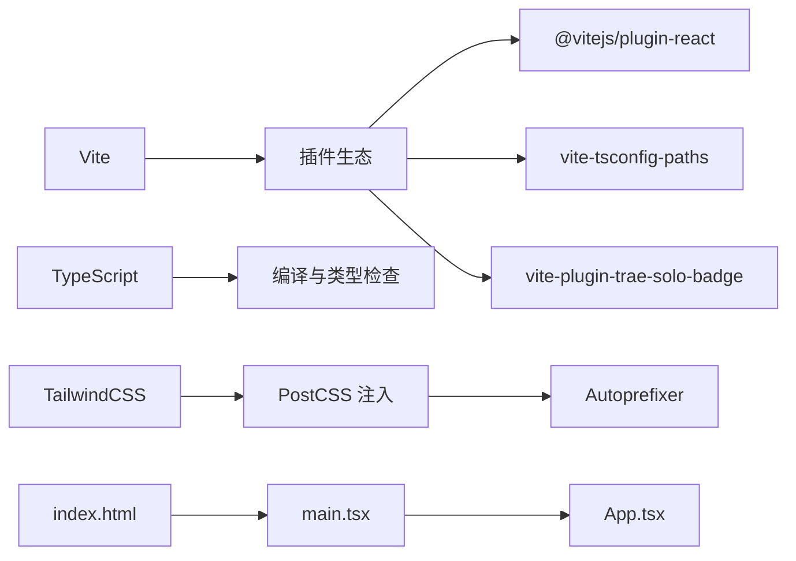

# 部署与运维

<cite>
**本文引用的文件**   
- [package.json](file://package.json)
- [vite.config.ts](file://vite.config.ts)
- [tsconfig.json](file://tsconfig.json)
- [tailwind.config.js](file://tailwind.config.js)
- [postcss.config.js](file://postcss.config.js)
- [nginx-config.txt](file://nginx-config.txt)
- [nginx.conf.example](file://nginx.conf.example)
- [README.md](file://README.md)
- [src/main.tsx](file://src/main.tsx)
- [src/App.tsx](file://src/App.tsx)
- [index.html](file://index.html)
</cite>

## 目录
1. [简介](#简介)
2. [项目结构](#项目结构)
3. [核心组件](#核心组件)
4. [架构总览](#架构总览)
5. [详细组件分析](#详细组件分析)
6. [依赖分析](#依赖分析)
7. [性能考虑](#性能考虑)
8. [故障排查指南](#故障排查指南)
9. [结论](#结论)
10. [附录](#附录)

## 简介
本指南面向部署与运维工程师，围绕前端应用的构建、发布、运行时优化与线上维护提供系统性方法论。结合仓库中的构建配置与 Nginx 示例，给出生产级的构建参数、静态资源优化、缓存策略、反向代理与 SSL 配置要点，并补充容器化、CI/CD 与自动化部署的通用实践建议。

## 项目结构
该仓库为基于 Vite + React + TypeScript 的前端项目，采用模块化页面与组件组织方式，使用 TailwindCSS 进行样式管理，PostCSS 自动注入工具链。构建产物输出至 dist 目录，Nginx 提供静态资源服务与 SPA 路由回退。

图表来源
- [vite.config.ts:1-22](file://vite.config.ts#L1-L22)
- [tsconfig.json:1-38](file://tsconfig.json#L1-L38)
- [tailwind.config.js:1-16](file://tailwind.config.js#L1-L16)
- [postcss.config.js:1-11](file://postcss.config.js#L1-L11)

章节来源
- [package.json:1-48](file://package.json#L1-L48)
- [vite.config.ts:1-22](file://vite.config.ts#L1-L22)
- [tsconfig.json:1-38](file://tsconfig.json#L1-L38)
- [tailwind.config.js:1-16](file://tailwind.config.js#L1-L16)
- [postcss.config.js:1-11](file://postcss.config.js#L1-L11)
- [index.html:1-25](file://index.html#L1-L25)

## 核心组件
- 构建与打包
  - 使用 Vite 进行快速开发与生产构建；TypeScript 编译与类型检查通过独立命令完成；构建产物位于默认 dist 目录。
- 样式与工具链
  - TailwindCSS 作为原子化样式框架；PostCSS 自动注入 Tailwind 与 Autoprefixer。
- 运行时入口
  - index.html 作为应用入口，挂载根节点并加载主入口脚本；React 应用在 main.tsx 中初始化。
- 路由与页面
  - App.tsx 定义路由层级与页面组件映射，支持嵌套路由与动态参数。

章节来源
- [package.json:6-12](file://package.json#L6-L12)
- [vite.config.ts:7-21](file://vite.config.ts#L7-L21)
- [tsconfig.json:1-38](file://tsconfig.json#L1-L38)
- [tailwind.config.js:3-15](file://tailwind.config.js#L3-L15)
- [postcss.config.js:5-10](file://postcss.config.js#L5-L10)
- [index.html:1-25](file://index.html#L1-L25)
- [src/main.tsx:1-11](file://src/main.tsx#L1-L11)
- [src/App.tsx:19-51](file://src/App.tsx#L19-L51)

## 架构总览
下图展示了从构建到上线的关键环节：本地开发与构建、产物分发、Nginx 静态托管与路由回退、浏览器访问。

图表来源
- [package.json:6-12](file://package.json#L6-L12)
- [vite.config.ts:7-21](file://vite.config.ts#L7-L21)
- [tsconfig.json:1-38](file://tsconfig.json#L1-L38)
- [nginx-config.txt:1-22](file://nginx-config.txt#L1-L22)
- [nginx.conf.example:1-23](file://nginx.conf.example#L1-L23)

## 详细组件分析

### 构建流程与产物优化
- 构建命令与流程
  - 开发模式：启动 Vite 开发服务器，支持热更新。
  - 生产构建：先执行 TypeScript 构建，再执行 Vite 打包生成 dist。
  - 预览模式：本地预览生产构建效果。
- 源码映射
  - 构建阶段启用隐藏源码映射，便于定位问题同时避免泄露源码。
- 工具链集成
  - React 插件、TS 路径别名插件、自定义 Trae 徽章插件等按需启用。
- 样式与自动前缀
  - Tailwind 内容扫描范围覆盖 HTML 与 src 下的 JS/TS/JSX/TSX 文件；PostCSS 注入 Tailwind 与 Autoprefixer。

图表来源
- [package.json:6-12](file://package.json#L6-L12)
- [vite.config.ts:7-21](file://vite.config.ts#L7-L21)
- [tsconfig.json:1-38](file://tsconfig.json#L1-L38)
- [tailwind.config.js:3-15](file://tailwind.config.js#L3-L15)
- [postcss.config.js:5-10](file://postcss.config.js#L5-L10)

章节来源
- [package.json:6-12](file://package.json#L6-L12)
- [vite.config.ts:7-21](file://vite.config.ts#L7-L21)
- [tsconfig.json:1-38](file://tsconfig.json#L1-L38)
- [tailwind.config.js:3-15](file://tailwind.config.js#L3-L15)
- [postcss.config.js:5-10](file://postcss.config.js#L5-L10)

### Nginx 配置与反向代理
- 基础站点
  - 监听 80 端口，server_name 对应域名。
  - root 指向 dist 目录，index 指定首页。
- SPA 路由回退
  - 使用 try_files 将未命中的请求回退到 index.html，解决前端路由刷新 404。
- 静态资源缓存
  - 对 js/css/png/gif/svg 等静态资源设置长缓存与关闭未命中日志。
- SSL 与重定向
  - 示例中提供 HTTP 到 HTTPS 的重定向注释，建议在具备证书时启用。

图表来源
- [nginx-config.txt:11-21](file://nginx-config.txt#L11-L21)
- [nginx.conf.example:12-22](file://nginx.conf.example#L12-L22)

章节来源
- [nginx-config.txt:1-22](file://nginx-config.txt#L1-L22)
- [nginx.conf.example:1-23](file://nginx.conf.example#L1-L23)

### 路由与入口
- 入口 HTML
  - index.html 定义根节点与标题，加载主入口脚本。
- React 初始化
  - main.tsx 创建根节点并渲染 App。
- 应用路由
  - App.tsx 使用 React Router 定义多级路由与页面组件映射，支持动态参数与嵌套布局。

图表来源
- [index.html:1-25](file://index.html#L1-L25)
- [src/main.tsx:1-11](file://src/main.tsx#L1-L11)
- [src/App.tsx:19-51](file://src/App.tsx#L19-L51)

章节来源
- [index.html:1-25](file://index.html#L1-L25)
- [src/main.tsx:1-11](file://src/main.tsx#L1-L11)
- [src/App.tsx:19-51](file://src/App.tsx#L19-L51)

### 静态资源优化与缓存策略
- 资源类型
  - JS/CSS/图片/字体等静态资源建议开启长期缓存，提升二次访问性能。
- 日志控制
  - 对静态资源关闭未命中日志，降低日志体量。
- 版本与指纹
  - 建议在构建时启用文件指纹（由 Vite 默认行为处理），以实现强缓存与更新可控。

章节来源
- [nginx-config.txt:16-20](file://nginx-config.txt#L16-L20)
- [nginx.conf.example:17-21](file://nginx.conf.example#L17-L21)

### 生产环境构建配置要点
- 构建命令
  - 先执行 TypeScript 构建，再执行 Vite 打包，确保类型检查与打包顺序正确。
- 源码映射
  - 使用隐藏源码映射，兼顾调试与安全。
- 工具链
  - Tailwind 内容扫描路径覆盖应用实际使用的模板与组件目录；PostCSS 自动注入保证兼容性。

章节来源
- [package.json:6-12](file://package.json#L6-L12)
- [vite.config.ts:9](file://vite.config.ts#L9)
- [tailwind.config.js:5](file://tailwind.config.js#L5)
- [postcss.config.js:5-10](file://postcss.config.js#L5-L10)

## 依赖分析
- 构建与打包
  - Vite 作为核心构建工具；TypeScript 提供类型检查；React 插件与 TS 路径插件增强开发体验。
- 样式与工具
  - TailwindCSS 提供原子化样式；Autoprefixer 自动添加浏览器前缀；PostCSS 统一注入。
- 运行时
  - React 生态组件与路由；应用在 index.html 中挂载根节点。

图表来源
- [package.json:27-46](file://package.json#L27-L46)
- [vite.config.ts:11-20](file://vite.config.ts#L11-L20)
- [tailwind.config.js:3-15](file://tailwind.config.js#L3-L15)
- [postcss.config.js:5-10](file://postcss.config.js#L5-L10)
- [index.html:1-25](file://index.html#L1-L25)
- [src/main.tsx:1-11](file://src/main.tsx#L1-L11)
- [src/App.tsx:19-51](file://src/App.tsx#L19-L51)

章节来源
- [package.json:13-26](file://package.json#L13-L26)
- [package.json:27-46](file://package.json#L27-L46)
- [vite.config.ts:11-20](file://vite.config.ts#L11-L20)
- [tailwind.config.js:3-15](file://tailwind.config.js#L3-L15)
- [postcss.config.js:5-10](file://postcss.config.js#L5-L10)
- [index.html:1-25](file://index.html#L1-L25)
- [src/main.tsx:1-11](file://src/main.tsx#L1-L11)
- [src/App.tsx:19-51](file://src/App.tsx#L19-L51)

## 性能考虑
- 构建与缓存
  - 启用隐藏源码映射以平衡调试与安全；静态资源设置长期缓存，减少带宽消耗。
- 路由与回退
  - 使用 try_files 将前端路由回退到 index.html，避免 404 并保持用户体验。
- 工具链优化
  - Tailwind 内容扫描仅覆盖实际使用目录，避免无谓的样式体积膨胀；PostCSS 自动注入减少手动维护成本。

章节来源
- [vite.config.ts:9](file://vite.config.ts#L9)
- [nginx-config.txt:11-21](file://nginx-config.txt#L11-L21)
- [tailwind.config.js:5](file://tailwind.config.js#L5)

## 故障排查指南
- 构建失败
  - 确认已先执行 TypeScript 构建再进行 Vite 打包；检查 tsconfig 与 vite 配置是否正确。
- 预览异常
  - 使用预览命令检查生产构建产物是否可正常访问。
- Nginx 404 或路由刷新问题
  - 确认已启用 try_files 回退到 index.html；检查 root 路径与 server_name 是否匹配。
- 静态资源未缓存
  - 检查正则匹配的资源类型与缓存头设置；确认未被其他 location 规则覆盖。
- 开发热更新异常
  - 查看浏览器控制台错误提示；根据 Vite 提示修复语法或导入问题。

章节来源
- [package.json:6-12](file://package.json#L6-L12)
- [vite.config.ts:7-21](file://vite.config.ts#L7-L21)
- [nginx-config.txt:11-21](file://nginx-config.txt#L11-L21)
- [index.html:8-18](file://index.html#L8-L18)

## 结论
本指南基于现有配置与示例文件，给出了从构建到上线的完整路径：明确构建命令与产物位置、合理配置 Nginx 以适配 SPA、利用静态资源缓存提升性能，并提供故障排查清单。建议在生产环境中进一步完善 CI/CD、容器化与监控告警体系，以实现更稳健的交付与运维。

## 附录

### 环境变量与安全配置
- 环境变量
  - 建议通过构建时注入或运行时加载的方式管理 API 地址、功能开关等配置项，避免硬编码。
- 安全加固
  - 启用 HTTPS 并强制跳转；限制静态资源访问权限；定期轮换证书与密钥。

### 备份与恢复策略
- 构建产物备份
  - 对 dist 目录进行版本化备份，保留最近 N 个版本以便快速回滚。
- 配置备份
  - 备份 Nginx 配置与证书文件，确保可快速恢复。

### 负载均衡与 CDN
- 负载均衡
  - 多实例部署时通过上游健康检查与会话亲和策略保障稳定性。
- CDN 集成
  - 将静态资源托管至 CDN，结合边缘缓存与全球分发提升访问速度。

### 域名管理
- DNS 记录
  - 正确配置 A/AAAA/CNAME 记录指向负载均衡或 CDN。
- 子路径与子域
  - 如需多子域或多应用并存，建议统一规划路径与证书覆盖范围。