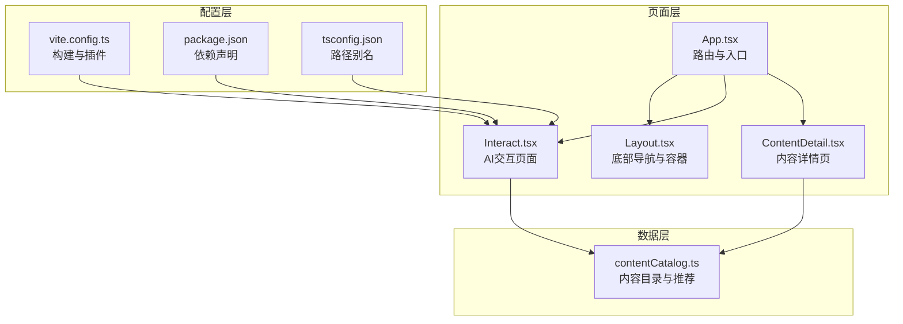
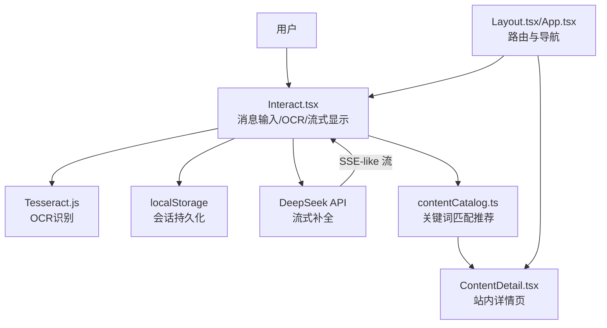
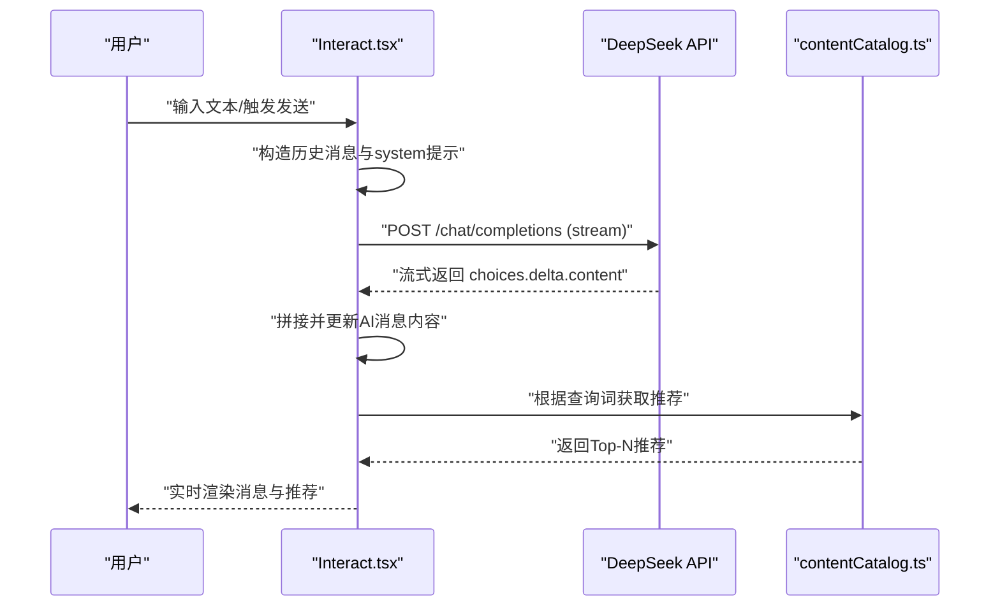
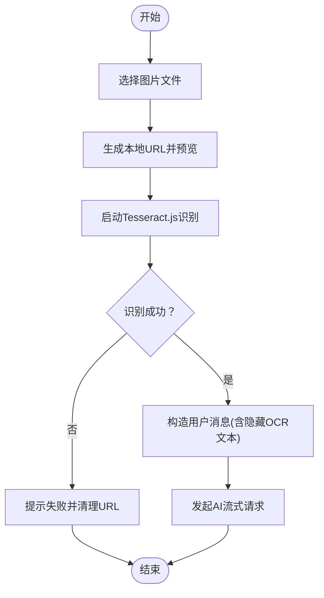
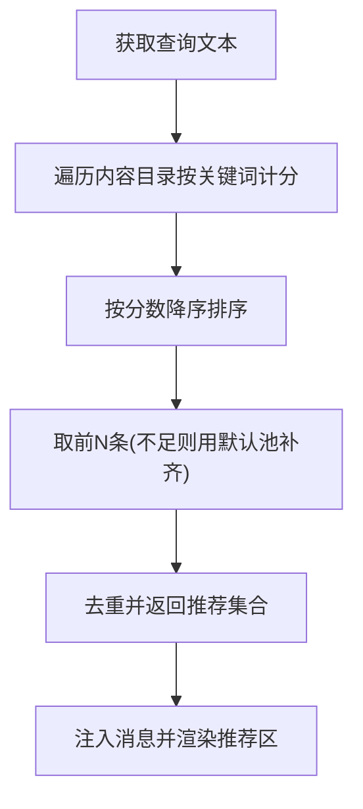
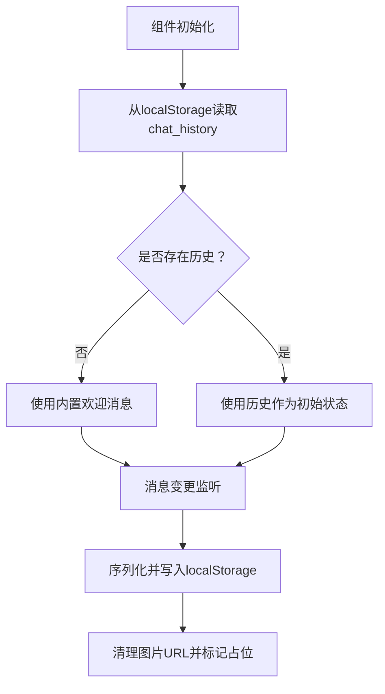
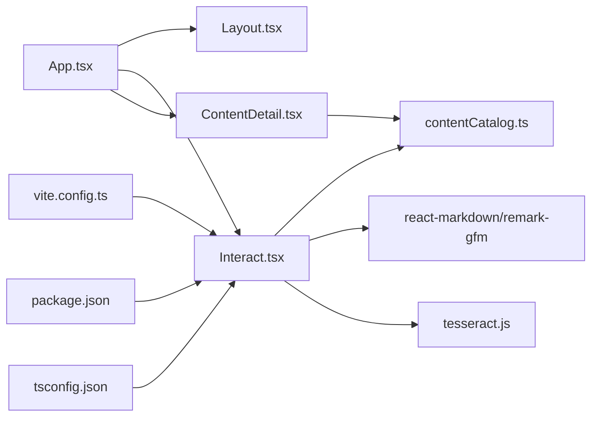

# AI交互页面

<cite>
**本文引用的文件**
- [Interact.tsx](file://src/pages/Interact.tsx)
- [contentCatalog.ts](file://src/data/contentCatalog.ts)
- [App.tsx](file://src/App.tsx)
- [Layout.tsx](file://src/components/Layout.tsx)
- [ContentDetail.tsx](file://src/pages/ContentDetail.tsx)
- [2026-04-14-chat-persistence-design.md](file://docs/superpowers/specs/2026-04-14-chat-persistence-design.md)
- [2026-04-14-chat-recommendations-design.md](file://docs/superpowers/specs/2026-04-14-chat-recommendations-design.md)
- [vite.config.ts](file://vite.config.ts)
- [package.json](file://package.json)
- [tsconfig.json](file://tsconfig.json)
- [test-tesseract.js](file://test-tesseract.js)
</cite>

## 目录
1. [简介](#简介)
2. [项目结构](#项目结构)
3. [核心组件](#核心组件)
4. [架构总览](#架构总览)
5. [详细组件分析](#详细组件分析)
6. [依赖关系分析](#依赖关系分析)
7. [性能考虑](#性能考虑)
8. [故障排查指南](#故障排查指南)
9. [结论](#结论)
10. [附录](#附录)

## 简介
本文件面向AI交互页面功能，系统性阐述对话系统架构、消息处理机制、OCR图像识别集成、智能推荐算法，以及会话状态持久化与上下文保持策略。文档同时覆盖与DeepSeek API的集成方式、错误重试与容错机制、对话历史管理与用户偏好学习的可扩展路径、对话安全与隐私保护建议，以及用户体验优化方案。为保证可追溯性，所有技术细节均与仓库中的实际源码文件相对应。

## 项目结构
本项目采用前端单页应用结构，AI交互页面位于独立页面组件中，配合内容目录与路由系统实现“对话—推荐—详情”的闭环体验。关键模块包括：
- 页面层：AI交互页面、内容详情页、布局导航
- 数据层：本地内容目录与推荐算法
- 配置层：Vite构建配置、TypeScript路径别名、依赖声明

**图表来源**
- [App.tsx:19-49](file://src/App.tsx#L19-L49)
- [Layout.tsx:19-65](file://src/components/Layout.tsx#L19-L65)
- [Interact.tsx:37-461](file://src/pages/Interact.tsx#L37-L461)
- [ContentDetail.tsx:14-133](file://src/pages/ContentDetail.tsx#L14-L133)
- [contentCatalog.ts:1-101](file://src/data/contentCatalog.ts#L1-L101)
- [vite.config.ts:1-22](file://vite.config.ts#L1-L22)
- [package.json:13-26](file://package.json#L13-L26)
- [tsconfig.json:26-31](file://tsconfig.json#L26-L31)

**章节来源**
- [App.tsx:19-49](file://src/App.tsx#L19-L49)
- [Layout.tsx:19-65](file://src/components/Layout.tsx#L19-L65)
- [Interact.tsx:37-461](file://src/pages/Interact.tsx#L37-L461)
- [ContentDetail.tsx:14-133](file://src/pages/ContentDetail.tsx#L14-L133)
- [contentCatalog.ts:1-101](file://src/data/contentCatalog.ts#L1-L101)
- [vite.config.ts:1-22](file://vite.config.ts#L1-L22)
- [package.json:13-26](file://package.json#L13-L26)
- [tsconfig.json:26-31](file://tsconfig.json#L26-L31)

## 核心组件
- AI交互页面（Interact.tsx）
  - 负责消息渲染、输入处理、OCR图像识别、与DeepSeek API的流式通信、会话持久化与推荐展示。
  - 关键能力：消息状态管理、滚动控制、localStorage持久化、Tesseract.js OCR、fetch流式响应解析、推荐内容注入。
- 内容目录与推荐（contentCatalog.ts）
  - 定义内容类型、内容项结构与推荐算法，提供关键词匹配与默认推荐池。
- 路由与布局（App.tsx、Layout.tsx）
  - 提供页面路由、底部导航与页面容器，支撑从首页到互动页再到详情页的导航闭环。
- 内容详情页（ContentDetail.tsx）
  - 基于路由参数加载内容，展示摘要、关键词与外部链接入口。

**章节来源**
- [Interact.tsx:18-35](file://src/pages/Interact.tsx#L18-L35)
- [Interact.tsx:144-248](file://src/pages/Interact.tsx#L144-L248)
- [contentCatalog.ts:1-101](file://src/data/contentCatalog.ts#L1-L101)
- [App.tsx:25-49](file://src/App.tsx#L25-L49)
- [Layout.tsx:10-65](file://src/components/Layout.tsx#L10-L65)
- [ContentDetail.tsx:14-133](file://src/pages/ContentDetail.tsx#L14-L133)

## 架构总览
AI交互页面采用“前端直连模型API + 本地增强”的架构模式：
- 前端负责UI渲染、用户输入、OCR处理、流式响应解析与推荐注入；
- 后端服务由第三方模型API承担（DeepSeek），前端通过HTTP流式接收模型输出；
- 本地数据与状态通过localStorage与组件状态协同，确保跨路由切换的连续性；
- 推荐系统基于本地内容目录与关键词匹配，点击后跳转至站内详情页。

**图表来源**
- [Interact.tsx:86-142](file://src/pages/Interact.tsx#L86-L142)
- [Interact.tsx:144-248](file://src/pages/Interact.tsx#L144-L248)
- [contentCatalog.ts:69-99](file://src/data/contentCatalog.ts#L69-L99)
- [ContentDetail.tsx:14-133](file://src/pages/ContentDetail.tsx#L14-L133)
- [Layout.tsx:19-65](file://src/components/Layout.tsx#L19-L65)
- [App.tsx:25-49](file://src/App.tsx#L25-L49)

## 详细组件分析

### 消息处理与流式响应
- 消息结构
  - 用户消息与AI消息共享统一结构，支持富文本渲染、图片展示、隐藏OCR文本与推荐注入。
- 流式响应解析
  - 通过fetch的ReadableStream逐块读取，按行解析JSON增量片段，逐步更新AI回复内容。
- 错误处理
  - 对API异常、JSON解析异常与网络错误进行捕获，并回退为默认提示与推荐兜底。

**图表来源**
- [Interact.tsx:144-248](file://src/pages/Interact.tsx#L144-L248)
- [contentCatalog.ts:69-99](file://src/data/contentCatalog.ts#L69-L99)

**章节来源**
- [Interact.tsx:18-35](file://src/pages/Interact.tsx#L18-L35)
- [Interact.tsx:144-248](file://src/pages/Interact.tsx#L144-L248)
- [contentCatalog.ts:69-99](file://src/data/contentCatalog.ts#L69-L99)

### OCR图像识别集成
- 图片上传与预览
  - 通过文件输入创建本地Blob URL用于预览；识别成功后保留隐藏OCR文本，避免将原始文本直接渲染给用户。
- OCR执行与清理
  - 使用Tesseract.js创建多语言识别器，识别完成后终止worker释放资源；对识别失败场景进行错误提示与URL回收。
- 会话持久化策略
  - 保存消息时过滤掉图片URL，仅保留占位标记，避免localStorage空间溢出。

**图表来源**
- [Interact.tsx:86-142](file://src/pages/Interact.tsx#L86-L142)

**章节来源**
- [Interact.tsx:86-142](file://src/pages/Interact.tsx#L86-L142)
- [2026-04-14-chat-persistence-design.md:16-18](file://docs/superpowers/specs/2026-04-14-chat-persistence-design.md#L16-L18)

### 智能推荐算法
- 输入来源
  - 文本提问：使用用户输入文本；图片/报告：优先使用隐藏OCR文本，回退到用户可见内容。
- 匹配策略
  - 基于关键词命中计分，按分数倒序取Top-N；不足时以默认推荐池补齐，去重保证唯一性。
- 展示与跳转
  - 在AI回复气泡下方展示推荐列表，点击进入站内详情页路由。

**图表来源**
- [contentCatalog.ts:69-99](file://src/data/contentCatalog.ts#L69-L99)
- [Interact.tsx:231-235](file://src/pages/Interact.tsx#L231-L235)

**章节来源**
- [contentCatalog.ts:69-99](file://src/data/contentCatalog.ts#L69-L99)
- [Interact.tsx:231-235](file://src/pages/Interact.tsx#L231-L235)
- [2026-04-14-chat-recommendations-design.md:55-68](file://docs/superpowers/specs/2026-04-14-chat-recommendations-design.md#L55-L68)

### 会话状态持久化与上下文保持
- 初始化恢复
  - 组件挂载时从localStorage读取历史消息，若存在则作为初始状态，否则使用内置欢迎消息。
- 写入时机
  - 在非输入/请求状态下监听消息变更，序列化并写入localStorage；对包含图片的消息进行URL清理，仅保留占位标记。
- 上下文传递
  - 发送请求时将历史消息映射为模型所需的role/content结构，优先使用隐藏OCR文本以提升上下文质量。

**图表来源**
- [Interact.tsx:37-84](file://src/pages/Interact.tsx#L37-L84)
- [2026-04-14-chat-persistence-design.md:11-18](file://docs/superpowers/specs/2026-04-14-chat-persistence-design.md#L11-L18)

**章节来源**
- [Interact.tsx:37-84](file://src/pages/Interact.tsx#L37-L84)
- [2026-04-14-chat-persistence-design.md:11-18](file://docs/superpowers/specs/2026-04-14-chat-persistence-design.md#L11-L18)

### WebSocket连接管理与实时传输
- 当前实现
  - 采用fetch流式响应模拟“实时传输”，逐块解析增量内容，避免传统WebSocket的复杂性。
- 扩展建议
  - 若未来引入后端WebSocket服务，需在组件卸载时清理连接与订阅，防止内存泄漏；在断线时进行指数退避重连与队列重放。

[本节为概念性说明，不直接分析具体文件，故无“章节来源”]

### DeepSeek API集成与错误重试
- 集成方式
  - 通过环境变量注入API密钥，构造标准的模型补全请求，启用流式响应。
- 错误处理
  - 捕获网络异常与解析异常，回退为默认提示与推荐兜底；在无API密钥时提示配置指引。
- 重试机制
  - 当前实现未内置自动重试；可在请求失败时增加有限次数的重试与退避策略，并记录失败日志以便诊断。

**章节来源**
- [Interact.tsx:144-248](file://src/pages/Interact.tsx#L144-L248)

### 对话历史管理与用户偏好学习
- 历史管理
  - 通过localStorage实现跨路由持久化；对图片URL进行清理，避免存储膨胀。
- 偏好学习
  - 当前为静态推荐；可扩展为基于用户点击行为统计的偏好向量，结合内容目录关键词构建个性化打分模型。

**章节来源**
- [Interact.tsx:37-84](file://src/pages/Interact.tsx#L37-L84)
- [2026-04-14-chat-recommendations-design.md:66-68](file://docs/superpowers/specs/2026-04-14-chat-recommendations-design.md#L66-L68)

### 对话安全策略与隐私保护
- 敏感信息处理
  - 隐藏OCR文本仅用于模型请求，不直接渲染给用户；图片URL在持久化前清理，避免泄露临时资源。
- 访问控制
  - API密钥通过环境变量注入，避免硬编码；生产构建中注意源码映射与敏感信息脱敏。
- 用户同意与透明度
  - 建议在首次使用时弹窗说明数据存储与使用范围，并提供清除历史记录的操作入口。

**章节来源**
- [Interact.tsx:86-142](file://src/pages/Interact.tsx#L86-L142)
- [Interact.tsx:144-248](file://src/pages/Interact.tsx#L144-L248)
- [2026-04-14-chat-persistence-design.md:16-18](file://docs/superpowers/specs/2026-04-14-chat-persistence-design.md#L16-L18)

### 用户体验优化方案
- 输入与交互
  - 快捷问题按钮减少认知负担；输入框禁用态与加载态明确状态；发送按钮在可输入时高亮。
- 视觉反馈
  - 正在输入动画、消息入场动效、底部导航高亮与缩放过渡提升流畅感。
- 可访问性
  - 为图标提供aria-label；焦点可见环与键盘导航支持；Markdown渲染保持语义化结构。

**章节来源**
- [Interact.tsx:280-461](file://src/pages/Interact.tsx#L280-L461)
- [Layout.tsx:19-65](file://src/components/Layout.tsx#L19-L65)

## 依赖关系分析
- 组件依赖
  - Interact依赖内容目录与推荐算法；内容详情页依赖内容目录；路由与布局贯穿全局。
- 外部依赖
  - Tesseract.js用于OCR；react-markdown与remark-gfm用于富文本渲染；lucide-react提供图标；framer-motion提供动画。
- 构建与类型
  - Vite提供开发与构建；TypeScript路径别名简化导入；package.json声明运行时依赖。

**图表来源**
- [Interact.tsx:1-10](file://src/pages/Interact.tsx#L1-L10)
- [contentCatalog.ts:1-101](file://src/data/contentCatalog.ts#L1-L101)
- [ContentDetail.tsx:1-6](file://src/pages/ContentDetail.tsx#L1-L6)
- [App.tsx:19-49](file://src/App.tsx#L19-L49)
- [Layout.tsx:19-65](file://src/components/Layout.tsx#L19-L65)
- [vite.config.ts:1-22](file://vite.config.ts#L1-L22)
- [package.json:13-26](file://package.json#L13-L26)
- [tsconfig.json:26-31](file://tsconfig.json#L26-L31)

**章节来源**
- [Interact.tsx:1-10](file://src/pages/Interact.tsx#L1-L10)
- [contentCatalog.ts:1-101](file://src/data/contentCatalog.ts#L1-L101)
- [ContentDetail.tsx:1-6](file://src/pages/ContentDetail.tsx#L1-L6)
- [App.tsx:19-49](file://src/App.tsx#L19-L49)
- [Layout.tsx:19-65](file://src/components/Layout.tsx#L19-L65)
- [vite.config.ts:1-22](file://vite.config.ts#L1-L22)
- [package.json:13-26](file://package.json#L13-L26)
- [tsconfig.json:26-31](file://tsconfig.json#L26-L31)

## 性能考虑
- 渲染性能
  - 使用动画库与条件渲染减少不必要的重绘；对长列表采用虚拟滚动（如后续扩展）。
- 网络性能
  - 流式响应降低首屏延迟；合理设置超时与取消请求；对重复请求进行去抖。
- 存储性能
  - localStorage写入在非输入/请求状态触发；清理图片URL避免膨胀；必要时引入分片存储策略。
- OCR性能
  - 预热识别器与终止释放；在移动端限制并发OCR任务；对大图进行压缩预处理。

[本节提供一般性指导，不直接分析具体文件，故无“章节来源”]

## 故障排查指南
- API密钥缺失
  - 现象：AI提示未配置密钥；建议：在部署环境设置环境变量并重启构建。
- OCR识别失败
  - 现象：提示识别失败或空白；建议：提高图片清晰度、检查文件格式、确认worker生命周期。
- 流式响应异常
  - 现象：内容不完整或解析报错；建议：检查网络稳定性、服务端响应格式、缓冲区处理。
- 历史丢失
  - 现象：切换页面后消息清空；建议：确认localStorage可用、避免同域多标签冲突、检查清理策略。

**章节来源**
- [Interact.tsx:152-166](file://src/pages/Interact.tsx#L152-L166)
- [Interact.tsx:128-136](file://src/pages/Interact.tsx#L128-L136)
- [Interact.tsx:237-247](file://src/pages/Interact.tsx#L237-L247)
- [2026-04-14-chat-persistence-design.md:11-18](file://docs/superpowers/specs/2026-04-14-chat-persistence-design.md#L11-L18)

## 结论
AI交互页面以轻量前端为核心，结合OCR与模型流式响应实现“所见即所得”的对话体验；通过本地内容目录与关键词匹配提供即时推荐；借助localStorage保障会话连续性。未来可在WebSocket扩展、重试机制、用户偏好学习与隐私治理方面持续演进，进一步提升稳定性、个性化与安全性。

[本节为总结性内容，不直接分析具体文件，故无“章节来源”]

## 附录

### API调用方式与关键参数
- 请求地址：模型补全接口（示例：深求API）
- 方法：POST
- 请求头：内容类型与授权头（包含API密钥）
- 请求体：系统提示、历史消息与当前用户消息、温度与流式开关
- 响应：流式增量内容，逐行解析并拼接

**章节来源**
- [Interact.tsx:167-186](file://src/pages/Interact.tsx#L167-L186)

### 实现示例路径
- OCR识别与消息构造：[handleImageUpload:86-142](file://src/pages/Interact.tsx#L86-142)
- 流式响应解析与推荐注入：[fetchAIResponse:144-248](file://src/pages/Interact.tsx#L144-248)
- 推荐算法与关键词匹配：[getRecommendations:69-99](file://src/data/contentCatalog.ts#L69-99)
- 路由与导航：[App路由定义:25-49](file://src/App.tsx#L25-49)、[底部导航:19-65](file://src/components/Layout.tsx#L19-65)
- 详情页跳转：[ContentDetail:14-133](file://src/pages/ContentDetail.tsx#L14-133)

**章节来源**
- [Interact.tsx:86-142](file://src/pages/Interact.tsx#L86-L142)
- [Interact.tsx:144-248](file://src/pages/Interact.tsx#L144-L248)
- [contentCatalog.ts:69-99](file://src/data/contentCatalog.ts#L69-L99)
- [App.tsx:25-49](file://src/App.tsx#L25-L49)
- [Layout.tsx:19-65](file://src/components/Layout.tsx#L19-L65)
- [ContentDetail.tsx:14-133](file://src/pages/ContentDetail.tsx#L14-L133)