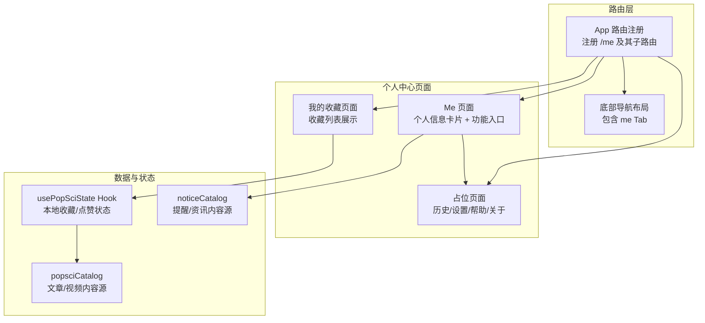
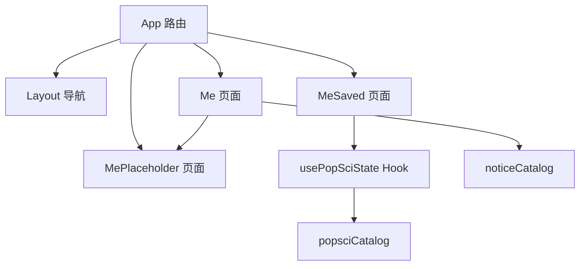
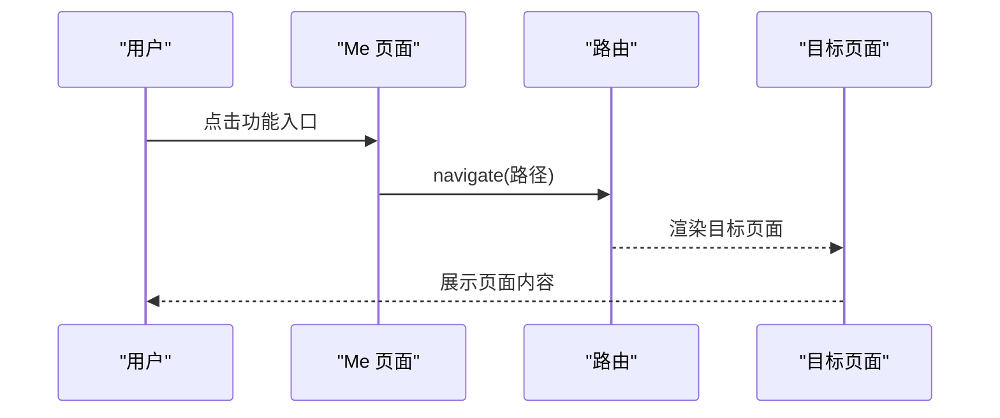
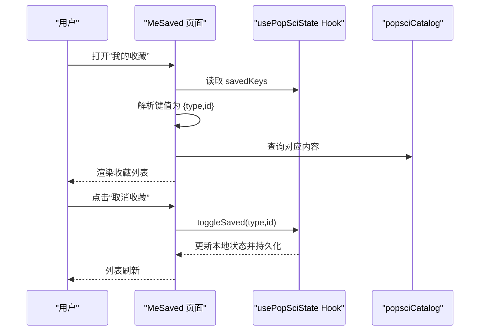
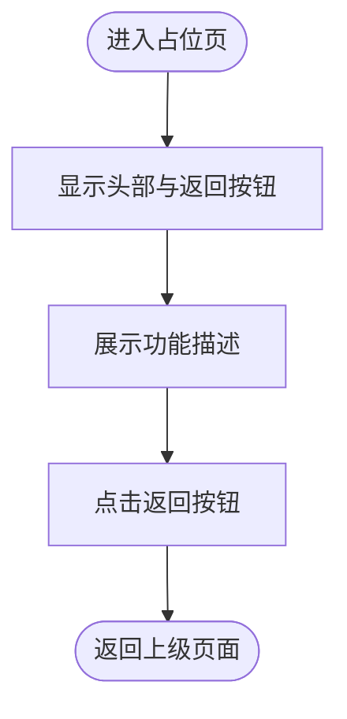
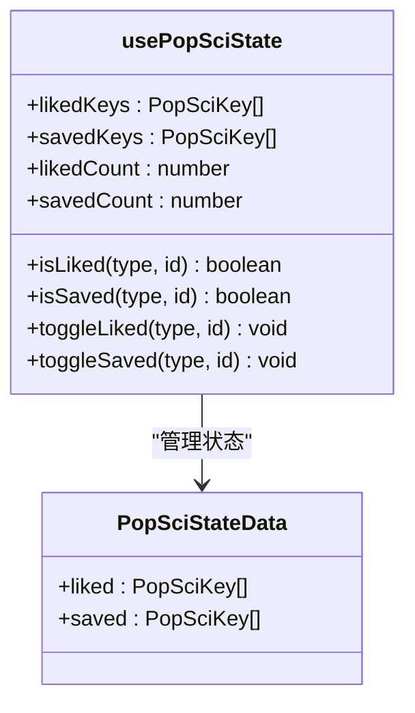
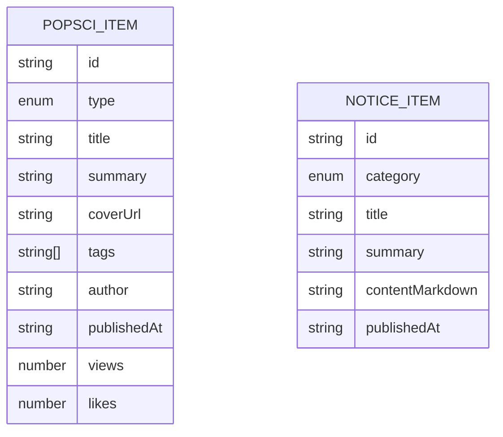
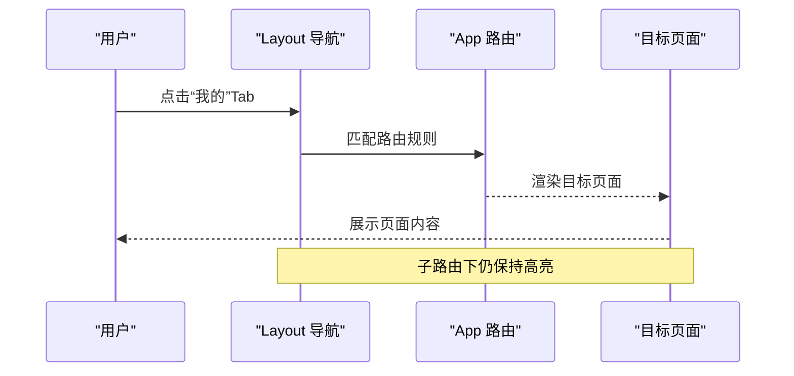
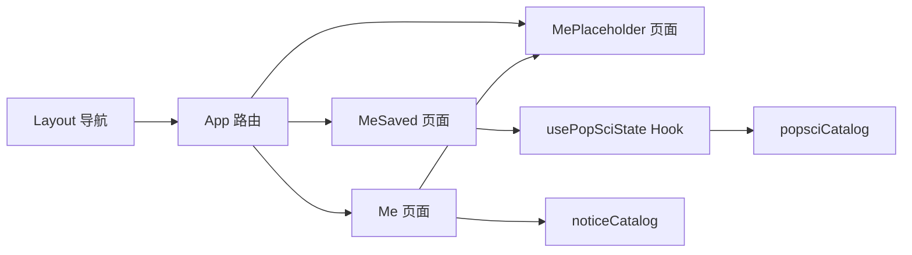

# 个人中心页面

<cite>
**本文档引用的文件**
- [src/App.tsx](file://src/App.tsx)
- [src/components/Layout.tsx](file://src/components/Layout.tsx)
- [src/pages/Me.tsx](file://src/pages/Me.tsx)
- [src/pages/Manage.tsx](file://src/pages/Manage.tsx)
- [src/pages/MeSaved.tsx](file://src/pages/MeSaved.tsx)
- [src/pages/MePlaceholder.tsx](file://src/pages/MePlaceholder.tsx)
- [src/hooks/usePopSciState.ts](file://src/hooks/usePopSciState.ts)
- [src/data/popsciCatalog.ts](file://src/data/popsciCatalog.ts)
- [src/data/noticeCatalog.ts](file://src/data/noticeCatalog.ts)
- [docs/superpowers/specs/2026-04-14-me-page-design.md](file://docs/superpowers/specs/2026-04-14-me-page-design.md)
- [docs/superpowers/specs/2026-04-15-service-manage-me-actions-design.md](file://docs/superpowers/specs/2026-04-15-service-manage-me-actions-design.md)
- [package.json](file://package.json)
</cite>

## 目录
1. [引言](#引言)
2. [项目结构](#项目结构)
3. [核心组件](#核心组件)
4. [架构总览](#架构总览)
5. [详细组件分析](#详细组件分析)
6. [依赖关系分析](#依赖关系分析)
7. [性能考虑](#性能考虑)
8. [故障排除指南](#故障排除指南)
9. [结论](#结论)
10. [附录](#附录)

## 引言
本文件围绕个人中心页面（“我的”页面）的功能与实现进行系统化梳理，重点覆盖以下方面：
- 用户个人信息管理：当前以静态头像与昵称占位为主，后续可接入真实用户态与登录态。
- 收藏内容展示：基于本地状态持久化的收藏列表，支持收藏/取消收藏与跳转详情。
- 历史记录查询：当前以占位页形式存在，后续可接入本地浏览记录或服务端同步。
- 账户设置：当前以占位页形式存在，后续可接入主题切换、隐私与通知设置等。
- 认证流程：当前未实现真实登录态，后续可接入微信登录或其他认证方式。
- 数据同步机制：当前使用本地存储，后续可扩展至服务端同步。
- 权限控制策略：当前未实现细粒度权限控制，后续可按角色与功能开关进行控制。
- 隐私设置管理：当前未实现隐私设置，后续可提供数据导出、删除与访问限制。
- 消息通知系统：健康提醒与最新资讯列表，支持跳转详情页。
- 帮助反馈功能：当前以占位页存在，后续可接入工单或客服。
- 账户安全设置：当前未实现，后续可提供密码修改、设备管理等。
- 数据导出功能：当前未实现，后续可提供导出收藏、历史等数据。

## 项目结构
个人中心页面位于移动端应用的路由体系中，作为底部导航的第五个 Tab，与“科普”“互动”“管理”“服务”“百问”共同构成主要功能区域。页面采用响应式布局，顶部个人信息卡片与中部功能入口列表组合，底部导航在子路由下仍能正确高亮。

图表来源
- [src/App.tsx:29-48](file://src/App.tsx#L29-L48)
- [src/components/Layout.tsx:10-17](file://src/components/Layout.tsx#L10-L17)
- [src/pages/Me.tsx:4-12](file://src/pages/Me.tsx#L4-L12)
- [src/pages/MeSaved.tsx:16-28](file://src/pages/MeSaved.tsx#L16-L28)
- [src/hooks/usePopSciState.ts:30-79](file://src/hooks/usePopSciState.ts#L30-L79)
- [src/data/popsciCatalog.ts:29-98](file://src/data/popsciCatalog.ts#L29-L98)
- [src/data/noticeCatalog.ts:12-59](file://src/data/noticeCatalog.ts#L12-L59)

章节来源
- [src/App.tsx:29-48](file://src/App.tsx#L29-L48)
- [src/components/Layout.tsx:10-17](file://src/components/Layout.tsx#L10-L17)
- [src/pages/Me.tsx:4-12](file://src/pages/Me.tsx#L4-L12)
- [src/pages/MeSaved.tsx:16-28](file://src/pages/MeSaved.tsx#L16-L28)
- [src/pages/MePlaceholder.tsx:4-35](file://src/pages/MePlaceholder.tsx#L4-L35)
- [src/hooks/usePopSciState.ts:30-79](file://src/hooks/usePopSciState.ts#L30-L79)
- [src/data/popsciCatalog.ts:29-98](file://src/data/popsciCatalog.ts#L29-L98)
- [src/data/noticeCatalog.ts:12-59](file://src/data/noticeCatalog.ts#L12-L59)

## 核心组件
- Me 页面：负责个人信息卡片与功能入口菜单渲染，点击后跳转至相应子页面。
- MeSaved 页面：基于本地状态展示收藏列表，支持取消收藏与跳转详情。
- MePlaceholder 页面：作为占位页承载“历史记录”“个人设置”“帮助与反馈”“关于我们”等功能入口。
- usePopSciState Hook：封装收藏/点赞状态的本地持久化逻辑，键值格式为“类型:ID”。
- popsciCatalog：提供文章/视频内容的数据源，供收藏页渲染与详情跳转。
- noticeCatalog：提供健康提醒与最新资讯的数据源，供管理页与详情页使用。
- App 路由：注册“我的”页面及其子路由，确保底部导航在子路由下正确高亮。
- Layout 组件：定义底部导航项，包含“我的”Tab，支持在子路由下保持高亮。

章节来源
- [src/pages/Me.tsx:4-12](file://src/pages/Me.tsx#L4-L12)
- [src/pages/MeSaved.tsx:16-28](file://src/pages/MeSaved.tsx#L16-L28)
- [src/pages/MePlaceholder.tsx:4-35](file://src/pages/MePlaceholder.tsx#L4-L35)
- [src/hooks/usePopSciState.ts:30-79](file://src/hooks/usePopSciState.ts#L30-L79)
- [src/data/popsciCatalog.ts:29-98](file://src/data/popsciCatalog.ts#L29-L98)
- [src/data/noticeCatalog.ts:12-59](file://src/data/noticeCatalog.ts#L12-L59)
- [src/App.tsx:29-48](file://src/App.tsx#L29-L48)
- [src/components/Layout.tsx:10-17](file://src/components/Layout.tsx#L10-L17)

## 架构总览
个人中心页面采用“路由 + 页面 + 数据/状态 Hook + 内容目录”的分层架构：
- 路由层：集中注册“我的”页面及其子路由，保证导航与跳转的一致性。
- 页面层：Me 提供入口菜单，MeSaved 展示收藏，MePlaceholder 承载占位功能。
- 数据/状态层：usePopSciState 负责收藏/点赞状态的本地持久化；popsciCatalog/noticeCatalog 提供内容数据。
- 布局层：Layout 统一管理底部导航，确保在子路由下 Tab 高亮正确。

图表来源
- [src/App.tsx:29-48](file://src/App.tsx#L29-L48)
- [src/components/Layout.tsx:10-17](file://src/components/Layout.tsx#L10-L17)
- [src/pages/Me.tsx:4-12](file://src/pages/Me.tsx#L4-L12)
- [src/pages/MeSaved.tsx:16-28](file://src/pages/MeSaved.tsx#L16-L28)
- [src/pages/MePlaceholder.tsx:4-35](file://src/pages/MePlaceholder.tsx#L4-L35)
- [src/hooks/usePopSciState.ts:30-79](file://src/hooks/usePopSciState.ts#L30-L79)
- [src/data/popsciCatalog.ts:29-98](file://src/data/popsciCatalog.ts#L29-L98)
- [src/data/noticeCatalog.ts:12-59](file://src/data/noticeCatalog.ts#L12-L59)

## 详细组件分析

### Me 页面（个人信息与入口菜单）
- 功能概述：渲染顶部个人信息卡片与中部功能入口列表，点击后跳转至相应子页面。
- 交互流程：点击任一入口触发路由跳转，进入对应的占位页或收藏页。
- 样式与视觉：采用沉浸式卡片风格，统一品牌色系，保持与其他页面一致的间距与圆角。

图表来源
- [src/pages/Me.tsx:44-58](file://src/pages/Me.tsx#L44-L58)
- [src/App.tsx:37-43](file://src/App.tsx#L37-L43)

章节来源
- [src/pages/Me.tsx:4-12](file://src/pages/Me.tsx#L4-L12)
- [src/pages/Me.tsx:14-63](file://src/pages/Me.tsx#L14-L63)
- [src/App.tsx:37-43](file://src/App.tsx#L37-L43)

### MeSaved 页面（收藏内容展示）
- 功能概述：基于本地状态展示用户收藏的文章/视频，支持取消收藏与跳转详情。
- 数据来源：通过 usePopSciState 获取收藏键集合，parseKey 解析类型与ID，再从 popsciCatalog 获取内容。
- 交互流程：点击卡片跳转详情；点击“取消收藏”调用 toggleSaved 更新状态并持久化。

图表来源
- [src/pages/MeSaved.tsx:16-28](file://src/pages/MeSaved.tsx#L16-L28)
- [src/pages/MeSaved.tsx:65-125](file://src/pages/MeSaved.tsx#L65-L125)
- [src/hooks/usePopSciState.ts:30-79](file://src/hooks/usePopSciState.ts#L30-L79)
- [src/data/popsciCatalog.ts:90-98](file://src/data/popsciCatalog.ts#L90-L98)

章节来源
- [src/pages/MeSaved.tsx:16-28](file://src/pages/MeSaved.tsx#L16-L28)
- [src/pages/MeSaved.tsx:30-131](file://src/pages/MeSaved.tsx#L30-L131)
- [src/hooks/usePopSciState.ts:30-79](file://src/hooks/usePopSciState.ts#L30-L79)
- [src/data/popsciCatalog.ts:29-98](file://src/data/popsciCatalog.ts#L29-L98)

### MePlaceholder 页面（占位页面）
- 功能概述：承载“历史记录”“个人设置”“帮助与反馈”“关于我们”等占位功能，描述后续接入计划。
- 交互流程：提供返回按钮，便于从子路由返回上级页面。

图表来源
- [src/pages/MePlaceholder.tsx:4-35](file://src/pages/MePlaceholder.tsx#L4-L35)

章节来源
- [src/pages/MePlaceholder.tsx:4-35](file://src/pages/MePlaceholder.tsx#L4-L35)

### usePopSciState Hook（收藏/点赞状态管理）
- 数据结构：以对象形式保存 liked 与 saved 键数组，键格式为“类型:ID”，类型限定为 article 或 video。
- 持久化策略：使用 localStorage 存储，初始化时尝试解析已有数据，未找到则回退为空状态。
- 方法能力：提供 isLiked/isSaved/toggleLiked/toggleSaved/统计数量等方法，均通过 useMemo 缓存以避免不必要的重渲染。

图表来源
- [src/hooks/usePopSciState.ts:6-28](file://src/hooks/usePopSciState.ts#L6-L28)
- [src/hooks/usePopSciState.ts:30-79](file://src/hooks/usePopSciState.ts#L30-L79)

章节来源
- [src/hooks/usePopSciState.ts:30-79](file://src/hooks/usePopSciState.ts#L30-L79)

### popsciCatalog 与 noticeCatalog（内容数据源）
- popsciCatalog：提供文章/视频的完整数据，包括标题、摘要、封面、标签、发布时间、作者、播放时长等字段。
- noticeCatalog：提供健康提醒与最新资讯的列表与详情数据，支持按分类筛选与按ID查询。

图表来源
- [src/data/popsciCatalog.ts:3-27](file://src/data/popsciCatalog.ts#L3-L27)
- [src/data/noticeCatalog.ts:3-10](file://src/data/noticeCatalog.ts#L3-L10)

章节来源
- [src/data/popsciCatalog.ts:29-98](file://src/data/popsciCatalog.ts#L29-L98)
- [src/data/noticeCatalog.ts:12-59](file://src/data/noticeCatalog.ts#L12-L59)

### 底部导航与路由高亮
- Layout 定义底部导航项，包含“我的”Tab；在子路由下仍能正确高亮。
- App 注册“我的”页面及其子路由，确保跳转与高亮一致。

图表来源
- [src/components/Layout.tsx:10-17](file://src/components/Layout.tsx#L10-L17)
- [src/components/Layout.tsx:19-65](file://src/components/Layout.tsx#L19-L65)
- [src/App.tsx:29-48](file://src/App.tsx#L29-L48)

章节来源
- [src/components/Layout.tsx:10-17](file://src/components/Layout.tsx#L10-L17)
- [src/components/Layout.tsx:19-65](file://src/components/Layout.tsx#L19-L65)
- [src/App.tsx:29-48](file://src/App.tsx#L29-L48)

## 依赖关系分析
- 组件耦合：Me 与 MePlaceholder 之间存在页面级耦合（入口跳转），但无直接数据耦合；MeSaved 与 usePopSciState 存在状态耦合。
- 外部依赖：使用 lucide-react 图标库、react-router-dom 路由、framer-motion 动画库、Tailwind CSS 样式工具。
- 数据依赖：收藏页依赖 usePopSciState 与 popsciCatalog；管理页依赖 noticeCatalog。

图表来源
- [src/pages/Me.tsx:4-12](file://src/pages/Me.tsx#L4-L12)
- [src/pages/MeSaved.tsx:16-28](file://src/pages/MeSaved.tsx#L16-L28)
- [src/hooks/usePopSciState.ts:30-79](file://src/hooks/usePopSciState.ts#L30-L79)
- [src/data/popsciCatalog.ts:29-98](file://src/data/popsciCatalog.ts#L29-L98)
- [src/data/noticeCatalog.ts:12-59](file://src/data/noticeCatalog.ts#L12-L59)
- [src/components/Layout.tsx:10-17](file://src/components/Layout.tsx#L10-L17)
- [src/App.tsx:29-48](file://src/App.tsx#L29-L48)

章节来源
- [src/pages/Me.tsx:4-12](file://src/pages/Me.tsx#L4-L12)
- [src/pages/MeSaved.tsx:16-28](file://src/pages/MeSaved.tsx#L16-L28)
- [src/hooks/usePopSciState.ts:30-79](file://src/hooks/usePopSciState.ts#L30-L79)
- [src/data/popsciCatalog.ts:29-98](file://src/data/popsciCatalog.ts#L29-L98)
- [src/data/noticeCatalog.ts:12-59](file://src/data/noticeCatalog.ts#L12-L59)
- [src/components/Layout.tsx:10-17](file://src/components/Layout.tsx#L10-L17)
- [src/App.tsx:29-48](file://src/App.tsx#L29-L48)

## 性能考虑
- 状态缓存：usePopSciState 使用 useMemo 缓存计算结果，避免重复渲染。
- 列表渲染：收藏页使用 useMemo 对数据进行一次性转换，减少不必要的映射与过滤。
- 动画与交互：管理页使用 Framer Motion 实现平滑动画，注意在低端设备上的性能表现。
- 路由懒加载：当前为内存路由，若未来接入后端接口，可考虑路由级懒加载与预取策略。

## 故障排除指南
- 收藏列表为空：检查 localStorage 中的状态键是否存在，确认 parseKey 解析是否正确。
- 跳转失败：确认 App 路由中已注册相应子路由，且路径与页面一致。
- 导航高亮异常：检查 Layout 中的路径匹配逻辑，确保子路由也能正确识别父路由。
- 占位页无法返回：确认 MePlaceholder 的返回按钮事件绑定正常。

章节来源
- [src/pages/MeSaved.tsx:8-14](file://src/pages/MeSaved.tsx#L8-L14)
- [src/App.tsx:39-43](file://src/App.tsx#L39-L43)
- [src/components/Layout.tsx:32](file://src/components/Layout.tsx#L32)
- [src/pages/MePlaceholder.tsx:11-18](file://src/pages/MePlaceholder.tsx#L11-L18)

## 结论
个人中心页面当前以静态与占位为主，完成了基础结构与路由集成，为后续接入真实用户态、数据同步、权限控制与隐私设置提供了清晰的扩展路径。收藏功能通过本地状态实现，具备良好的可扩展性；占位页面明确了后续开发方向。建议在下一阶段优先完成认证与数据同步，再逐步完善账户设置、隐私与安全、消息通知与帮助反馈等模块。

## 附录
- 设计文档参考
  - [“我的”页面设计方案:1-39](file://docs/superpowers/specs/2026-04-14-me-page-design.md#L1-L39)
  - [服务/管理/我的按钮闭环设计:1-54](file://docs/superpowers/specs/2026-04-15-service-manage-me-actions-design.md#L1-L54)
- 依赖清单
  - [package.json:13-26](file://package.json#L13-L26)