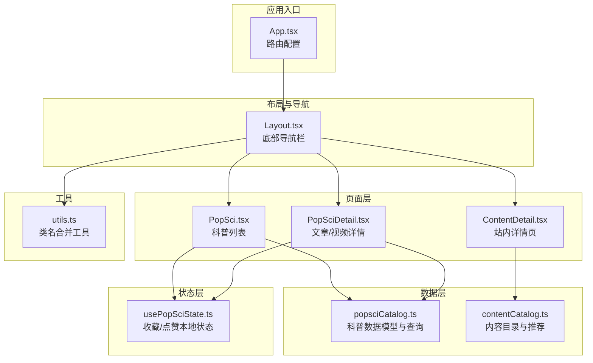
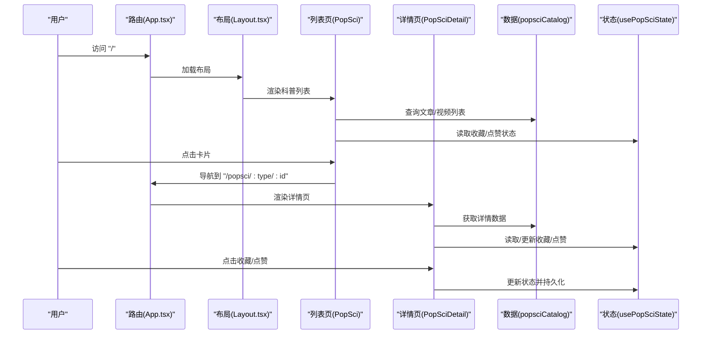
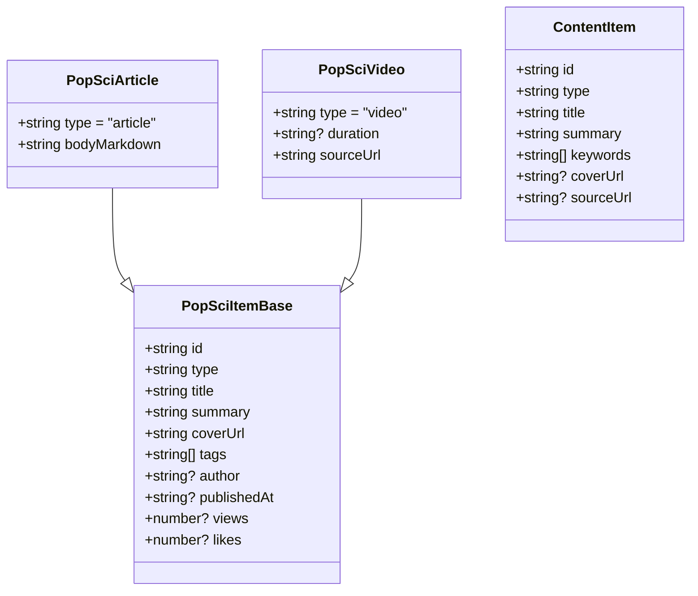
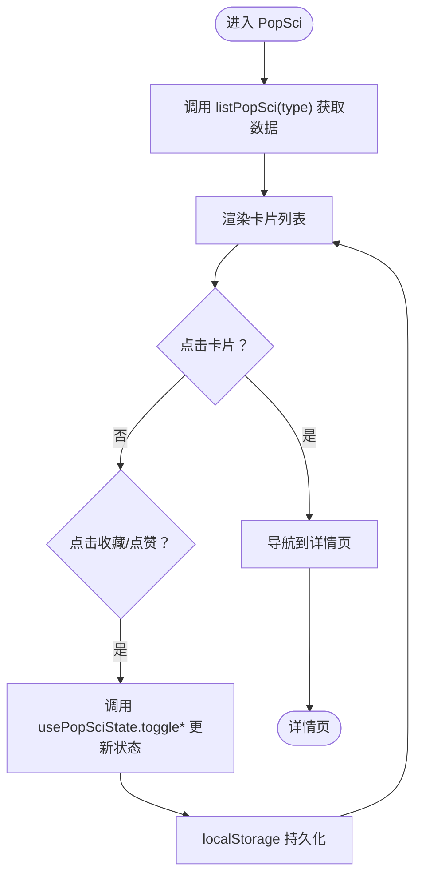
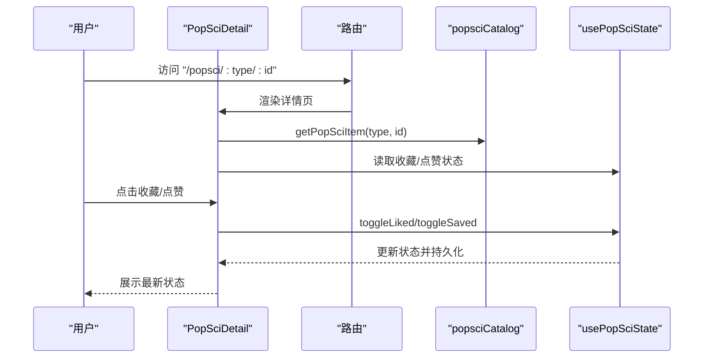
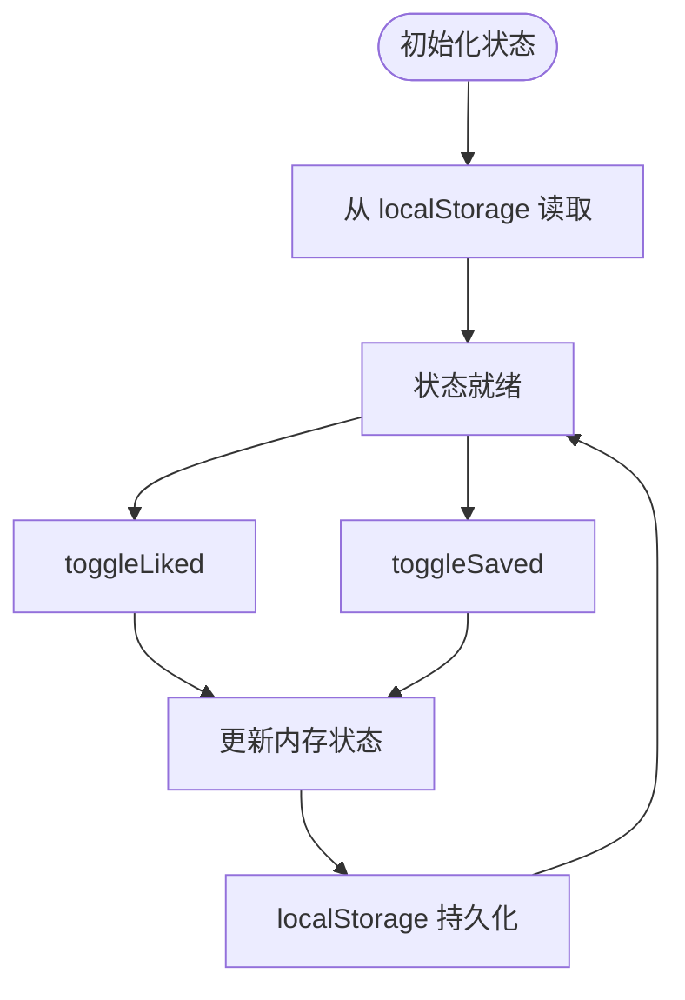
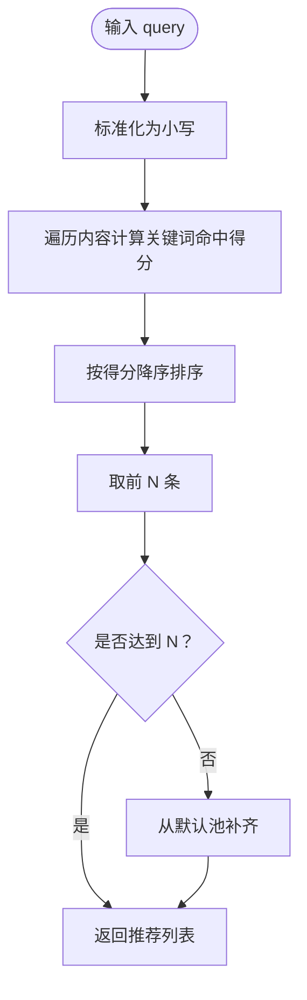
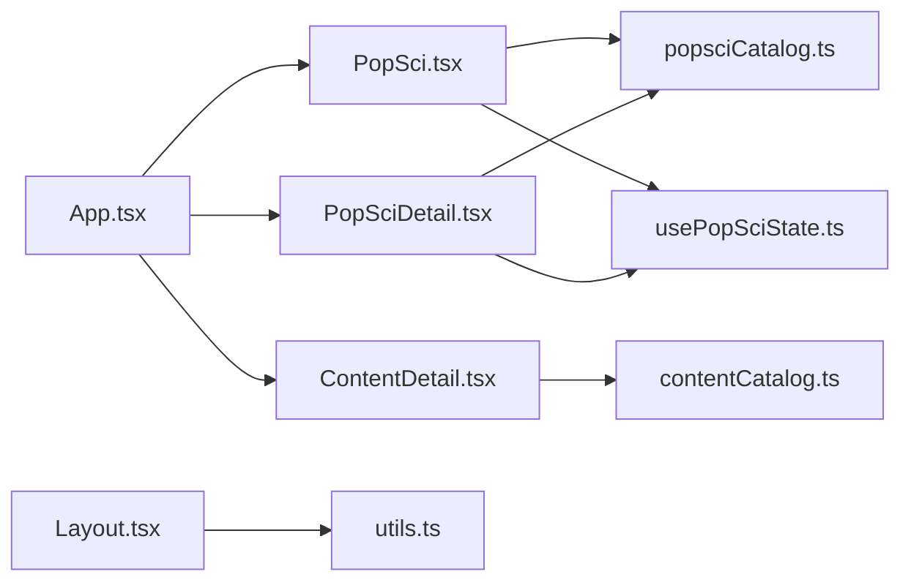

# 健康科普页面

<cite>
**本文引用的文件**
- [src/pages/PopSci.tsx](file://src/pages/PopSci.tsx)
- [src/pages/PopSciDetail.tsx](file://src/pages/PopSciDetail.tsx)
- [src/pages/ContentDetail.tsx](file://src/pages/ContentDetail.tsx)
- [src/data/popsciCatalog.ts](file://src/data/popsciCatalog.ts)
- [src/data/contentCatalog.ts](file://src/data/contentCatalog.ts)
- [src/hooks/usePopSciState.ts](file://src/hooks/usePopSciState.ts)
- [src/components/Layout.tsx](file://src/components/Layout.tsx)
- [src/lib/utils.ts](file://src/lib/utils.ts)
- [src/App.tsx](file://src/App.tsx)
- [docs/superpowers/specs/2026-04-15-popsci-detail-like-save-design.md](file://docs/superpowers/specs/2026-04-15-popsci-detail-like-save-design.md)
- [docs/superpowers/specs/2026-04-14-chat-recommendations-design.md](file://docs/superpowers/specs/2026-04-14-chat-recommendations-design.md)
</cite>

## 目录
1. [简介](#简介)
2. [项目结构](#项目结构)
3. [核心组件](#核心组件)
4. [架构总览](#架构总览)
5. [详细组件分析](#详细组件分析)
6. [依赖关系分析](#依赖关系分析)
7. [性能考虑](#性能考虑)
8. [故障排查指南](#故障排查指南)
9. [结论](#结论)
10. [附录](#附录)

## 简介
本文件面向健康科普页面功能，围绕以下目标进行系统化文档化：
- 科普内容的分类展示（文章/视频/故事）
- 文章详情页面与视频详情页面
- 收藏/点赞系统（本地持久化）
- 分享机制（外链打开）
- 内容数据模型与状态管理策略
- 图片懒加载与多媒体内容处理
- 内容搜索过滤、阅读进度跟踪、离线缓存与内容推荐算法
- 内容安全策略、版权管理与用户互动设计原则

本项目采用 React + TypeScript + Vite 构建，UI 使用 Tailwind CSS 与自定义工具函数，路由基于 React Router v6，状态持久化采用 localStorage。

## 项目结构
项目采用按页面与功能模块划分的组织方式，核心目录与职责如下：
- src/pages：页面级组件，如 PopSci、PopSciDetail、ContentDetail 等
- src/data：数据源与内容目录，如 popsciCatalog、contentCatalog
- src/hooks：自定义 Hook，如 usePopSciState
- src/components：通用组件，如 Layout、Empty、Splash
- src/lib：工具函数，如 cn
- docs/superpowers/specs：设计文档，指导功能范围与实现细节

图表来源
- [src/App.tsx:19-51](file://src/App.tsx#L19-L51)
- [src/components/Layout.tsx:19-65](file://src/components/Layout.tsx#L19-L65)
- [src/pages/PopSci.tsx:26-269](file://src/pages/PopSci.tsx#L26-L269)
- [src/pages/PopSciDetail.tsx:15-148](file://src/pages/PopSciDetail.tsx#L15-L148)
- [src/pages/ContentDetail.tsx:14-133](file://src/pages/ContentDetail.tsx#L14-L133)
- [src/data/popsciCatalog.ts:1-98](file://src/data/popsciCatalog.ts#L1-L98)
- [src/data/contentCatalog.ts:1-101](file://src/data/contentCatalog.ts#L1-L101)
- [src/hooks/usePopSciState.ts:30-79](file://src/hooks/usePopSciState.ts#L30-L79)
- [src/lib/utils.ts:4-6](file://src/lib/utils.ts#L4-L6)

章节来源
- [src/App.tsx:19-51](file://src/App.tsx#L19-L51)
- [src/components/Layout.tsx:19-65](file://src/components/Layout.tsx#L19-L65)

## 核心组件
本节聚焦于健康科普页面的关键功能模块及其职责：
- PopSci 列表页：提供“科普文章/科普视频/康复故事”三类内容的分类展示，支持卡片点击跳转详情、收藏/点赞交互与 Tab 切换。
- PopSciDetail 详情页：根据路由参数动态渲染文章 Markdown 或视频详情，并提供收藏/点赞与返回导航。
- ContentDetail 站内详情页：用于展示来自 contentCatalog 的内容，提供“原始链接”等入口。
- popsciCatalog：定义科普内容的数据模型与查询方法，支持文章与视频两类。
- contentCatalog：定义通用内容模型与推荐算法，支持关键词匹配与默认推荐。
- usePopSciState：封装收藏/点赞的本地状态管理，基于 localStorage 持久化。
- Layout：提供底部导航与全局样式，统一页面容器。
- utils：提供类名合并工具 cn，简化样式拼接。

章节来源
- [src/pages/PopSci.tsx:26-269](file://src/pages/PopSci.tsx#L26-L269)
- [src/pages/PopSciDetail.tsx:15-148](file://src/pages/PopSciDetail.tsx#L15-L148)
- [src/pages/ContentDetail.tsx:14-133](file://src/pages/ContentDetail.tsx#L14-L133)
- [src/data/popsciCatalog.ts:1-98](file://src/data/popsciCatalog.ts#L1-L98)
- [src/data/contentCatalog.ts:1-101](file://src/data/contentCatalog.ts#L1-L101)
- [src/hooks/usePopSciState.ts:30-79](file://src/hooks/usePopSciState.ts#L30-L79)
- [src/components/Layout.tsx:19-65](file://src/components/Layout.tsx#L19-L65)
- [src/lib/utils.ts:4-6](file://src/lib/utils.ts#L4-L6)

## 架构总览
健康科普页面采用“页面层-数据层-状态层-工具层”的分层架构，路由驱动页面切换，页面通过数据源与 Hook 获取数据与状态，工具函数提供通用能力。

图表来源
- [src/App.tsx:28-47](file://src/App.tsx#L28-L47)
- [src/components/Layout.tsx:22-27](file://src/components/Layout.tsx#L22-L27)
- [src/pages/PopSci.tsx:34-36](file://src/pages/PopSci.tsx#L34-L36)
- [src/pages/PopSciDetail.tsx:18-19](file://src/pages/PopSciDetail.tsx#L18-L19)
- [src/data/popsciCatalog.ts:90-96](file://src/data/popsciCatalog.ts#L90-L96)
- [src/hooks/usePopSciState.ts:30-79](file://src/hooks/usePopSciState.ts#L30-L79)

## 详细组件分析

### 数据模型与内容目录
- 科普内容模型（popsciCatalog）
  - 基础字段：id、type、title、summary、coverUrl、tags、author、publishedAt、views、likes
  - 文章特有：bodyMarkdown
  - 视频特有：duration、sourceUrl
  - 查询接口：getPopSciItem(type, id)、listPopSci(type)
- 通用内容模型（contentCatalog）
  - 字段：id、type、title、summary、keywords、coverUrl、sourceUrl
  - 推荐接口：getRecommendations(input, limit)，基于关键词匹配与默认池补齐

图表来源
- [src/data/popsciCatalog.ts:3-27](file://src/data/popsciCatalog.ts#L3-L27)
- [src/data/contentCatalog.ts:3-11](file://src/data/contentCatalog.ts#L3-L11)

章节来源
- [src/data/popsciCatalog.ts:1-98](file://src/data/popsciCatalog.ts#L1-L98)
- [src/data/contentCatalog.ts:1-101](file://src/data/contentCatalog.ts#L1-L101)

### 列表页（PopSci）
- 功能要点
  - 三类 Tab：科普文章、科普视频、康复故事
  - 文章卡片：标题、摘要、封面图、阅读量、点赞数、收藏/点赞按钮
  - 视频卡片：封面图、播放图标、时长、标题、收藏/点赞按钮
  - 康复故事：头像、标题、讲述人
  - 点击卡片主体跳转详情页，收藏/点赞按钮阻止事件冒泡
- 性能与交互
  - 使用 useMemo 缓存列表数据
  - 使用 framer-motion 实现 Tab 内容切换动画
  - 使用 lucide-react 图标库提供视觉反馈

图表来源
- [src/pages/PopSci.tsx:31-36](file://src/pages/PopSci.tsx#L31-L36)
- [src/pages/PopSci.tsx:80-147](file://src/pages/PopSci.tsx#L80-L147)
- [src/pages/PopSci.tsx:160-236](file://src/pages/PopSci.tsx#L160-L236)
- [src/pages/PopSci.tsx:249-262](file://src/pages/PopSci.tsx#L249-L262)
- [src/data/popsciCatalog.ts:94-96](file://src/data/popsciCatalog.ts#L94-L96)
- [src/hooks/usePopSciState.ts:50-64](file://src/hooks/usePopSciState.ts#L50-L64)

章节来源
- [src/pages/PopSci.tsx:26-269](file://src/pages/PopSci.tsx#L26-L269)
- [src/data/popsciCatalog.ts:94-96](file://src/data/popsciCatalog.ts#L94-L96)
- [src/hooks/usePopSciState.ts:30-79](file://src/hooks/usePopSciState.ts#L30-L79)

### 详情页（PopSciDetail）
- 功能要点
  - 根据路由参数动态渲染文章或视频详情
  - 文章：使用 react-markdown + remark-gfm 渲染 Markdown 正文
  - 视频：展示封面、简介与“打开视频来源”按钮（外链）
  - 收藏/点赞：顶部按钮，支持切换与持久化
  - 返回导航：左上角返回按钮
- 安全与版权
  - 视频详情通过外链打开，避免站内播放器带来的版权与合规风险
  - 详情页提供“原始链接”入口，便于用户追溯来源

图表来源
- [src/pages/PopSciDetail.tsx:18-19](file://src/pages/PopSciDetail.tsx#L18-L19)
- [src/pages/PopSciDetail.tsx:125-142](file://src/pages/PopSciDetail.tsx#L125-L142)
- [src/data/popsciCatalog.ts:90-96](file://src/data/popsciCatalog.ts#L90-L96)
- [src/hooks/usePopSciState.ts:40-64](file://src/hooks/usePopSciState.ts#L40-L64)

章节来源
- [src/pages/PopSciDetail.tsx:15-148](file://src/pages/PopSciDetail.tsx#L15-L148)
- [src/data/popsciCatalog.ts:90-96](file://src/data/popsciCatalog.ts#L90-L96)
- [src/hooks/usePopSciState.ts:30-79](file://src/hooks/usePopSciState.ts#L30-L79)

### 站内详情页（ContentDetail）
- 功能要点
  - 展示来自 contentCatalog 的内容摘要、关键词与类型标签
  - 提供“原始链接”按钮（若存在）
  - 提供“相关服务”跳转入口
- 适用场景
  - 对话后推荐内容的站内详情页，替代外链跳转，提升用户体验

章节来源
- [src/pages/ContentDetail.tsx:14-133](file://src/pages/ContentDetail.tsx#L14-L133)
- [src/data/contentCatalog.ts:65-99](file://src/data/contentCatalog.ts#L65-L99)

### 收藏/点赞系统（usePopSciState）
- 状态模型
  - liked/saved：字符串数组，格式为 "type:id"
  - 通过 localStorage 持久化，键名为 "popsci_state_v1"
- API
  - isLiked(type, id)、isSaved(type, id)
  - toggleLiked(type, id)、toggleSaved(type, id)
- 设计原则
  - 本地闭环：无需登录与后端，状态在本地持久化
  - 事件冒泡控制：收藏/点赞按钮阻止事件冒泡，避免误触跳转
  - 可扩展：支持未来接入服务端同步与多端一致性

图表来源
- [src/hooks/usePopSciState.ts:30-38](file://src/hooks/usePopSciState.ts#L30-L38)
- [src/hooks/usePopSciState.ts:50-64](file://src/hooks/usePopSciState.ts#L50-L64)
- [docs/superpowers/specs/2026-04-15-popsci-detail-like-save-design.md:63-78](file://docs/superpowers/specs/2026-04-15-popsci-detail-like-save-design.md#L63-L78)

章节来源
- [src/hooks/usePopSciState.ts:30-79](file://src/hooks/usePopSciState.ts#L30-L79)
- [docs/superpowers/specs/2026-04-15-popsci-detail-like-save-design.md:63-78](file://docs/superpowers/specs/2026-04-15-popsci-detail-like-save-design.md#L63-L78)

### 内容推荐算法（contentCatalog.getRecommendations）
- 输入：用户对话文本（普通文本或 OCR 文本）
- 匹配：遍历 contentCatalog，统计关键词命中次数
- 输出：按命中次数排序的前 N 条，不足时用默认推荐池补齐
- 默认池：defaultRecommendationIds

图表来源
- [src/data/contentCatalog.ts:69-99](file://src/data/contentCatalog.ts#L69-L99)
- [docs/superpowers/specs/2026-04-14-chat-recommendations-design.md:55-67](file://docs/superpowers/specs/2026-04-14-chat-recommendations-design.md#L55-L67)

章节来源
- [src/data/contentCatalog.ts:69-99](file://src/data/contentCatalog.ts#L69-L99)
- [docs/superpowers/specs/2026-04-14-chat-recommendations-design.md:55-67](file://docs/superpowers/specs/2026-04-14-chat-recommendations-design.md#L55-L67)

### 分享机制
- 视频详情：提供“打开视频来源”按钮，使用外链打开，避免站内播放器带来的版权与合规风险
- 站内详情：提供“原始链接”按钮，便于用户跳转至来源页面
- 设计原则：尊重版权、降低法律风险、提升用户信任度

章节来源
- [src/pages/PopSciDetail.tsx:133-140](file://src/pages/PopSciDetail.tsx#L133-L140)
- [src/pages/ContentDetail.tsx:100-125](file://src/pages/ContentDetail.tsx#L100-L125)

### 图片懒加载与多媒体内容处理
- 图片懒加载：当前实现使用静态资源与外链图片，未引入懒加载库
- 建议实践
  - 使用 IntersectionObserver 或第三方库（如 react-intersection-observer）实现懒加载
  - 为图片设置合适的尺寸与占位符，优化首屏体验
- 多媒体内容
  - 文章：使用 react-markdown + remark-gfm 渲染 Markdown
  - 视频：外链打开，避免站内播放器复杂度

章节来源
- [src/pages/PopSci.tsx:143](file://src/pages/PopSci.tsx#L143)
- [src/pages/PopSciDetail.tsx:127-129](file://src/pages/PopSciDetail.tsx#L127-L129)

### 内容搜索过滤
- 当前实现
  - 列表页通过 Tab 切换过滤文章/视频
  - 详情页通过路由参数区分文章/视频
- 建议扩展
  - 增加搜索框，结合关键词与标签进行过滤
  - 使用 useMemo 缓存过滤结果，提升性能
  - 支持多条件组合过滤（类型、标签、时间）

章节来源
- [src/pages/PopSci.tsx:27-31](file://src/pages/PopSci.tsx#L27-L31)
- [src/pages/PopSci.tsx:31-36](file://src/pages/PopSci.tsx#L31-L36)

### 阅读进度跟踪
- 当前实现：未见阅读进度跟踪逻辑
- 建议实践
  - 使用 IntersectionObserver 监听可见区域变化
  - 结合 localStorage 记录阅读进度，支持断点续读
  - 为文章详情页增加“继续阅读”入口

章节来源
- [src/pages/PopSciDetail.tsx:125-131](file://src/pages/PopSciDetail.tsx#L125-L131)

### 离线缓存
- 当前实现
  - 收藏/点赞状态通过 localStorage 持久化
  - 内容数据为本地固定数组
- 建议实践
  - 引入浏览器缓存策略（Service Worker/Cache API）
  - 对文章内容进行本地缓存，支持离线查看
  - 为图片与视频资源设置合理的缓存策略

章节来源
- [src/hooks/usePopSciState.ts:30-38](file://src/hooks/usePopSciState.ts#L30-L38)
- [src/data/popsciCatalog.ts:29-88](file://src/data/popsciCatalog.ts#L29-L88)

### 内容安全策略、版权管理与用户互动设计原则
- 内容安全
  - 外链打开视频与来源，避免站内播放器带来的版权与合规风险
  - Markdown 渲染使用 remark-gfm，注意 XSS 风险，建议限制允许的 HTML 标签
- 版权管理
  - 明确标注来源与版权信息
  - 提供“原始链接”入口，便于用户追溯
- 用户互动
  - 本地收藏/点赞闭环，无需登录
  - 事件冒泡控制，避免误触跳转
  - 可扩展接入服务端同步与多端一致性

章节来源
- [src/pages/PopSciDetail.tsx:133-140](file://src/pages/PopSciDetail.tsx#L133-L140)
- [docs/superpowers/specs/2026-04-15-popsci-detail-like-save-design.md:74-78](file://docs/superpowers/specs/2026-04-15-popsci-detail-like-save-design.md#L74-L78)

## 依赖关系分析
- 组件依赖
  - PopSci 依赖 popsciCatalog 与 usePopSciState
  - PopSciDetail 依赖 popsciCatalog 与 usePopSciState
  - ContentDetail 依赖 contentCatalog
  - Layout 提供全局导航与容器
- 路由依赖
  - App.tsx 统一配置路由，PopSciDetail 通过路由参数区分文章/视频
- 工具依赖
  - utils.cn 用于类名合并，减少样式拼接复杂度

图表来源
- [src/pages/PopSci.tsx:6-7](file://src/pages/PopSci.tsx#L6-L7)
- [src/pages/PopSciDetail.tsx:6-8](file://src/pages/PopSciDetail.tsx#L6-L8)
- [src/pages/ContentDetail.tsx:4](file://src/pages/ContentDetail.tsx#L4)
- [src/components/Layout.tsx:6](file://src/components/Layout.tsx#L6)
- [src/App.tsx:28-47](file://src/App.tsx#L28-L47)

章节来源
- [src/App.tsx:28-47](file://src/App.tsx#L28-L47)
- [src/pages/PopSci.tsx:6-7](file://src/pages/PopSci.tsx#L6-L7)
- [src/pages/PopSciDetail.tsx:6-8](file://src/pages/PopSciDetail.tsx#L6-L8)
- [src/pages/ContentDetail.tsx:4](file://src/pages/ContentDetail.tsx#L4)
- [src/components/Layout.tsx:6](file://src/components/Layout.tsx#L6)

## 性能考虑
- 列表渲染
  - 使用 useMemo 缓存列表数据，避免重复计算
  - 使用 framer-motion 实现轻量动画，避免阻塞主线程
- 状态管理
  - localStorage 持久化在 useEffect 中写入，避免频繁 IO
  - 使用 useCallback 包装 toggle 方法，减少子组件重渲染
- 图片与多媒体
  - 建议引入懒加载与占位符，优化首屏加载
  - 视频外链打开，避免站内播放器复杂度与性能开销

章节来源
- [src/pages/PopSci.tsx:32](file://src/pages/PopSci.tsx#L32)
- [src/hooks/usePopSciState.ts:36-38](file://src/hooks/usePopSciState.ts#L36-L38)
- [src/hooks/usePopSciState.ts:50-64](file://src/hooks/usePopSciState.ts#L50-L64)

## 故障排查指南
- 内容为空或未找到
  - 检查路由参数与数据源是否存在匹配项
  - PopSciDetail 中对空内容提供友好提示与返回按钮
- 收藏/点赞状态不同步
  - 确认 localStorage 是否被清理或禁用
  - 检查 usePopSciState 的存储键名与格式
- 视频无法打开
  - 确认 sourceUrl 是否有效
  - 检查外链打开策略与浏览器设置

章节来源
- [src/pages/PopSciDetail.tsx:77-86](file://src/pages/PopSciDetail.tsx#L77-L86)
- [src/hooks/usePopSciState.ts:13-24](file://src/hooks/usePopSciState.ts#L13-L24)

## 结论
健康科普页面在当前版本实现了：
- 清晰的分类展示与详情页渲染
- 本地化的收藏/点赞闭环
- 外链分享机制，降低版权与合规风险
- 基于关键词的推荐算法与站内详情页

建议在未来版本中引入搜索过滤、阅读进度跟踪、离线缓存与多媒体懒加载等能力，进一步提升用户体验与性能表现。

## 附录
- 路由设计参考：[2026-04-15-popsci-detail-like-save-design.md:24-27](file://docs/superpowers/specs/2026-04-15-popsci-detail-like-save-design.md#L24-L27)
- 推荐算法设计参考：[2026-04-14-chat-recommendations-design.md:55-67](file://docs/superpowers/specs/2026-04-14-chat-recommendations-design.md#L55-L67)