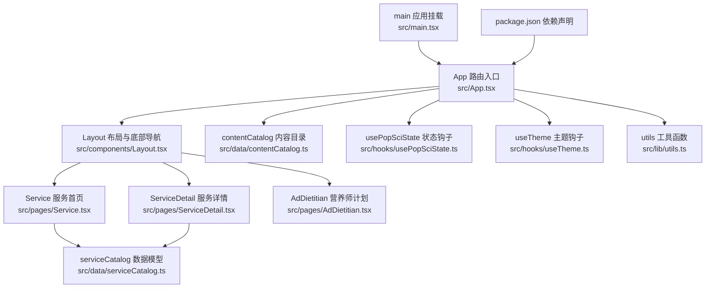
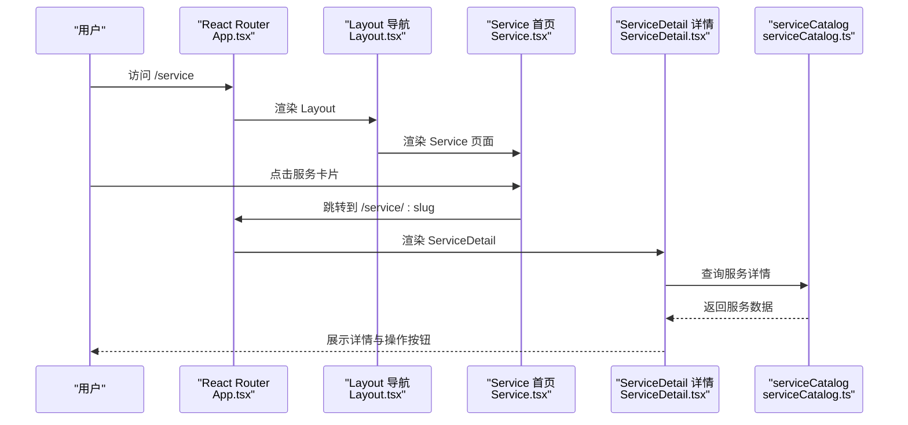
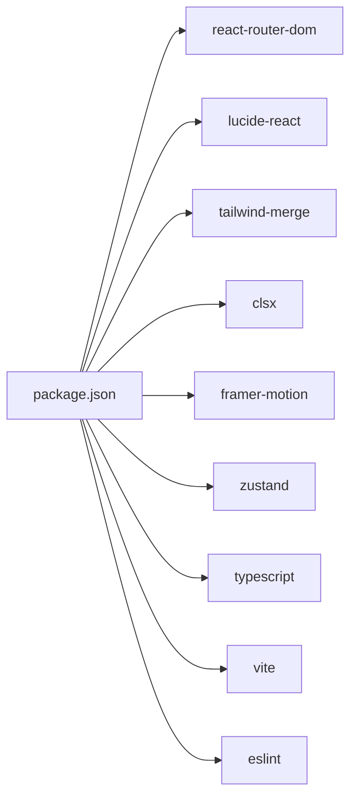

# 医疗服务页面

<cite>
**本文引用的文件**
- [src/App.tsx](file://src/App.tsx)
- [src/components/Layout.tsx](file://src/components/Layout.tsx)
- [src/pages/Service.tsx](file://src/pages/Service.tsx)
- [src/pages/ServiceDetail.tsx](file://src/pages/ServiceDetail.tsx)
- [src/data/serviceCatalog.ts](file://src/data/serviceCatalog.ts)
- [src/pages/AdDietitian.tsx](file://src/pages/AdDietitian.tsx)
- [src/data/contentCatalog.ts](file://src/data/contentCatalog.ts)
- [src/hooks/usePopSciState.ts](file://src/hooks/usePopSciState.ts)
- [src/hooks/useTheme.ts](file://src/hooks/useTheme.ts)
- [src/lib/utils.ts](file://src/lib/utils.ts)
- [src/main.tsx](file://src/main.tsx)
- [package.json](file://package.json)
</cite>

## 目录
1. [简介](#简介)
2. [项目结构](#项目结构)
3. [核心组件](#核心组件)
4. [架构总览](#架构总览)
5. [详细组件分析](#详细组件分析)
6. [依赖分析](#依赖分析)
7. [性能考虑](#性能考虑)
8. [故障排查指南](#故障排查指南)
9. [结论](#结论)
10. [附录](#附录)

## 简介
本文件面向“医疗服务页面”功能，基于现有代码库进行深入解析，覆盖以下主题：
- 医疗服务平台的页面组织与导航集成
- 服务分类展示与详情页联动
- 预约系统设计（当前为占位与跳转，后续可扩展）
- 支付流程处理（当前为占位，后续可扩展）
- 服务数据模型与状态管理策略
- 第三方API集成与订单管理机制（当前为占位，后续可扩展）
- 服务搜索筛选、价格比较、医生评价与预约冲突检测（当前为占位，后续可扩展）
- 安全认证方案（当前为占位，后续可扩展）
- 医疗数据合规性、隐私保护与用户信任建立的设计原则

## 项目结构
本项目采用移动端优先的单页应用（SPA）架构，路由通过 React Router v6+ 组织，页面组件位于 pages 目录，通用布局与导航位于 components 目录，数据模型与内容目录位于 data 目录，状态管理与工具函数位于 hooks 与 lib 目录。

图表来源
- [src/App.tsx:19-51](file://src/App.tsx#L19-L51)
- [src/components/Layout.tsx:19-65](file://src/components/Layout.tsx#L19-L65)
- [src/pages/Service.tsx:6-132](file://src/pages/Service.tsx#L6-L132)
- [src/pages/ServiceDetail.tsx:6-73](file://src/pages/ServiceDetail.tsx#L6-L73)
- [src/pages/AdDietitian.tsx:4-124](file://src/pages/AdDietitian.tsx#L4-L124)
- [src/data/serviceCatalog.ts:10-49](file://src/data/serviceCatalog.ts#L10-L49)
- [src/data/contentCatalog.ts:13-101](file://src/data/contentCatalog.ts#L13-L101)
- [src/hooks/usePopSciState.ts:30-79](file://src/hooks/usePopSciState.ts#L30-L79)
- [src/hooks/useTheme.ts:5-29](file://src/hooks/useTheme.ts#L5-L29)
- [src/lib/utils.ts:4-6](file://src/lib/utils.ts#L4-L6)
- [src/main.tsx:6-10](file://src/main.tsx#L6-L10)
- [package.json:13-26](file://package.json#L13-L26)

章节来源
- [src/App.tsx:19-51](file://src/App.tsx#L19-L51)
- [src/components/Layout.tsx:19-65](file://src/components/Layout.tsx#L19-L65)
- [src/main.tsx:6-10](file://src/main.tsx#L6-L10)
- [package.json:13-26](file://package.json#L13-L26)

## 核心组件
- 应用入口与路由配置：负责页面路由映射、嵌套路由与页面加载控制。
- 布局与导航：提供统一的顶部标题与底部导航栏，支持页面激活态样式与图标高亮。
- 服务首页：展示服务分类卡片、快速入口与营养师专属服务模块。
- 服务详情页：根据 slug 动态渲染服务详情与操作按钮。
- 营养师计划页：展示服务特色、计划包含项与加入计划的占位交互。
- 数据模型：服务目录与内容目录的数据结构定义与查询方法。
- 状态钩子：本地持久化的阅读状态与主题切换逻辑。
- 工具函数：类名合并工具，简化样式拼接。

章节来源
- [src/App.tsx:19-51](file://src/App.tsx#L19-L51)
- [src/components/Layout.tsx:19-65](file://src/components/Layout.tsx#L19-L65)
- [src/pages/Service.tsx:6-132](file://src/pages/Service.tsx#L6-L132)
- [src/pages/ServiceDetail.tsx:6-73](file://src/pages/ServiceDetail.tsx#L6-L73)
- [src/pages/AdDietitian.tsx:4-124](file://src/pages/AdDietitian.tsx#L4-L124)
- [src/data/serviceCatalog.ts:10-49](file://src/data/serviceCatalog.ts#L10-L49)
- [src/data/contentCatalog.ts:13-101](file://src/data/contentCatalog.ts#L13-L101)
- [src/hooks/usePopSciState.ts:30-79](file://src/hooks/usePopSciState.ts#L30-L79)
- [src/hooks/useTheme.ts:5-29](file://src/hooks/useTheme.ts#L5-L29)
- [src/lib/utils.ts:4-6](file://src/lib/utils.ts#L4-L6)

## 架构总览
医疗服务页面的前端架构遵循“路由驱动 + 组件化 + 数据模型 + 状态管理”的模式。页面通过路由参数驱动详情页渲染；服务数据通过本地数据模型提供；用户行为通过自定义钩子进行本地持久化；UI 通过 Tailwind 与图标库统一风格。

图表来源
- [src/App.tsx:35-36](file://src/App.tsx#L35-L36)
- [src/pages/Service.tsx:93](file://src/pages/Service.tsx#L93)
- [src/pages/ServiceDetail.tsx:9](file://src/pages/ServiceDetail.tsx#L9)
- [src/data/serviceCatalog.ts:45-47](file://src/data/serviceCatalog.ts#L45-L47)

## 详细组件分析

### 组件一：应用入口与路由（App）
- 负责根路由与嵌套路由的配置，包括服务页、详情页、营养师计划页等。
- 使用 React Router 的 Outlet 渲染嵌套页面。
- 提供启动页控制与页面级错误兜底占位页。

章节来源
- [src/App.tsx:19-51](file://src/App.tsx#L19-L51)

### 组件二：布局与导航（Layout）
- 提供统一的底部导航栏，支持图标与文字高亮、激活态样式。
- 使用 clsx/tailwind-merge 合并类名，提升样式可维护性。
- 通过 useLocation 判断当前激活路径，动态设置导航样式。

章节来源
- [src/components/Layout.tsx:19-65](file://src/components/Layout.tsx#L19-L65)
- [src/lib/utils.ts:4-6](file://src/lib/utils.ts#L4-L6)

### 组件三：服务首页（Service）
- 展示“营养师专属服务”模块与“精选服务”卡片网格。
- “快速入口”区域从服务目录中截取前 N 项，作为快捷跳转。
- 点击卡片跳转至对应详情页或外部链接（当前指向营养师计划页）。

章节来源
- [src/pages/Service.tsx:6-132](file://src/pages/Service.tsx#L6-L132)
- [src/data/serviceCatalog.ts:43-47](file://src/data/serviceCatalog.ts#L43-L47)

### 组件四：服务详情页（ServiceDetail）
- 通过 useParams 获取 slug，调用 getServiceBySlug 查询服务详情。
- 若未找到服务，提供返回按钮与提示信息。
- 渲染服务描述、亮点标签与操作按钮（跳转至营养师计划页）。

章节来源
- [src/pages/ServiceDetail.tsx:6-73](file://src/pages/ServiceDetail.tsx#L6-L73)
- [src/data/serviceCatalog.ts:45-47](file://src/data/serviceCatalog.ts#L45-L47)

### 组件五：数据模型（serviceCatalog）
- 定义服务项接口与服务目录数组。
- 提供按 slug 查询服务的方法，便于详情页使用。
- 为后续扩展“价格比较、医生评价、预约冲突检测”提供数据基础。

章节来源
- [src/data/serviceCatalog.ts:10-49](file://src/data/serviceCatalog.ts#L10-L49)

### 组件六：营养师计划页（AdDietitian）
- 展示服务特色、计划包含项与限时优惠信息。
- 提供“立即加入计划”按钮的占位交互（当前弹出提示）。
- 适合承接后续的预约系统与支付流程。

章节来源
- [src/pages/AdDietitian.tsx:4-124](file://src/pages/AdDietitian.tsx#L4-L124)

### 组件七：内容目录与推荐（contentCatalog）
- 定义内容项类型与数据结构，提供关键词匹配与推荐算法。
- 可作为服务搜索筛选的基础，用于匹配“服务-内容”关联场景。

章节来源
- [src/data/contentCatalog.ts:13-101](file://src/data/contentCatalog.ts#L13-L101)

### 组件八：状态管理与本地存储（usePopSciState）
- 将“点赞/收藏”状态持久化到 localStorage，避免刷新丢失。
- 提供 isLiked/isSaved/toggleLiked/toggleSaved 等方法，便于复用。

章节来源
- [src/hooks/usePopSciState.ts:30-79](file://src/hooks/usePopSciState.ts#L30-L79)

### 组件九：主题切换（useTheme）
- 自动读取系统主题偏好，支持手动切换并持久化。
- 通过为 documentElement 添加类名实现全局主题切换。

章节来源
- [src/hooks/useTheme.ts:5-29](file://src/hooks/useTheme.ts#L5-L29)

### 组件十：工具函数（utils）
- cn 函数用于合并类名，简化样式拼接与条件样式处理。

章节来源
- [src/lib/utils.ts:4-6](file://src/lib/utils.ts#L4-L6)

### 组件十一：应用挂载（main）
- 使用 createRoot 挂载 App，开启严格模式。

章节来源
- [src/main.tsx:6-10](file://src/main.tsx#L6-L10)

## 依赖分析
- 路由与导航：react-router-dom 提供路由与导航能力。
- 图标与样式：lucide-react 提供图标，Tailwind CSS 提供样式基础。
- 动画与工具：framer-motion 提供动画，clsx/tailwind-merge 提供类名合并。
- 状态管理：zustand 作为可选的状态管理方案（当前项目未直接使用，但已引入）。
- 类型与构建：TypeScript、Vite、ESLint 等保障类型安全与工程化质量。

图表来源
- [package.json:13-26](file://package.json#L13-L26)

章节来源
- [package.json:13-26](file://package.json#L13-L26)

## 性能考虑
- 路由懒加载：可通过 React.lazy 与 Suspense 对非首屏页面进行懒加载，减少初始包体。
- 图标按需引入：仅引入所需图标，避免整体导入导致体积增大。
- 样式优化：使用 Tailwind 的原子类，配合 purge 配置移除未使用样式。
- 本地存储：将轻量状态持久化到 localStorage，减少网络请求与重渲染。
- 动画与交互：合理使用过渡与缓动，避免过度动画影响性能。

## 故障排查指南
- 路由不生效或空白页
  - 检查 App 中路由配置是否正确，嵌套路径与页面组件是否匹配。
  - 确认 Layout 是否包裹了 Outlet。
- 服务详情页显示“服务不存在”
  - 检查 slug 是否与 serviceCatalog 中的 slug 一致。
  - 确认 getServiceBySlug 返回值是否为空。
- 底部导航高亮异常
  - 检查 useLocation 的路径判断逻辑，确保激活态条件正确。
- 主题切换无效
  - 检查 localStorage 中的主题键值是否存在，确认 documentElement 类名切换逻辑。
- 打卡/收藏状态丢失
  - 检查 localStorage 中的状态键是否存在，确认序列化/反序列化逻辑。

章节来源
- [src/App.tsx:29-48](file://src/App.tsx#L29-L48)
- [src/pages/ServiceDetail.tsx:33-44](file://src/pages/ServiceDetail.tsx#L33-L44)
- [src/components/Layout.tsx:32](file://src/components/Layout.tsx#L32)
- [src/hooks/useTheme.ts:14-18](file://src/hooks/useTheme.ts#L14-L18)
- [src/hooks/usePopSciState.ts:36-38](file://src/hooks/usePopSciState.ts#L36-L38)

## 结论
当前代码库提供了清晰的服务页面骨架：路由组织、布局导航、服务列表与详情、数据模型与本地状态管理。对于医疗服务页面的后续扩展（预约系统、支付流程、第三方API集成、订单管理、搜索筛选、价格比较、医生评价、冲突检测、安全认证、合规与隐私），可在现有结构基础上逐步迭代，保持组件职责单一与数据流清晰。

## 附录

### 数据模型与状态管理策略
- 服务数据模型
  - 字段：slug、title、desc、highlights、ctaLabel、ctaUrl
  - 查询：按 slug 快速定位服务详情
- 状态管理策略
  - 轻量状态：localStorage 持久化（如点赞/收藏）
  - 路由状态：通过 URL 参数传递（如详情页 slug）

章节来源
- [src/data/serviceCatalog.ts:10-49](file://src/data/serviceCatalog.ts#L10-L49)
- [src/hooks/usePopSciState.ts:30-79](file://src/hooks/usePopSciState.ts#L30-L79)

### 第三方API集成与订单管理机制（扩展建议）
- 集成点
  - 预约系统：对接医院/医生排班接口，查询可预约时间段。
  - 支付流程：对接第三方支付网关，完成订单创建与回调处理。
  - 评价系统：对接评论接口，支持上传图片与评分。
- 订单管理
  - 订单状态机：待支付、已支付、已取消、已完成、已评价。
  - 冲突检测：同一用户在同一时间、同一医生不可重复预约。
- 安全认证
  - 微信登录/授权，Token 管理与刷新。
  - 敏感字段加密存储，接口 HTTPS 与签名校验。
- 合规与隐私
  - 明示收集目的与范围，提供撤回同意与删除权。
  - 医疗数据最小化采集，匿名化与去标识化处理。

### API调用方式（扩展建议）
- GET /api/services/{slug}：获取服务详情
- GET /api/available-slots?doctorId={id}&date={date}：查询可用时间段
- POST /api/orders：创建订单
- POST /api/payments：发起支付
- POST /api/reviews：提交评价
- GET /api/orders/{orderId}：查询订单状态

### 实现示例（扩展建议）
- 预约系统
  - 在 ServiceDetail 中增加“立即预约”按钮，点击后跳转至 AdDietitian 或新增预约页。
  - 新增 useAppointmentStore 管理预约表单与冲突检测。
- 支付流程
  - 在 AdDietitian 中替换“立即加入计划”为“立即支付”，调用支付接口并监听回调。
- 搜索筛选
  - 基于 contentCatalog 的关键词匹配，扩展到服务项的关键词字段。
- 价格比较与医生评价
  - 在服务详情页增加“价格对比”与“医生评价”模块，数据来自后端接口。
- 冲突检测
  - 在提交预约时调用冲突检测接口，若冲突则提示并阻止提交。