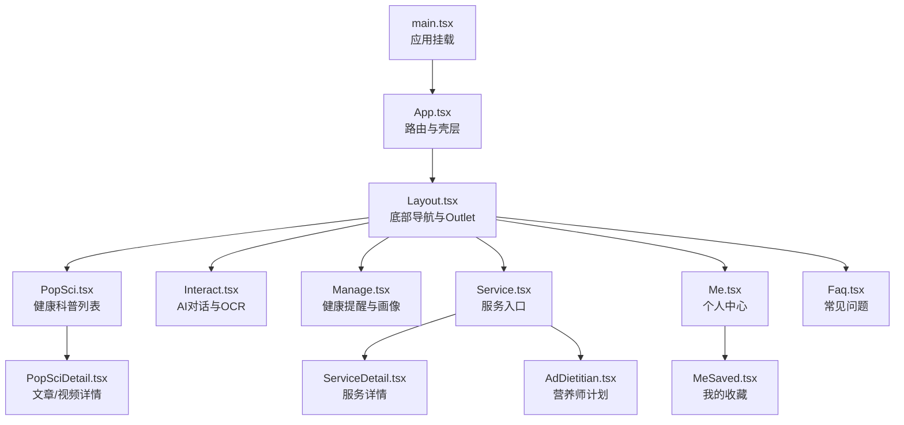
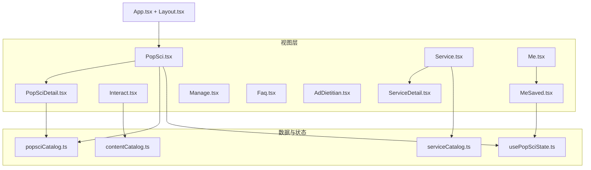
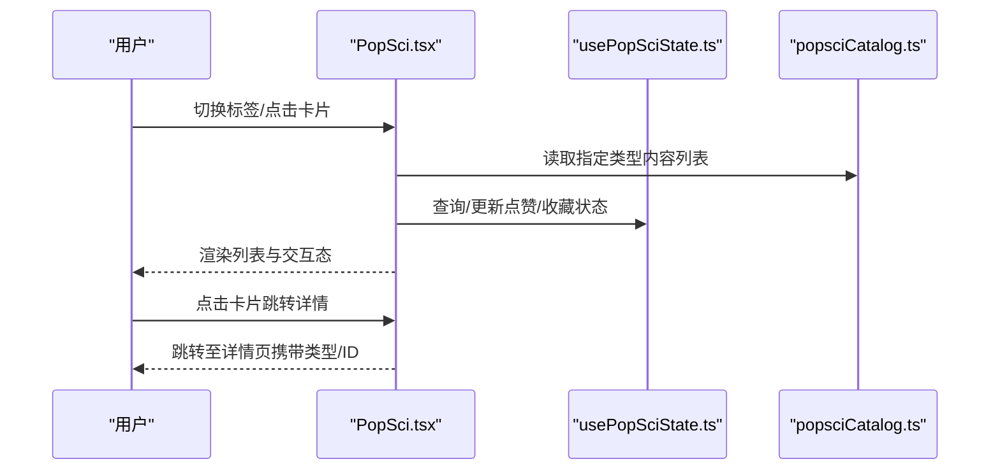
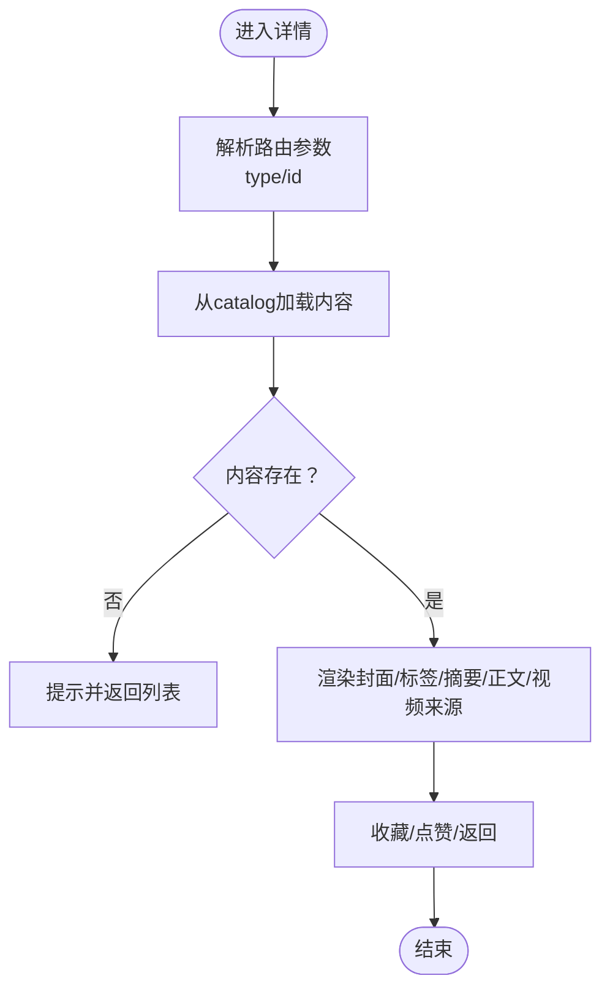
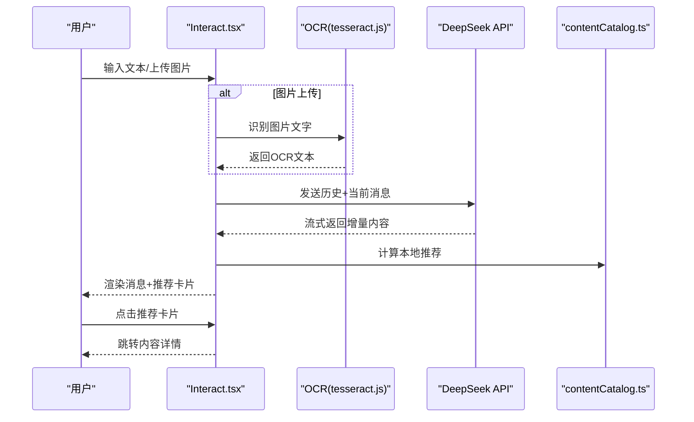
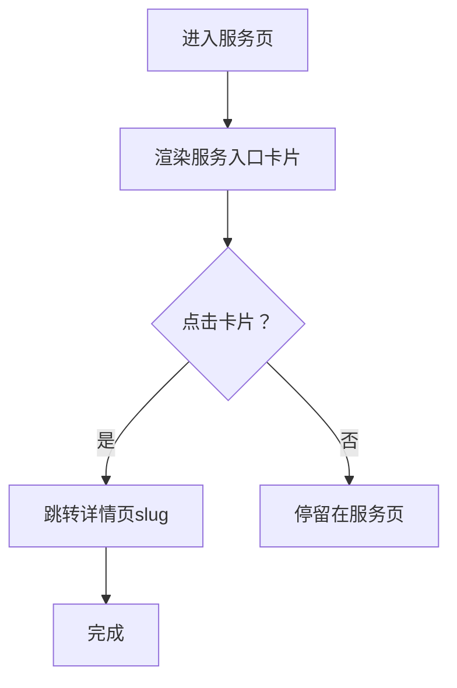
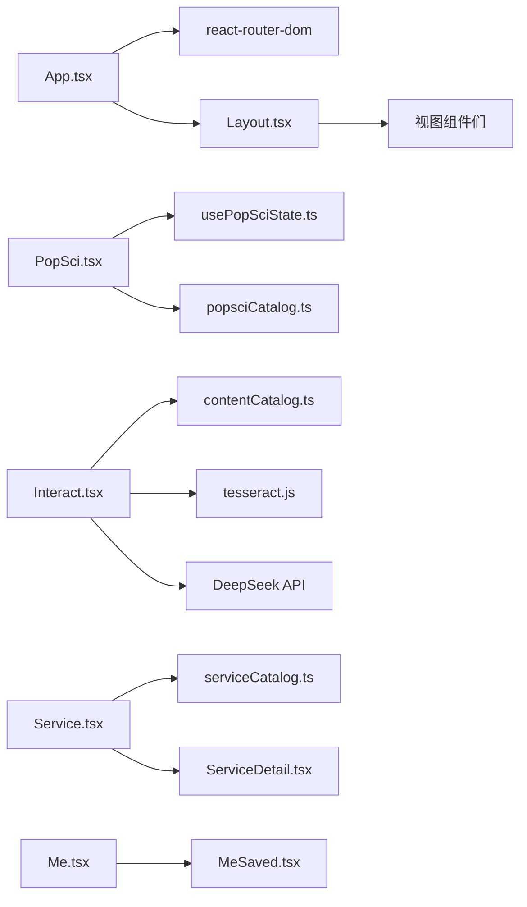

# 页面功能详解

<cite>
**本文引用的文件**
- [src/App.tsx](file://src/App.tsx)
- [src/main.tsx](file://src/main.tsx)
- [src/components/Layout.tsx](file://src/components/Layout.tsx)
- [src/pages/Home.tsx](file://src/pages/Home.tsx)
- [src/pages/PopSci.tsx](file://src/pages/PopSci.tsx)
- [src/pages/PopSciDetail.tsx](file://src/pages/PopSciDetail.tsx)
- [src/pages/Interact.tsx](file://src/pages/Interact.tsx)
- [src/pages/Manage.tsx](file://src/pages/Manage.tsx)
- [src/pages/Service.tsx](file://src/pages/Service.tsx)
- [src/pages/ServiceDetail.tsx](file://src/pages/ServiceDetail.tsx)
- [src/pages/Me.tsx](file://src/pages/Me.tsx)
- [src/pages/MeSaved.tsx](file://src/pages/MeSaved.tsx)
- [src/pages/Faq.tsx](file://src/pages/Faq.tsx)
- [src/pages/AdDietitian.tsx](file://src/pages/AdDietitian.tsx)
- [src/data/popsciCatalog.ts](file://src/data/popsciCatalog.ts)
- [src/data/contentCatalog.ts](file://src/data/contentCatalog.ts)
- [src/data/serviceCatalog.ts](file://src/data/serviceCatalog.ts)
- [src/hooks/usePopSciState.ts](file://src/hooks/usePopSciState.ts)
- [package.json](file://package.json)
</cite>

## 目录
1. [简介](#简介)
2. [项目结构](#项目结构)
3. [核心组件](#核心组件)
4. [架构总览](#架构总览)
5. [详细组件分析](#详细组件分析)
6. [依赖分析](#依赖分析)
7. [性能考量](#性能考量)
8. [故障排查指南](#故障排查指南)
9. [结论](#结论)
10. [附录](#附录)

## 简介
本文件面向应用的五大核心页面，提供从数据获取、状态管理、交互设计到响应式布局的完整功能文档，并说明页面间导航关系、数据传递与状态同步方案。涉及页面包括：首页（占位）、健康科普、AI交互、医疗服务、个人中心及其子页面。

## 项目结构
应用采用基于路由的单页应用架构，主入口负责全局路由与壳层布局，页面按功能模块组织，数据与状态通过本地存储与轻量 Hook 管理，部分页面集成外部服务（如 OCR 与大模型 API）。

图示来源
- [src/main.tsx:1-11](file://src/main.tsx#L1-L11)
- [src/App.tsx:19-51](file://src/App.tsx#L19-L51)
- [src/components/Layout.tsx:19-65](file://src/components/Layout.tsx#L19-L65)
- [src/pages/PopSci.tsx:26-269](file://src/pages/PopSci.tsx#L26-L269)
- [src/pages/Interact.tsx:37-461](file://src/pages/Interact.tsx#L37-L461)
- [src/pages/Manage.tsx:7-166](file://src/pages/Manage.tsx#L7-L166)
- [src/pages/Service.tsx:6-132](file://src/pages/Service.tsx#L6-L132)
- [src/pages/Me.tsx:4-64](file://src/pages/Me.tsx#L4-L64)
- [src/pages/Faq.tsx:7-100](file://src/pages/Faq.tsx#L7-L100)
- [src/pages/PopSciDetail.tsx:15-148](file://src/pages/PopSciDetail.tsx#L15-L148)
- [src/pages/ServiceDetail.tsx:6-73](file://src/pages/ServiceDetail.tsx#L6-L73)
- [src/pages/MeSaved.tsx:16-131](file://src/pages/MeSaved.tsx#L16-L131)
- [src/pages/AdDietitian.tsx:4-124](file://src/pages/AdDietitian.tsx#L4-L124)

章节来源
- [src/main.tsx:1-11](file://src/main.tsx#L1-L11)
- [src/App.tsx:19-51](file://src/App.tsx#L19-L51)
- [src/components/Layout.tsx:19-65](file://src/components/Layout.tsx#L19-L65)

## 核心组件
- 应用入口与路由
  - 应用通过入口文件挂载，根组件配置浏览器路由与壳层布局；壳层提供底部导航与 Outlet 容器，承载各页面。
  - 路由覆盖首页、科普、AI、管理、服务、个人中心、FAQ、详情页、收藏页、广告页等。
- 健康科普数据与状态
  - 科普数据来自本地 catalog，状态通过 Hook 在本地持久化，支持点赞/收藏的即时态与持久态联动。
- AI 对话与 OCR
  - 支持文本与图片（OCR）输入，集成外部大模型 API，具备流式响应与本地会话持久化。
- 服务目录与详情
  - 服务目录提供入口卡片与详情页，详情页支持跳转外部链接或内部广告页。
- 个人中心与收藏
  - 个人中心菜单跳转至收藏、历史、设置、帮助、关于等占位页；收藏页从本地状态解析并展示内容。

章节来源
- [src/App.tsx:19-51](file://src/App.tsx#L19-L51)
- [src/components/Layout.tsx:19-65](file://src/components/Layout.tsx#L19-L65)
- [src/hooks/usePopSciState.ts:30-79](file://src/hooks/usePopSciState.ts#L30-L79)
- [src/data/popsciCatalog.ts:29-98](file://src/data/popsciCatalog.ts#L29-L98)
- [src/data/contentCatalog.ts:65-99](file://src/data/contentCatalog.ts#L65-L99)

## 架构总览
应用采用“路由驱动 + 局部状态 + 本地持久化”的轻量架构。页面间通过路由参数与查询传递数据；状态通过本地存储与自定义 Hook 维持跨会话一致性；部分页面集成外部能力（OCR、大模型 API）。

图示来源
- [src/App.tsx:19-51](file://src/App.tsx#L19-L51)
- [src/components/Layout.tsx:19-65](file://src/components/Layout.tsx#L19-L65)
- [src/pages/PopSci.tsx:26-269](file://src/pages/PopSci.tsx#L26-L269)
- [src/pages/PopSciDetail.tsx:15-148](file://src/pages/PopSciDetail.tsx#L15-L148)
- [src/pages/Interact.tsx:37-461](file://src/pages/Interact.tsx#L37-L461)
- [src/pages/Service.tsx:6-132](file://src/pages/Service.tsx#L6-L132)
- [src/pages/ServiceDetail.tsx:6-73](file://src/pages/ServiceDetail.tsx#L6-L73)
- [src/pages/Me.tsx:4-64](file://src/pages/Me.tsx#L4-L64)
- [src/pages/MeSaved.tsx:16-131](file://src/pages/MeSaved.tsx#L16-L131)
- [src/pages/Manage.tsx:7-166](file://src/pages/Manage.tsx#L7-L166)
- [src/pages/Faq.tsx:7-100](file://src/pages/Faq.tsx#L7-L100)
- [src/pages/AdDietitian.tsx:4-124](file://src/pages/AdDietitian.tsx#L4-L124)
- [src/data/popsciCatalog.ts:29-98](file://src/data/popsciCatalog.ts#L29-L98)
- [src/data/contentCatalog.ts:65-99](file://src/data/contentCatalog.ts#L65-L99)
- [src/data/serviceCatalog.ts:10-49](file://src/data/serviceCatalog.ts#L10-L49)
- [src/hooks/usePopSciState.ts:30-79](file://src/hooks/usePopSciState.ts#L30-L79)

## 详细组件分析

### 首页（占位）
- 功能概述
  - 当前为占位页面，未实现具体业务逻辑。
- 数据与状态
  - 无外部数据依赖，无状态管理。
- 交互与布局
  - 作为路由根路径，由壳层统一渲染。
- 性能与体验
  - 无额外开销，加载极快。

章节来源
- [src/pages/Home.tsx:1-3](file://src/pages/Home.tsx#L1-L3)
- [src/App.tsx:30](file://src/App.tsx#L30)

### 健康科普页面（PopSci）
- 功能概述
  - 提供“科普文章”“科普视频”“康复故事”三类内容的列表展示，支持切换与跳转详情。
- 数据获取流程
  - 使用本地 catalog 导出的列表函数按类型筛选数据。
- 状态管理策略
  - 通过自定义 Hook 管理点赞/收藏的本地状态，键值采用“类型:ID”形式，持久化于本地存储。
- 用户交互设计
  - 支持点击卡片跳转详情；支持收藏/点赞按钮即时反馈；支持键盘激活。
- 响应式布局实现
  - 使用 Tailwind 类控制间距、圆角、阴影与边框，配合滚动容器与动画库实现过渡效果。
- 页面间导航与数据传递
  - 列表项点击触发路由跳转，携带类型与 ID 参数，详情页通过路由参数解析并渲染。
- 错误处理策略
  - 列表渲染失败时回退为占位文案；详情页缺失内容时引导返回列表。
- 性能优化技巧
  - 使用记忆化计算列表与状态判断，避免重复渲染；长列表滚动采用虚拟化思路（本项目通过简单滚动实现）。
- SEO 考虑
  - 列表页标题与描述语义明确；详情页提供结构化元信息（标签、摘要、发布时间）。
- 用户体验设计原则
  - 信息层级清晰，操作反馈即时，视觉焦点明确。

图示来源
- [src/pages/PopSci.tsx:26-269](file://src/pages/PopSci.tsx#L26-L269)
- [src/hooks/usePopSciState.ts:30-79](file://src/hooks/usePopSciState.ts#L30-L79)
- [src/data/popsciCatalog.ts:90-98](file://src/data/popsciCatalog.ts#L90-L98)

章节来源
- [src/pages/PopSci.tsx:26-269](file://src/pages/PopSci.tsx#L26-L269)
- [src/hooks/usePopSciState.ts:30-79](file://src/hooks/usePopSciState.ts#L30-L79)
- [src/data/popsciCatalog.ts:29-98](file://src/data/popsciCatalog.ts#L29-L98)

### 健康科普详情页（PopSciDetail）
- 功能概述
  - 展示文章正文或视频来源，支持收藏/点赞与返回上一页。
- 数据获取流程
  - 通过路由参数解析类型与 ID，从本地 catalog 获取对应内容。
- 状态管理策略
  - 借助全局 Hook 同步点赞/收藏状态，保持与列表页一致。
- 用户交互设计
  - 支持返回、收藏、点赞、打开视频来源等操作。
- 响应式布局实现
  - 使用卡片、网格与弹性布局适配移动端。
- 页面间导航与数据传递
  - 详情页通过路由参数接收数据，无需额外传参。
- 错误处理策略
  - 内容不存在时提示并引导返回列表。
- 性能优化技巧
  - 使用记忆化避免重复查询；仅在必要时渲染 Markdown。
- SEO 考虑
  - 标题、标签、摘要与发布信息结构化呈现。
- 用户体验设计原则
  - 信息密度适中，操作路径简洁。

图示来源
- [src/pages/PopSciDetail.tsx:15-148](file://src/pages/PopSciDetail.tsx#L15-L148)
- [src/data/popsciCatalog.ts:90-98](file://src/data/popsciCatalog.ts#L90-L98)
- [src/hooks/usePopSciState.ts:30-79](file://src/hooks/usePopSciState.ts#L30-L79)

章节来源
- [src/pages/PopSciDetail.tsx:15-148](file://src/pages/PopSciDetail.tsx#L15-L148)
- [src/data/popsciCatalog.ts:90-98](file://src/data/popsciCatalog.ts#L90-L98)

### AI 交互页面（Interact）
- 功能概述
  - 提供健康问答与检查报告 OCR 识别，支持流式大模型响应与内容推荐。
- 数据获取流程
  - 本地内容目录用于兜底推荐；当未配置 API Key 时，直接返回本地推荐。
- 状态管理策略
  - 会话消息保存于本地存储，过滤图片资源以控制体积；支持“占位”标记以兼容后续恢复。
- 用户交互设计
  - 支持文本输入与图片上传（OCR），快捷问题一键发送，输入区固定在底部。
- 响应式布局实现
  - 消息区域自适应滚动，输入区吸底，卡片圆角与阴影增强层次感。
- 页面间导航与数据传递
  - AI 推荐卡片点击跳转至内容详情页，传递 ID 与类型。
- 错误处理策略
  - API 请求失败时回退为本地推荐并提示；OCR 失败清理临时 URL。
- 性能优化技巧
  - 流式响应增量渲染，避免一次性渲染大文本；图片上传后及时释放对象 URL。
- SEO 考虑
  - 该页面为交互型页面，主要关注可用性与可访问性。
- 用户体验设计原则
  - 输入便捷、反馈及时、错误友好、可恢复。

图示来源
- [src/pages/Interact.tsx:37-461](file://src/pages/Interact.tsx#L37-L461)
- [src/data/contentCatalog.ts:69-99](file://src/data/contentCatalog.ts#L69-L99)

章节来源
- [src/pages/Interact.tsx:37-461](file://src/pages/Interact.tsx#L37-L461)
- [src/data/contentCatalog.ts:69-99](file://src/data/contentCatalog.ts#L69-L99)

### 医疗服务页面（Service）
- 功能概述
  - 展示服务入口与快速链接，支持跳转至广告页或服务详情页。
- 数据获取流程
  - 服务目录提供入口卡片与快速链接，详情页通过 slug 解析。
- 状态管理策略
  - 无持久化状态，仅内存态。
- 用户交互设计
  - 卡片点击跳转，强调“营养师专属服务”入口。
- 响应式布局实现
  - 网格布局与卡片圆角、阴影提升可读性。
- 页面间导航与数据传递
  - 服务入口点击跳转至详情页；详情页通过 slug 参数解析。
- 错误处理策略
  - 详情页缺失时提示并引导返回。
- 性能优化技巧
  - 列表渲染使用固定数量切片，避免过度重排。
- SEO 考虑
  - 标题与描述语义明确，利于搜索引擎理解服务主题。
- 用户体验设计原则
  - 信息直达、路径明确、视觉突出。

图示来源
- [src/pages/Service.tsx:6-132](file://src/pages/Service.tsx#L6-L132)
- [src/pages/ServiceDetail.tsx:6-73](file://src/pages/ServiceDetail.tsx#L6-L73)
- [src/data/serviceCatalog.ts:45-49](file://src/data/serviceCatalog.ts#L45-L49)

章节来源
- [src/pages/Service.tsx:6-132](file://src/pages/Service.tsx#L6-L132)
- [src/pages/ServiceDetail.tsx:6-73](file://src/pages/ServiceDetail.tsx#L6-L73)
- [src/data/serviceCatalog.ts:10-49](file://src/data/serviceCatalog.ts#L10-L49)

### 个人中心页面（Me）
- 功能概述
  - 展示用户头像与等级、菜单入口（收藏、历史、设置、帮助、关于）。
- 数据获取流程
  - 无外部数据，菜单项为静态配置。
- 状态管理策略
  - 无持久化状态。
- 用户交互设计
  - 菜单项点击跳转至对应页面（部分为占位）。
- 响应式布局实现
  - 头像背景与卡片布局适配移动端。
- 页面间导航与数据传递
  - 通过路由路径直接跳转。
- 错误处理策略
  - 无错误场景。
- 性能优化技巧
  - 列表渲染简单，无复杂计算。
- SEO 考虑
  - 该页面为功能入口，主要关注可访问性与交互。
- 用户体验设计原则
  - 一目了然的入口与清晰的图标/颜色区分。

章节来源
- [src/pages/Me.tsx:4-64](file://src/pages/Me.tsx#L4-L64)

### 我的收藏页面（MeSaved）
- 功能概述
  - 展示用户收藏的科普内容，支持取消收藏与跳转详情。
- 数据获取流程
  - 从本地状态解析收藏键，映射到内容列表。
- 状态管理策略
  - 通过全局 Hook 维护收藏键集合，解析后渲染。
- 用户交互设计
  - 支持取消收藏、跳转详情、返回上一页。
- 响应式布局实现
  - 卡片布局与缩略图适配移动端。
- 页面间导航与数据传递
  - 点击卡片跳转详情页，传递类型与 ID。
- 错误处理策略
  - 无收藏时提示并引导前往列表页。
- 性能优化技巧
  - 使用记忆化过滤与解析，避免重复计算。
- SEO 考虑
  - 该页面为用户私有数据展示，主要关注可用性。
- 用户体验设计原则
  - 快速定位与批量操作（取消收藏）。

章节来源
- [src/pages/MeSaved.tsx:16-131](file://src/pages/MeSaved.tsx#L16-L131)
- [src/hooks/usePopSciState.ts:30-79](file://src/hooks/usePopSciState.ts#L30-L79)

### 常见问题页面（Faq）
- 功能概述
  - 展示常见健康问题，支持分类筛选与折叠展开。
- 数据获取流程
  - 本地 FAQ 数据与分类数组，按分类过滤。
- 状态管理策略
  - 本地维护展开项 ID 与当前分类。
- 用户交互设计
  - 分类切换与问题展开收起，动画过渡自然。
- 响应式布局实现
  - 横向滚动分类标签，卡片圆角与阴影。
- 页面间导航与数据传递
  - 无路由参数传递。
- 错误处理策略
  - 无错误场景。
- 性能优化技巧
  - 使用记忆化与动画库实现平滑过渡。
- SEO 考虑
  - 结构化问答内容，利于搜索引擎抓取。
- 用户体验设计原则
  - 信息可检索、操作低认知成本。

章节来源
- [src/pages/Faq.tsx:7-100](file://src/pages/Faq.tsx#L7-L100)

### 广告页（AdDietitian）
- 功能概述
  - 展示“专属营养师计划”的服务特色与限时优惠，提供加入按钮占位。
- 数据获取流程
  - 无外部数据，纯静态内容。
- 状态管理策略
  - 无状态。
- 用户交互设计
  - 返回按钮、吸底操作栏、图标与颜色强化品牌感。
- 响应式布局实现
  - 固定头部与吸底操作栏，内容区卡片化布局。
- 页面间导航与数据传递
  - 通过路由返回或占位跳转。
- 错误处理策略
  - 无错误场景。
- 性能优化技巧
  - 简洁布局，避免复杂计算。
- SEO 考虑
  - 服务介绍页面，标题与描述明确。
- 用户体验设计原则
  - 强化价值主张与转化路径。

章节来源
- [src/pages/AdDietitian.tsx:4-124](file://src/pages/AdDietitian.tsx#L4-L124)

## 依赖分析
- 核心依赖
  - 路由与视图：react-router-dom
  - 动画与交互：framer-motion、lucide-react
  - Markdown 渲染：react-markdown、remark-gfm
  - OCR：tesseract.js
  - 工具库：clsx、tailwind-merge
  - 状态：zustand（声明式状态库，但本项目未使用）
- 外部集成点
  - AI 对话：DeepSeek API（需配置密钥）
  - 图片 OCR：Tesseract.js（浏览器端识别）

图示来源
- [package.json:13-26](file://package.json#L13-L26)
- [src/App.tsx:19-51](file://src/App.tsx#L19-L51)
- [src/components/Layout.tsx:19-65](file://src/components/Layout.tsx#L19-L65)
- [src/pages/PopSci.tsx:26-269](file://src/pages/PopSci.tsx#L26-L269)
- [src/pages/Interact.tsx:37-461](file://src/pages/Interact.tsx#L37-L461)
- [src/pages/Service.tsx:6-132](file://src/pages/Service.tsx#L6-L132)
- [src/pages/Me.tsx:4-64](file://src/pages/Me.tsx#L4-L64)
- [src/pages/MeSaved.tsx:16-131](file://src/pages/MeSaved.tsx#L16-L131)
- [src/hooks/usePopSciState.ts:30-79](file://src/hooks/usePopSciState.ts#L30-L79)
- [src/data/popsciCatalog.ts:29-98](file://src/data/popsciCatalog.ts#L29-L98)
- [src/data/contentCatalog.ts:65-99](file://src/data/contentCatalog.ts#L65-L99)
- [src/data/serviceCatalog.ts:10-49](file://src/data/serviceCatalog.ts#L10-L49)

章节来源
- [package.json:13-26](file://package.json#L13-L26)

## 性能考量
- 渲染性能
  - 使用记忆化与条件渲染减少不必要的重绘；长列表采用滚动容器而非虚拟列表。
- 状态持久化
  - 本地存储键值精简，避免存储大对象；对图片 URL 进行清理与占位标记。
- 网络与外部依赖
  - API 请求失败时回退本地推荐；OCR 失败及时释放对象 URL。
- 可访问性与体验
  - 键盘可达、焦点可见、动画流畅、吸底输入区降低误触。

## 故障排查指南
- AI 对话无响应
  - 检查环境变量是否配置；确认网络连通；查看控制台错误日志。
- OCR 识别失败
  - 确认图片清晰度与格式；检查浏览器权限；查看错误提示并清理临时资源。
- 收藏/点赞不同步
  - 检查本地存储键值格式；确认状态 Hook 是否正确初始化。
- 详情页空白
  - 检查路由参数与内容 ID 是否匹配；确认 catalog 中是否存在对应项。

章节来源
- [src/pages/Interact.tsx:70-84](file://src/pages/Interact.tsx#L70-L84)
- [src/pages/Interact.tsx:128-142](file://src/pages/Interact.tsx#L128-L142)
- [src/hooks/usePopSciState.ts:30-79](file://src/hooks/usePopSciState.ts#L30-L79)
- [src/pages/PopSciDetail.tsx:19-22](file://src/pages/PopSciDetail.tsx#L19-L22)

## 结论
本应用以轻量、可扩展为目标，围绕健康科普、AI 交互、服务入口与个人中心构建核心体验。通过本地数据与状态持久化、路由驱动的页面导航以及对外部能力的渐进集成，实现了良好的可用性与可维护性。建议后续在以下方面持续优化：引入更完善的错误边界与监控、增强 SEO 结构化数据、扩展状态共享方案以支持多标签页同步。

## 附录
- API 与密钥
  - AI 对话接口：DeepSeek API（需配置密钥）
  - OCR 识别：浏览器端 tesseract.js
- 环境变量
  - VITE_DEEPSEEK_API_KEY：用于启用 AI 对话与推荐
- 本地存储键
  - popsci_state_v1：存储点赞/收藏键集合