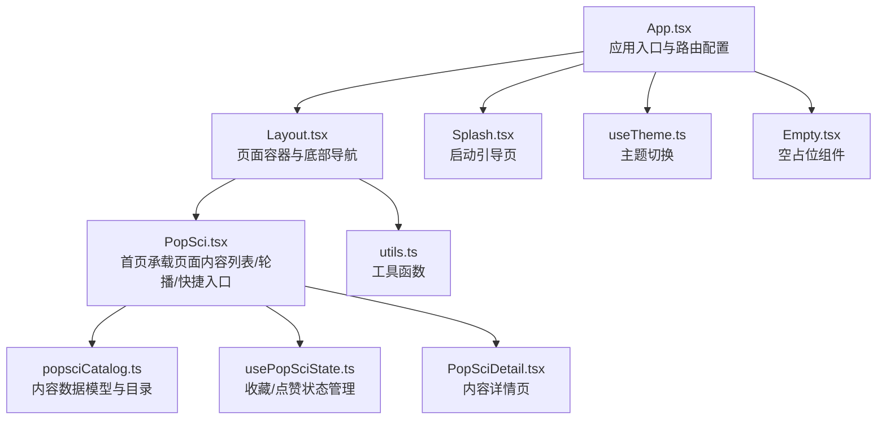
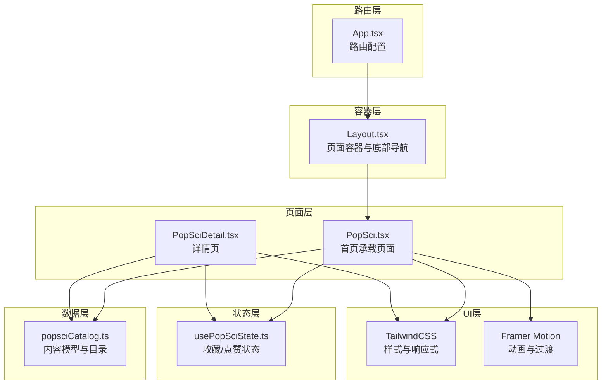
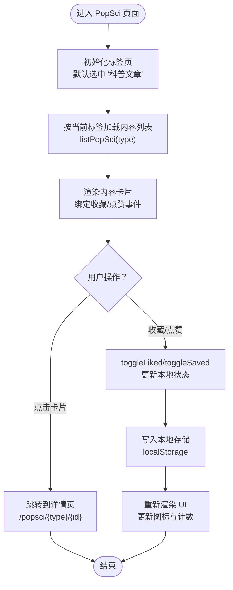
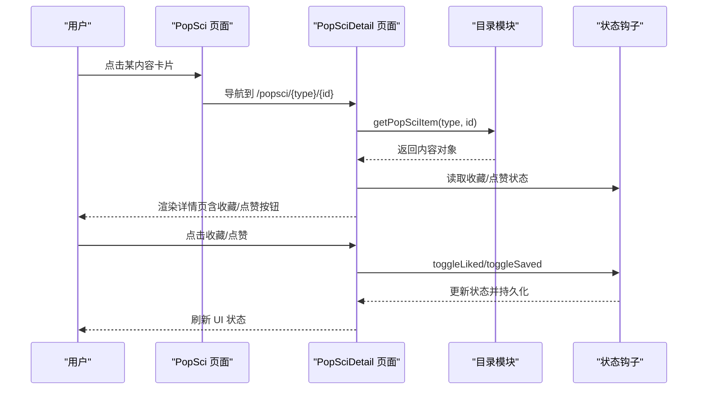
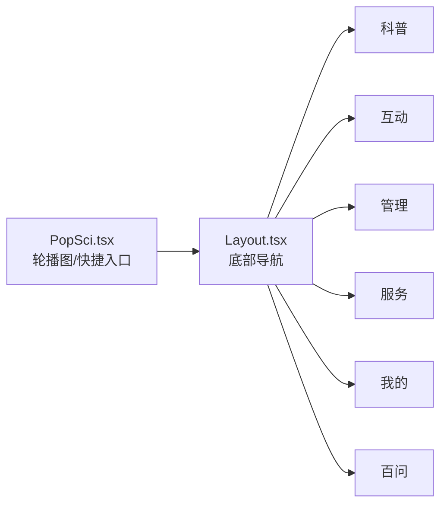
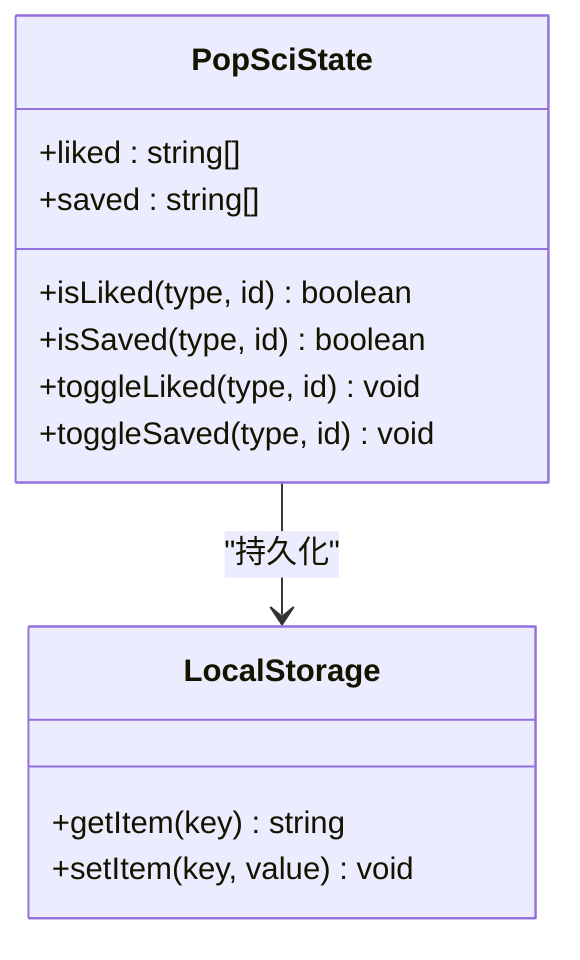
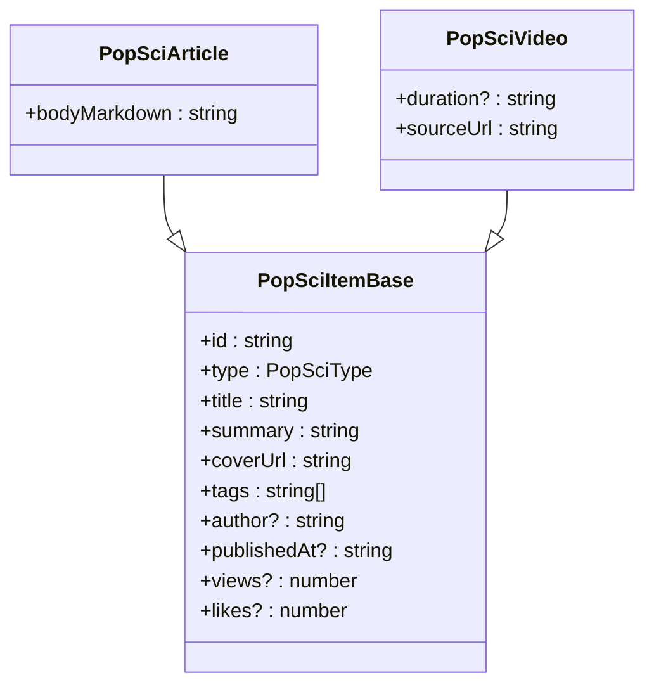
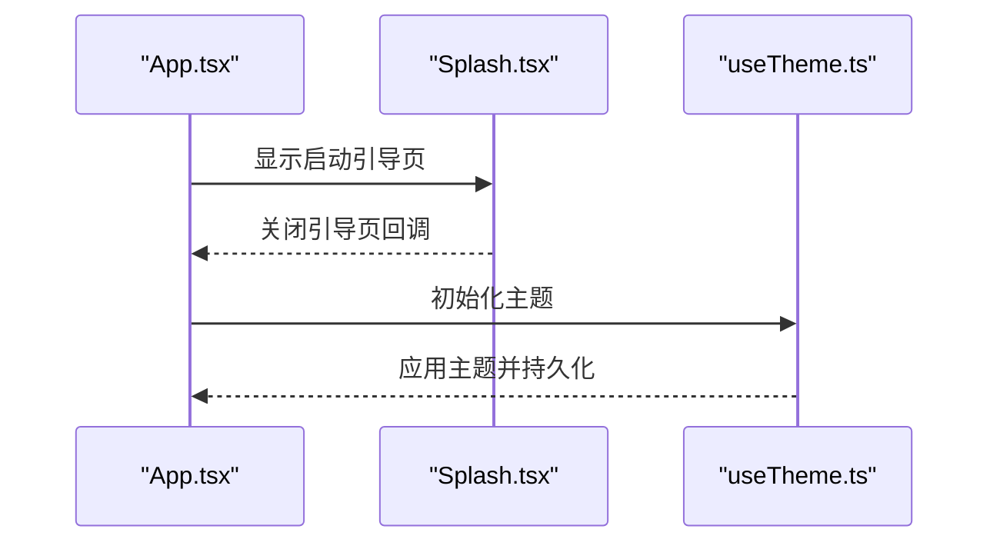
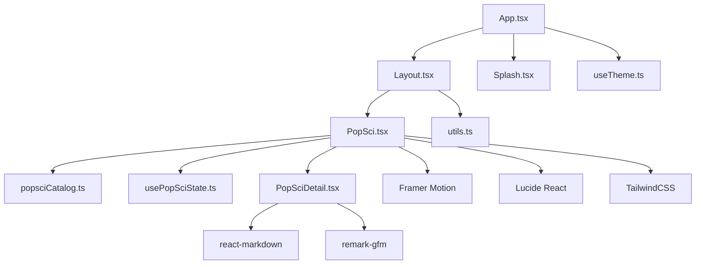

# 首页功能

<cite>
**本文引用的文件**
- [Home.tsx](file://src/pages/Home.tsx)
- [App.tsx](file://src/App.tsx)
- [Layout.tsx](file://src/components/Layout.tsx)
- [PopSci.tsx](file://src/pages/PopSci.tsx)
- [PopSciDetail.tsx](file://src/pages/PopSciDetail.tsx)
- [popsciCatalog.ts](file://src/data/popsciCatalog.ts)
- [usePopSciState.ts](file://src/hooks/usePopSciState.ts)
- [Splash.tsx](file://src/components/Splash.tsx)
- [useTheme.ts](file://src/hooks/useTheme.ts)
- [utils.ts](file://src/lib/utils.ts)
- [package.json](file://package.json)
- [Empty.tsx](file://src/components/Empty.tsx)
</cite>

## 目录
1. [引言](#引言)
2. [项目结构](#项目结构)
3. [核心组件](#核心组件)
4. [架构总览](#架构总览)
5. [详细组件分析](#详细组件分析)
6. [依赖分析](#依赖分析)
7. [性能考虑](#性能考虑)
8. [故障排查指南](#故障排查指南)
9. [结论](#结论)
10. [附录](#附录)

## 引言
本文件面向首页功能的完整说明，重点覆盖以下方面：
- 首页内容推荐机制与轮播图展示
- 快捷入口设计与导航关系
- 个性化内容分发与状态管理策略
- 数据获取流程与响应式布局实现
- 与其他页面的导航关系、用户行为追踪与内容缓存策略
- 实现示例、API调用方式与性能优化技巧
- 用户体验设计原则、A/B测试集成与转化率优化策略

当前仓库中首页入口由路由配置指向“科普”页面（PopSci），首页功能的落地以“科普”页面为核心载体，结合轮播图、快捷入口、标签页切换与收藏/点赞等交互实现。

## 项目结构
本项目的前端采用 React + Vite 架构，使用 TailwindCSS 作为样式工具，路由基于 react-router-dom。首页功能主要通过路由与页面组件组合实现，核心文件如下：
- 路由与应用入口：App.tsx
- 页面容器与底部导航：Layout.tsx
- 首页承载页面：PopSci.tsx
- 内容详情页：PopSciDetail.tsx
- 数据模型与目录：popsciCatalog.ts
- 状态钩子：usePopSciState.ts
- 启动引导页：Splash.tsx
- 主题钩子：useTheme.ts
- 工具函数：utils.ts
- 空占位组件：Empty.tsx

图表来源
- [App.tsx:19-51](file://src/App.tsx#L19-L51)
- [Layout.tsx:19-65](file://src/components/Layout.tsx#L19-L65)
- [PopSci.tsx:26-270](file://src/pages/PopSci.tsx#L26-L270)
- [popsciCatalog.ts:29-98](file://src/data/popsciCatalog.ts#L29-L98)
- [usePopSciState.ts:30-80](file://src/hooks/usePopSciState.ts#L30-L80)
- [PopSciDetail.tsx:15-99](file://src/pages/PopSciDetail.tsx#L15-L99)
- [Splash.tsx:9-171](file://src/components/Splash.tsx#L9-L171)
- [useTheme.ts:5-29](file://src/hooks/useTheme.ts#L5-L29)
- [utils.ts:4-7](file://src/lib/utils.ts#L4-L7)
- [Empty.tsx:4-8](file://src/components/Empty.tsx#L4-L8)

章节来源
- [App.tsx:19-51](file://src/App.tsx#L19-L51)
- [Layout.tsx:19-65](file://src/components/Layout.tsx#L19-L65)
- [PopSci.tsx:26-270](file://src/pages/PopSci.tsx#L26-L270)
- [popsciCatalog.ts:29-98](file://src/data/popsciCatalog.ts#L29-L98)
- [usePopSciState.ts:30-80](file://src/hooks/usePopSciState.ts#L30-L80)
- [PopSciDetail.tsx:15-99](file://src/pages/PopSciDetail.tsx#L15-L99)
- [Splash.tsx:9-171](file://src/components/Splash.tsx#L9-L171)
- [useTheme.ts:5-29](file://src/hooks/useTheme.ts#L5-L29)
- [utils.ts:4-7](file://src/lib/utils.ts#L4-L7)
- [Empty.tsx:4-8](file://src/components/Empty.tsx#L4-L8)

## 核心组件
- 应用入口与路由配置：负责启动引导页、主路由与页面嵌套，首页承载页位于“科普”路径下。
- 页面容器与底部导航：提供统一的页面骨架、底部导航栏与响应式布局。
- 首页承载页面（PopSci）：实现标签页切换、内容列表渲染、轮播图展示、快捷入口与收藏/点赞交互。
- 内容数据模型：定义内容类型、字段与目录查询方法。
- 状态钩子：提供收藏/点赞状态的本地持久化与更新。
- 启动引导页：提供游客浏览与手机号登录能力，支持验证码倒计时。
- 主题钩子：提供明暗主题切换与本地持久化。
- 工具函数：提供类名合并工具。
- 空占位组件：用于占位与占位页面。

章节来源
- [App.tsx:19-51](file://src/App.tsx#L19-L51)
- [Layout.tsx:19-65](file://src/components/Layout.tsx#L19-L65)
- [PopSci.tsx:26-270](file://src/pages/PopSci.tsx#L26-L270)
- [popsciCatalog.ts:29-98](file://src/data/popsciCatalog.ts#L29-L98)
- [usePopSciState.ts:30-80](file://src/hooks/usePopSciState.ts#L30-L80)
- [Splash.tsx:9-171](file://src/components/Splash.tsx#L9-L171)
- [useTheme.ts:5-29](file://src/hooks/useTheme.ts#L5-L29)
- [utils.ts:4-7](file://src/lib/utils.ts#L4-L7)
- [Empty.tsx:4-8](file://src/components/Empty.tsx#L4-L8)

## 架构总览
首页功能的运行时架构围绕“路由—容器—页面—数据—状态—UI”的链路展开。路由层将首页映射至“科普”页面；容器层提供统一布局与导航；页面层负责内容渲染与交互；数据层提供内容模型与目录；状态层提供收藏/点赞的本地持久化；UI层通过 TailwindCSS 与动画库实现响应式与交互效果。

图表来源
- [App.tsx:19-51](file://src/App.tsx#L19-L51)
- [Layout.tsx:19-65](file://src/components/Layout.tsx#L19-L65)
- [PopSci.tsx:26-270](file://src/pages/PopSci.tsx#L26-L270)
- [PopSciDetail.tsx:15-99](file://src/pages/PopSciDetail.tsx#L15-L99)
- [popsciCatalog.ts:29-98](file://src/data/popsciCatalog.ts#L29-L98)
- [usePopSciState.ts:30-80](file://src/hooks/usePopSciState.ts#L30-L80)

## 详细组件分析

### 首页承载页面（PopSci）
- 功能职责
  - 标签页切换：支持“科普文章”“科普视频”“康复故事”三类内容的切换与渲染。
  - 内容列表：根据当前标签动态加载对应类型的内容列表。
  - 轮播图展示：在“康复故事”区域以卡片形式展示轮播内容。
  - 快捷入口：通过导航栏与底部导航直达“科普”“互动”“管理”“服务”“我的”“百问”等页面。
  - 个性化交互：收藏/点赞状态通过本地存储持久化，支持实时切换与计数。
  - 响应式布局：基于 TailwindCSS 的移动端优先设计，配合容器宽度限制与滚动区域划分。
- 数据流
  - 通过目录方法按类型筛选内容，再通过状态钩子判断收藏/点赞状态，最后渲染 UI。
- 性能与交互
  - 使用动画库实现标签页切换与卡片点击的过渡效果，提升交互流畅度。
  - 使用记忆化计算避免不必要的重渲染。

图表来源
- [PopSci.tsx:26-270](file://src/pages/PopSci.tsx#L26-L270)
- [usePopSciState.ts:30-80](file://src/hooks/usePopSciState.ts#L30-L80)
- [popsciCatalog.ts:90-98](file://src/data/popsciCatalog.ts#L90-L98)

章节来源
- [PopSci.tsx:26-270](file://src/pages/PopSci.tsx#L26-L270)
- [usePopSciState.ts:30-80](file://src/hooks/usePopSciState.ts#L30-L80)
- [popsciCatalog.ts:90-98](file://src/data/popsciCatalog.ts#L90-L98)

### 内容详情页（PopSciDetail）
- 功能职责
  - 根据路由参数加载指定内容，支持“文章”与“视频”两种类型。
  - 展示封面图、标题、摘要、统计信息与来源链接（视频）。
  - 提供收藏/点赞切换与返回上一页的能力。
- 数据流
  - 通过目录方法按类型与 ID 获取内容，再渲染详情 UI。
- 性能与交互
  - 使用 Markdown 渲染器展示文章正文，支持表格等扩展语法。

图表来源
- [PopSci.tsx:34-36](file://src/pages/PopSci.tsx#L34-L36)
- [PopSciDetail.tsx:15-99](file://src/pages/PopSciDetail.tsx#L15-L99)
- [popsciCatalog.ts:90-92](file://src/data/popsciCatalog.ts#L90-L92)
- [usePopSciState.ts:50-64](file://src/hooks/usePopSciState.ts#L50-L64)

章节来源
- [PopSciDetail.tsx:15-99](file://src/pages/PopSciDetail.tsx#L15-L99)
- [popsciCatalog.ts:90-92](file://src/data/popsciCatalog.ts#L90-L92)
- [usePopSciState.ts:50-64](file://src/hooks/usePopSciState.ts#L50-L64)

### 轮播图与快捷入口
- 轮播图展示
  - “康复故事”区域以卡片形式展示故事列表，支持左右滑动与点击跳转。
- 快捷入口
  - 底部导航提供直达“科普”“互动”“管理”“服务”“我的”“百问”的入口，支持高亮与图标视觉反馈。
- 响应式布局
  - 容器限制最大宽度并在移动端提供安全区适配，滚动区域与导航栏分离，保证交互一致性。

图表来源
- [Layout.tsx:10-17](file://src/components/Layout.tsx#L10-L17)
- [Layout.tsx:30-62](file://src/components/Layout.tsx#L30-L62)
- [PopSci.tsx:11-24](file://src/pages/PopSci.tsx#L11-L24)

章节来源
- [Layout.tsx:10-17](file://src/components/Layout.tsx#L10-L17)
- [Layout.tsx:30-62](file://src/components/Layout.tsx#L30-L62)
- [PopSci.tsx:11-24](file://src/pages/PopSci.tsx#L11-L24)

### 个性化内容分发与状态管理
- 收藏/点赞状态
  - 通过自定义 Hook 维护本地状态，键值格式为“类型:ID”，使用本地存储进行持久化。
  - 提供切换与查询方法，支持在列表与详情页联动更新。
- 推荐机制
  - 当前实现以目录数据为主，未见服务端推荐接口或算法实现；可扩展方向包括：基于浏览/收藏/点赞行为构建简单协同过滤或热门度排序。
- 缓存策略
  - 列表渲染使用记忆化计算，避免重复筛选；状态持久化于本地存储，刷新后恢复。

图表来源
- [usePopSciState.ts:30-80](file://src/hooks/usePopSciState.ts#L30-L80)

章节来源
- [usePopSciState.ts:30-80](file://src/hooks/usePopSciState.ts#L30-L80)

### 数据获取流程与内容模型
- 内容模型
  - 定义“文章”与“视频”两类内容的基础字段与差异字段，提供类型守卫与联合类型。
- 目录方法
  - 提供按类型筛选与按类型+ID 查询的方法，便于页面层按需加载。
- 列表渲染
  - 页面层根据当前标签动态选择类型，再调用目录方法获取数据并渲染。

图表来源
- [popsciCatalog.ts:3-27](file://src/data/popsciCatalog.ts#L3-L27)

章节来源
- [popsciCatalog.ts:3-27](file://src/data/popsciCatalog.ts#L3-L27)
- [popsciCatalog.ts:90-98](file://src/data/popsciCatalog.ts#L90-L98)

### 启动引导与主题系统
- 启动引导页
  - 提供手机号登录与验证码倒计时，支持游客浏览模式，首屏动画增强品牌感知。
- 主题系统
  - 自动检测系统偏好主题，支持手动切换并持久化至本地存储。

图表来源
- [App.tsx:19-28](file://src/App.tsx#L19-L28)
- [Splash.tsx:9-171](file://src/components/Splash.tsx#L9-L171)
- [useTheme.ts:5-29](file://src/hooks/useTheme.ts#L5-L29)

章节来源
- [App.tsx:19-28](file://src/App.tsx#L19-L28)
- [Splash.tsx:9-171](file://src/components/Splash.tsx#L9-L171)
- [useTheme.ts:5-29](file://src/hooks/useTheme.ts#L5-L29)

## 依赖分析
- 路由与页面
  - App.tsx 配置路由与嵌套路由，将首页承载页映射至“科普”路径。
  - Layout.tsx 提供页面容器与底部导航，作为所有页面的公共骨架。
- 组件依赖
  - PopSci.tsx 依赖目录模块与状态钩子，渲染内容列表与交互。
  - PopSciDetail.tsx 依赖目录模块与状态钩子，渲染详情页。
- 第三方库
  - 动画与过渡：Framer Motion
  - 图标与 UI：Lucide React
  - 样式与响应式：TailwindCSS 及其插件
  - Markdown 渲染：react-markdown 与 remark-gfm
  - 类名合并：clsx 与 tailwind-merge

图表来源
- [App.tsx:19-51](file://src/App.tsx#L19-L51)
- [Layout.tsx:19-65](file://src/components/Layout.tsx#L19-L65)
- [PopSci.tsx:26-270](file://src/pages/PopSci.tsx#L26-L270)
- [PopSciDetail.tsx:15-99](file://src/pages/PopSciDetail.tsx#L15-L99)
- [popsciCatalog.ts:29-98](file://src/data/popsciCatalog.ts#L29-L98)
- [usePopSciState.ts:30-80](file://src/hooks/usePopSciState.ts#L30-L80)
- [Splash.tsx:9-171](file://src/components/Splash.tsx#L9-L171)
- [useTheme.ts:5-29](file://src/hooks/useTheme.ts#L5-L29)
- [utils.ts:4-7](file://src/lib/utils.ts#L4-L7)
- [package.json:13-26](file://package.json#L13-L26)

章节来源
- [package.json:13-26](file://package.json#L13-L26)

## 性能考虑
- 渲染优化
  - 使用记忆化计算减少列表筛选与渲染开销。
  - 使用动画库实现轻量过渡，避免复杂动画导致掉帧。
- 状态持久化
  - 使用本地存储保存收藏/点赞状态，减少网络请求与服务器压力。
- 资源加载
  - 图片资源采用懒加载与合适的尺寸，避免阻塞主线程。
- 响应式布局
  - 移动端优先设计，合理使用滚动区域与安全区适配，减少重排与重绘。

## 故障排查指南
- 首页空白或路由不生效
  - 检查路由配置是否正确映射至“科普”页面，确认嵌套路由与索引路由设置。
- 内容不显示或标签页切换无效
  - 检查目录方法是否正确返回数据，确认当前标签与类型匹配。
- 收藏/点赞状态不同步
  - 检查本地存储键值格式与状态更新逻辑，确保在点击时触发更新并持久化。
- 启动引导页无法关闭
  - 检查引导页回调与状态切换逻辑，确认关闭条件与倒计时处理。
- 主题切换不生效
  - 检查主题钩子的本地存储与 DOM 类名切换逻辑。

章节来源
- [App.tsx:29-30](file://src/App.tsx#L29-L30)
- [usePopSciState.ts:30-80](file://src/hooks/usePopSciState.ts#L30-L80)
- [Splash.tsx:34-49](file://src/components/Splash.tsx#L34-L49)
- [useTheme.ts:14-18](file://src/hooks/useTheme.ts#L14-L18)

## 结论
首页功能以“科普”页面为核心，结合标签页切换、轮播图与快捷入口，实现了清晰的内容分发与便捷的导航体验。通过本地状态持久化与响应式布局，提升了交互流畅度与可用性。未来可在推荐机制、用户行为追踪与缓存策略等方面进一步扩展，以支持更丰富的个性化与转化优化场景。

## 附录
- 实现示例与 API 调用方式
  - 列表加载：调用目录方法按类型筛选内容。
  - 详情跳转：根据内容类型与 ID 构造路由路径。
  - 收藏/点赞：调用状态钩子的切换方法并持久化。
- 性能优化技巧
  - 使用记忆化与防抖减少重渲染。
  - 合理拆分组件，避免大组件一次性渲染。
  - 图片懒加载与尺寸优化。
- 用户体验设计原则
  - 移动端优先、信息层级清晰、交互反馈即时。
- A/B 测试与转化率优化
  - 可在轮播图与快捷入口位置进行 A/B 测试，评估不同布局对点击率的影响。
  - 对收藏/点赞按钮的视觉与位置进行实验，优化转化路径。