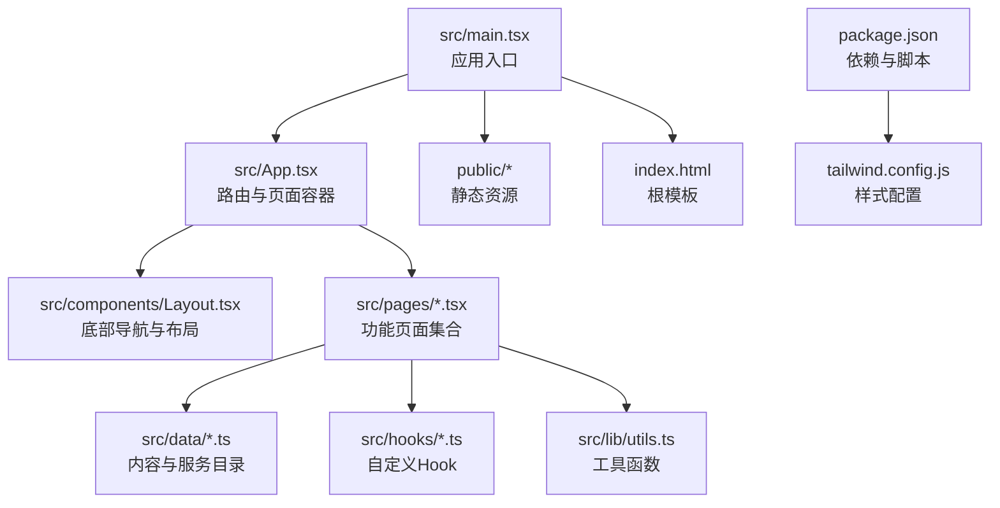
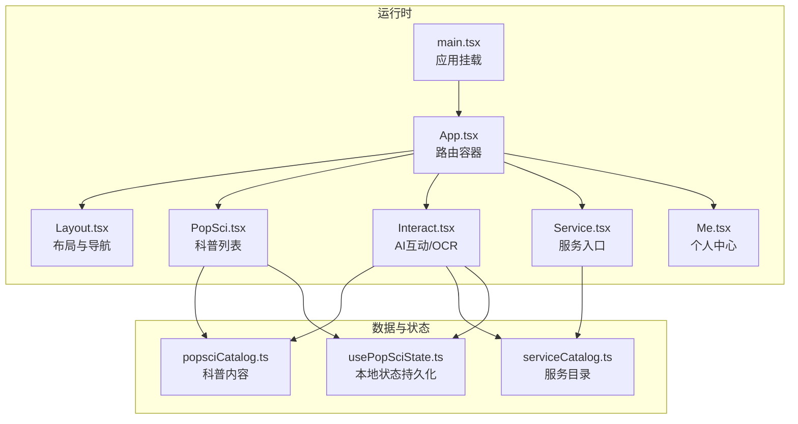
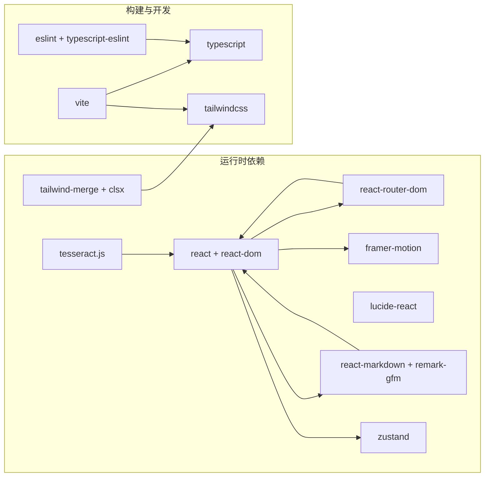

# 项目概述

<cite>
**本文档引用的文件**
- [README.md](file://README.md)
- [package.json](file://package.json)
- [tailwind.config.js](file://tailwind.config.js)
- [src/App.tsx](file://src/App.tsx)
- [src/main.tsx](file://src/main.tsx)
- [src/components/Layout.tsx](file://src/components/Layout.tsx)
- [src/lib/utils.ts](file://src/lib/utils.ts)
- [src/data/popsciCatalog.ts](file://src/data/popsciCatalog.ts)
- [src/data/serviceCatalog.ts](file://src/data/serviceCatalog.ts)
- [src/hooks/usePopSciState.ts](file://src/hooks/usePopSciState.ts)
- [src/pages/Home.tsx](file://src/pages/Home.tsx)
- [src/pages/PopSci.tsx](file://src/pages/PopSci.tsx)
- [src/pages/Interact.tsx](file://src/pages/Interact.tsx)
- [src/pages/Service.tsx](file://src/pages/Service.tsx)
- [src/pages/Me.tsx](file://src/pages/Me.tsx)
</cite>

## 目录
1. [引言](#引言)
2. [项目结构](#项目结构)
3. [核心组件](#核心组件)
4. [架构总览](#架构总览)
5. [详细组件分析](#详细组件分析)
6. [依赖关系分析](#依赖关系分析)
7. [性能考虑](#性能考虑)
8. [故障排查指南](#故障排查指南)
9. [结论](#结论)
10. [附录](#附录)

## 引言
本项目是一个面向移动优先的医疗健康科普应用，围绕“健康科普传播、AI健康助手、医疗服务集成”三大核心业务场景设计。应用通过简洁直观的移动端界面，提供权威易懂的健康知识、智能问答与报告解读、便捷的健康服务入口，帮助用户建立科学的健康认知、提升自我管理能力，并在必要时高效对接线下/线上医疗服务。

- 目标用户：关注自身与家人健康的普通用户，希望获得专业、易懂、可操作的健康知识与服务入口。
- 核心价值主张：以“专业但不冰冷”的方式传递健康知识；以“可即时获得”的AI助手降低信息获取成本；以“一站式服务入口”连接权威资源与专业服务。
- 差异化优势：统一的移动端体验、轻量化的交互设计、可扩展的AI问答与OCR能力、可插拔的服务目录与内容生态。

## 项目结构
项目采用前端单页应用（SPA）架构，基于 React 18 + TypeScript + Vite 构建，使用 Tailwind CSS 实现原子化样式与主题系统，配合路由与状态管理实现清晰的功能模块划分。

图表来源
- [src/main.tsx:1-11](file://src/main.tsx#L1-L11)
- [src/App.tsx:1-52](file://src/App.tsx#L1-L52)
- [src/components/Layout.tsx:1-66](file://src/components/Layout.tsx#L1-L66)
- [package.json:1-48](file://package.json#L1-L48)
- [tailwind.config.js:1-16](file://tailwind.config.js#L1-L16)

章节来源
- [src/main.tsx:1-11](file://src/main.tsx#L1-L11)
- [src/App.tsx:1-52](file://src/App.tsx#L1-L52)
- [package.json:1-48](file://package.json#L1-L48)
- [tailwind.config.js:1-16](file://tailwind.config.js#L1-L16)

## 核心组件
- 应用入口与渲染
  - 入口文件负责挂载 React 根节点并引入全局样式。
  - 参考路径：[src/main.tsx:1-11](file://src/main.tsx#L1-L11)
- 路由与页面容器
  - 使用浏览器路由组织页面，统一包裹在 Layout 中，提供底部导航与主内容区。
  - 参考路径：[src/App.tsx:1-52](file://src/App.tsx#L1-L52)
- 布局与导航
  - 底部导航栏提供“科普/互动/管理/服务/我的/百问”等入口，支持图标与高亮态切换。
  - 参考路径：[src/components/Layout.tsx:1-66](file://src/components/Layout.tsx#L1-L66)
- 内容与服务目录
  - 科普内容（文章/视频）与服务目录（绿通、体检套餐、产品分享、名医在线）以类型安全的数据结构提供。
  - 参考路径：
    - [src/data/popsciCatalog.ts:1-98](file://src/data/popsciCatalog.ts#L1-L98)
    - [src/data/serviceCatalog.ts:1-49](file://src/data/serviceCatalog.ts#L1-L49)
- 自定义 Hook
  - 本地状态持久化（点赞/收藏）与键值管理，确保跨会话一致性。
  - 参考路径：[src/hooks/usePopSciState.ts:1-80](file://src/hooks/usePopSciState.ts#L1-L80)
- 工具函数
  - 统一的类名合并工具，结合 Tailwind CSS 使用。
  - 参考路径：[src/lib/utils.ts:1-7](file://src/lib/utils.ts#L1-L7)

章节来源
- [src/main.tsx:1-11](file://src/main.tsx#L1-L11)
- [src/App.tsx:1-52](file://src/App.tsx#L1-L52)
- [src/components/Layout.tsx:1-66](file://src/components/Layout.tsx#L1-L66)
- [src/data/popsciCatalog.ts:1-98](file://src/data/popsciCatalog.ts#L1-L98)
- [src/data/serviceCatalog.ts:1-49](file://src/data/serviceCatalog.ts#L1-L49)
- [src/hooks/usePopSciState.ts:1-80](file://src/hooks/usePopSciState.ts#L1-L80)
- [src/lib/utils.ts:1-7](file://src/lib/utils.ts#L1-L7)

## 架构总览
应用采用“路由驱动 + 数据目录 + Hook 状态”的分层架构，页面组件通过数据目录与自定义 Hook 获取数据与状态，UI 层使用 Tailwind 原子化样式与动画库增强交互体验。

图表来源
- [src/main.tsx:1-11](file://src/main.tsx#L1-L11)
- [src/App.tsx:1-52](file://src/App.tsx#L1-L52)
- [src/components/Layout.tsx:1-66](file://src/components/Layout.tsx#L1-L66)
- [src/pages/PopSci.tsx:1-270](file://src/pages/PopSci.tsx#L1-L270)
- [src/pages/Interact.tsx:1-462](file://src/pages/Interact.tsx#L1-L462)
- [src/pages/Service.tsx:1-133](file://src/pages/Service.tsx#L1-L133)
- [src/pages/Me.tsx:1-65](file://src/pages/Me.tsx#L1-L65)
- [src/data/popsciCatalog.ts:1-98](file://src/data/popsciCatalog.ts#L1-L98)
- [src/data/serviceCatalog.ts:1-49](file://src/data/serviceCatalog.ts#L1-L49)
- [src/hooks/usePopSciState.ts:1-80](file://src/hooks/usePopSciState.ts#L1-L80)

## 详细组件分析

### 路由与页面容器（App）
- 职责：集中声明所有页面路由，统一包裹在 Layout 下，控制首页与详情页的导航。
- 关键点：首页作为默认路由，详情页根据类型区分文章/视频；底部导航与页面路径保持一致。
- 参考路径：[src/App.tsx:1-52](file://src/App.tsx#L1-L52)

章节来源
- [src/App.tsx:1-52](file://src/App.tsx#L1-L52)

### 布局与导航（Layout）
- 职责：提供移动端专用的主内容区与底部导航栏，支持图标高亮、标签激活态与无障碍访问。
- 关键点：导航项与路径匹配，使用图标库与类名合并工具实现视觉一致性。
- 参考路径：[src/components/Layout.tsx:1-66](file://src/components/Layout.tsx#L1-L66)

章节来源
- [src/components/Layout.tsx:1-66](file://src/components/Layout.tsx#L1-L66)

### 科普内容（PopSci）
- 职责：展示文章与视频两类内容，支持标签切换、收藏/点赞、跳转详情页。
- 关键点：使用动画库实现标签切换过渡；通过数据目录与 Hook 管理用户行为状态；详情页路由按类型区分。
- 参考路径：
  - [src/pages/PopSci.tsx:1-270](file://src/pages/PopSci.tsx#L1-L270)
  - [src/data/popsciCatalog.ts:1-98](file://src/data/popsciCatalog.ts#L1-L98)
  - [src/hooks/usePopSciState.ts:1-80](file://src/hooks/usePopSciState.ts#L1-L80)

章节来源
- [src/pages/PopSci.tsx:1-270](file://src/pages/PopSci.tsx#L1-L270)
- [src/data/popsciCatalog.ts:1-98](file://src/data/popsciCatalog.ts#L1-L98)
- [src/hooks/usePopSciState.ts:1-80](file://src/hooks/usePopSciState.ts#L1-L80)

### AI互动与OCR（Interact）
- 职责：提供健康问答与检查报告OCR解读能力，支持快捷问题、图片上传、流式响应与内容推荐。
- 关键点：本地聊天历史持久化；OCR识别与AI接口调用；无API Key时回退到本地推荐；Markdown渲染与无障碍优化。
- 参考路径：[src/pages/Interact.tsx:1-462](file://src/pages/Interact.tsx#L1-L462)

章节来源
- [src/pages/Interact.tsx:1-462](file://src/pages/Interact.tsx#L1-L462)

### 服务入口（Service）
- 职责：聚合健康服务入口，提供营养师专属服务与快速跳转。
- 关键点：卡片式布局与图标色彩搭配；点击跳转至服务详情或外部链接。
- 参考路径：[src/pages/Service.tsx:1-133](file://src/pages/Service.tsx#L1-L133)

章节来源
- [src/pages/Service.tsx:1-133](file://src/pages/Service.tsx#L1-L133)

### 个人中心（Me）
- 职责：展示用户信息与常用入口（收藏、历史、设置、帮助、关于）。
- 关键点：卡片化菜单与图标高亮；路径占位便于后续接入真实账号体系。
- 参考路径：[src/pages/Me.tsx:1-65](file://src/pages/Me.tsx#L1-L65)

章节来源
- [src/pages/Me.tsx:1-65](file://src/pages/Me.tsx#L1-L65)

### 数据与状态（目录与Hook）
- popsciCatalog：定义文章/视频类型与字段，提供查询与筛选工具函数。
- serviceCatalog：定义服务项结构与查询工具函数。
- usePopSciState：封装本地存储的点赞/收藏状态，提供查询与切换方法。
- 参考路径：
  - [src/data/popsciCatalog.ts:1-98](file://src/data/popsciCatalog.ts#L1-L98)
  - [src/data/serviceCatalog.ts:1-49](file://src/data/serviceCatalog.ts#L1-L49)
  - [src/hooks/usePopSciState.ts:1-80](file://src/hooks/usePopSciState.ts#L1-L80)

章节来源
- [src/data/popsciCatalog.ts:1-98](file://src/data/popsciCatalog.ts#L1-L98)
- [src/data/serviceCatalog.ts:1-49](file://src/data/serviceCatalog.ts#L1-L49)
- [src/hooks/usePopSciState.ts:1-80](file://src/hooks/usePopSciState.ts#L1-L80)

## 依赖关系分析
- 技术栈概览
  - 前端框架：React 18（函数组件、Hooks、严格模式）
  - 类型系统：TypeScript（强类型数据结构与参数校验）
  - 构建工具：Vite（快速开发与热更新）
  - 样式系统：Tailwind CSS（原子化与暗色模式支持）
  - 动画与交互：Framer Motion（流畅过渡与骨架屏）
  - 图标库：Lucide React（语义化图标与无障碍）
  - Markdown 渲染：react-markdown + remark-gfm
  - OCR 能力：tesseract.js（浏览器端图片文字识别）
  - 状态管理：Zustand（轻量状态容器，本项目使用本地持久化）
  - 路由：react-router-dom（浏览器路由）
- 开发与构建
  - ESLint 配置（TypeScript感知规则、React相关规则）
  - PostCSS 与 Tailwind 插件（自动扫描与按需生成样式）

图表来源
- [package.json:13-26](file://package.json#L13-L26)
- [package.json:27-46](file://package.json#L27-L46)
- [tailwind.config.js:1-16](file://tailwind.config.js#L1-L16)

章节来源
- [package.json:13-46](file://package.json#L13-L46)
- [tailwind.config.js:1-16](file://tailwind.config.js#L1-L16)

## 性能考虑
- 构建与打包
  - 使用 Vite 的原生 ES 模块与按需编译，缩短启动与热更新时间。
  - Tailwind CSS 启用内容扫描，按需生成样式，避免冗余体积。
- 运行时优化
  - 页面级懒加载与动画库按需使用，减少首屏负担。
  - 本地状态持久化仅在必要时写入，避免频繁 I/O。
- 数据与渲染
  - 列表渲染使用稳定 key 与虚拟滚动友好结构，提升滚动性能。
  - 图片与封面图采用懒加载与尺寸约束，降低内存占用。

## 故障排查指南
- 路由与导航
  - 若底部导航无法正确高亮，请检查路径与匹配逻辑是否与路由声明一致。
  - 参考路径：[src/components/Layout.tsx:19-62](file://src/components/Layout.tsx#L19-L62)
- 科普内容
  - 若收藏/点赞状态不同步，请确认本地存储键名与解析逻辑。
  - 参考路径：[src/hooks/usePopSciState.ts:11-38](file://src/hooks/usePopSciState.ts#L11-L38)
- AI互动与OCR
  - 未配置API Key时，AI解读会回退到本地推荐；请检查环境变量注入与网络连通性。
  - 参考路径：[src/pages/Interact.tsx:56-166](file://src/pages/Interact.tsx#L56-L166)
  - OCR识别失败时，检查图片格式与清晰度，确认浏览器权限与对象URL释放。
  - 参考路径：[src/pages/Interact.tsx:86-142](file://src/pages/Interact.tsx#L86-L142)
- 样式与主题
  - 暗色模式未生效时，检查 Tailwind 配置与类名拼接工具使用。
  - 参考路径：
    - [tailwind.config.js:4](file://tailwind.config.js#L4)
    - [src/lib/utils.ts:4-6](file://src/lib/utils.ts#L4-L6)

章节来源
- [src/components/Layout.tsx:19-62](file://src/components/Layout.tsx#L19-L62)
- [src/hooks/usePopSciState.ts:11-38](file://src/hooks/usePopSciState.ts#L11-L38)
- [src/pages/Interact.tsx:56-166](file://src/pages/Interact.tsx#L56-L166)
- [src/pages/Interact.tsx:86-142](file://src/pages/Interact.tsx#L86-L142)
- [tailwind.config.js:4](file://tailwind.config.js#L4)
- [src/lib/utils.ts:4-6](file://src/lib/utils.ts#L4-L6)

## 结论
本项目以移动端为核心，围绕健康科普、AI助手与服务集成构建了清晰的功能边界与可扩展的架构。通过类型安全的数据结构、本地状态持久化与现代化的前端技术栈，既满足初学者快速上手的需求，也为有经验的开发者提供了良好的扩展空间。未来可在以下方向演进：完善账号体系与服务打通、引入服务端状态与推送、扩展AI能力与多模态交互、加强数据分析与个性化推荐。

## 附录
- 快速开始
  - 安装依赖：npm install
  - 开发运行：npm run dev
  - 构建产物：npm run build
  - 预览构建：npm run preview
- 环境变量
  - VITE_DEEPSEEK_API_KEY：用于启用AI问答与报告解读（可选）
- 目录结构要点
  - src/pages：页面组件按功能划分
  - src/data：内容与服务目录，提供类型安全的数据访问
  - src/hooks：自定义Hook，封装业务逻辑与状态
  - src/lib：通用工具函数
  - public：静态资源与入口HTML