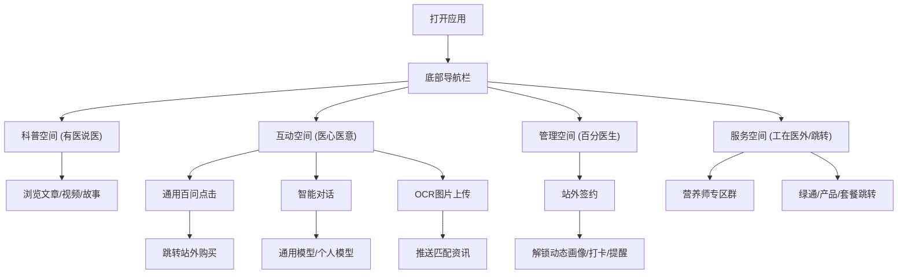

## 1. 产品概述
本项目是一个针对手机端设计的医疗健康空间React单页面应用（SPA）或PWA。
- 主要解决用户在医疗健康领域的科普获取、智能问答互动、健康追踪管理以及专业服务获取的需求。
- 为医疗健康平台提供高粘性的用户载体，通过丰富的内容、智能交互和社群服务实现用户留存和转化。

## 2. 核心功能

### 2.1 用户角色
| 角色 | 注册方式 | 核心权限 |
|------|---------------------|------------------|
| 普通用户 | 手机号/微信授权登录 | 浏览科普、进行通用模型对话、进行打卡等基础功能 |
| 签约用户 | 站外跳转签约后同步状态 | 享受跟踪管理服务、专属智能体对话、营养师专属群等高级服务 |

### 2.2 功能模块
1. **首页/科普空间（有医说医）**：科普文章、科普视频、康复故事流。
2. **互动空间（医心医意）**：通用百问列表、智能问答对话框（通用模型/个人模型/OCR识别推送入口）。
3. **管理空间（百分医生）**：动态画像展示、每日打卡（阅读/游戏积分）、最新资讯流、非医提醒。
4. **服务与跳转（工在医外 & 跳转空间）**：营养师版块链接、前置索引触发词库、外部服务快捷入口（绿通招募、产品分享、健康套餐等）。

### 2.3 页面详情
| 页面名称 | 模块名称 | 功能描述 |
|-----------|-------------|---------------------|
| 底部导航 | 导航栏 | 切换四个主模块：科普、互动、管理、服务 |
| 科普页面 | 内容流 | 分Tab展示文章、视频、康复故事；支持无限滚动和分类筛选 |
| 互动页面 | 问答区与对话框 | 顶部展示“通用百问”快捷标签；主体为聊天流，支持文字和OCR图片上传；根据用户状态切换通用模型或专属智能体 |
| 管理页面 | 健康看板 | 环形图展示画像完整度；打卡日历与积分进度条；健康提醒通知卡片 |
| 服务页面 | 快捷入口卡片 | 网格化布局展示营养师入群、绿通、套餐等跳转链接 |

## 3. 核心流程
用户通过首页进入后，可自由浏览科普内容，也可通过底部导航切换至互动区进行AI问答。在问答中或服务区，点击特定关键词/卡片可跳转至站外购买或签约。签约后解锁更高级的管理服务。

## 4. UI/UX 设计
### 4.1 设计风格
- **主色调**：医疗蓝（#2563EB）或薄荷绿（#10B981），传达专业、健康与安心。
- **辅助色**：纯净白背景、柔和的灰底色分割区块，警告色（如橙色）用于提醒。
- **按钮与卡片**：大圆角（16px或24px）、轻微投影，符合现代移动端App风格。
- **字体**：系统默认无衬线字体（PingFang SC, -apple-system），加大行高提升阅读体验。
- **布局**：一维纵向滚动，底部固定TabBar。

### 4.2 页面设计总览
| 页面名称 | 模块名称 | UI元素与交互 |
|-----------|-------------|-------------|
| 底部导航 | TabBar | 选中状态图标高亮并带有微动效（如缩放或颜色渐变） |
| 科普页面 | 内容卡片 | 视频卡片带播放icon；文章卡片左文右图结构；平滑滚动 |
| 互动页面 | 聊天气泡 | 用户居右（主色），AI居左（白底灰字）；底部输入框带相机（OCR）图标 |
| 管理页面 | 打卡与画像 | 环形进度条展示打卡积分与画像完整度；卡片式提醒 |

### 4.3 响应式策略
- **Mobile-first**：完全针对手机端（375px - 430px宽度基准）设计。
- **Touch-friendly**：所有可点击区域最小高度44px；支持滑动切换Tab或关闭弹窗。
- 如果在桌面端打开，采用居中的移动端尺寸容器（Max-width: 480px），两侧留白或显示模糊背景。
